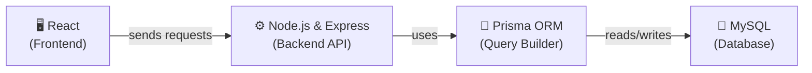
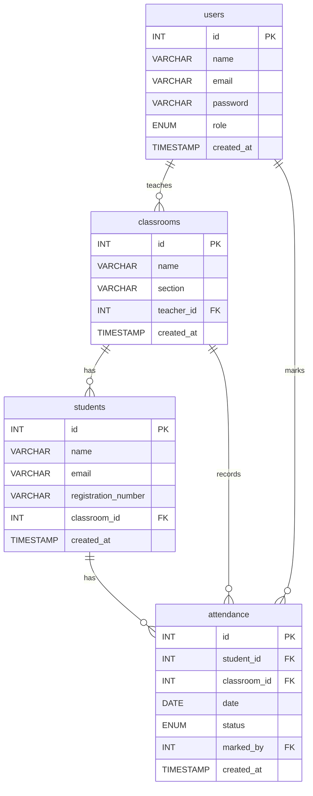

# 📚 Student Attendance Management System — Database Guide

> **Day 1 of designHer Bootcamp**
> Today we learn how to design and build a MySQL database from scratch!

---

## 📖 Table of Contents

1. [Project Overview & Tech Stack](#1--project-overview--tech-stack)
2. [Introduction to Databases](#2--introduction-to-databases)
3. [Understanding Relationships (Crow's Foot Notation)](#3--understanding-relationships-crows-foot-notation)
4. [Database Design (ERD)](#4--database-design-erd)
5. [Step-by-Step Table Creation](#5--step-by-step-table-creation)
6. [Adding Sample Data](#6--adding-sample-data)
7. [Fetching Data (SELECT Queries)](#7--fetching-data-select-queries)

---

## 1. 🎯 Project Overview & Tech Stack

### What are we building?

We are building a **Student Attendance Management System**. Think of it like a digital attendance register.

- **Admins** can create classrooms and teacher accounts.
- **Teachers** are assigned to classrooms. They can add students.
- **Teachers** mark attendance every day — Present, Absent, or Late.
- Each student can only have **one** attendance record per day.

### Our Tech Stack

Over 3 days, we will use these technologies together:



**How does this flow work?**

| Layer | What it does | Simple Analogy |
|-------|-------------|----------------|
| **React** | The user interface. What you see and click. | The *menu card* at a restaurant. |
| **Node.js & Express** | The backend server. It receives requests and sends responses. | The *waiter* who takes your order to the kitchen. |
| **Prisma ORM** | A tool that helps Node.js talk to the database easily. | A *translator* between the waiter and the chef. |
| **MySQL** | The database. It stores all our data permanently. | The *kitchen storage room* where all ingredients are kept. |

> **Today (Day 1)**, we focus only on the **MySQL Database** layer. We will design tables, add data, and write queries.

---

## 2. 🗄️ Introduction to Databases

### What is a Database?

A database is a place where we **store data** in an organized way. Think of it like a **big Excel file** saved on a server.

### What is a Relational Database?

A **relational database** stores data in **tables**. These tables can be **connected** (related) to each other. MySQL is a relational database.

### What is a Table?

A table looks like a spreadsheet. It has **rows** and **columns**.

| id | name | email |
|----|------|-------|
| 1 | Nimal | nimal@school.com |
| 2 | Sanduni | sanduni@school.com |

- Each **column** is a type of information (like `name`, `email`).
- Each **row** is one record (like one teacher).

### What is a Primary Key (PK)?

A Primary Key is a **unique ID** for each row. No two rows can have the same Primary Key.

> 🎯 **Analogy:** Think of your **National ID Card number**. Every person has a different one. That is a Primary Key.

In our tables, the `id` column is the Primary Key.

### What is a Foreign Key (FK)?

A Foreign Key is a column that **points to** the Primary Key of another table. It creates a **connection** between two tables.

> 🎯 **Analogy:** On your school ID card, there is a "Class" field. That class name **points to** a real class in the school. That is a Foreign Key.

**Example:** The `students` table has a `classroom_id` column. This points to the `id` in the `classrooms` table. Now we know which student is in which classroom.

---

## 3. 🔗 Understanding Relationships (Crow's Foot Notation)

Before we look at our database design, let's learn how to **read** a database diagram.

We use something called **Crow's Foot Notation**. It shows how tables are connected.

### The Three Types of Relationships

#### 1️⃣ One-to-One (1:1)

One record in Table A connects to **exactly one** record in Table B.

> 🎯 **Analogy:** One person has **one** passport. One passport belongs to **one** person.

#### 2️⃣ One-to-Many (1:N)

One record in Table A connects to **many** records in Table B.

> 🎯 **Analogy:** One **mother** can have **many children**. But each child has only **one** birth mother.

This is the **most common** relationship. We use it a lot in our system!

#### 3️⃣ Many-to-Many (M:N)

Many records in Table A connect to **many** records in Table B.

> 🎯 **Analogy:** A **student** can join **many clubs**. A **club** can have **many students**.

> 💡 In a database, we handle Many-to-Many by creating a **third table** in the middle (called a junction table).

### How to Read Crow's Foot Symbols

| Symbol | Meaning |
|--------|---------|
| `\|\|` (single line) | **One** (exactly one) |
| `o\|` | **Zero or One** |
| `\|{` or `}o` | **One or Many** |
| `o{` | **Zero or Many** |

When you see `||--o{` it means: **One** connects to **Zero or Many**.

---

## 4. 📊 Database Design (ERD)

ERD stands for **Entity-Relationship Diagram**. It is a picture of our database design.

Here is the ERD for our Attendance System:



### Relationships in Our System Explained

| Relationship | Meaning |
|-------------|---------|
| **users → classrooms** | One teacher can teach **many** classrooms. Each classroom has **one** teacher. |
| **classrooms → students** | One classroom can have **many** students. Each student belongs to **one** classroom. |
| **students → attendance** | One student can have **many** attendance records (one per day). Each attendance record belongs to **one** student. |
| **classrooms → attendance** | One classroom can have **many** attendance records. Each record belongs to **one** classroom. |
| **users → attendance** | One teacher can mark **many** attendance records. Each record is marked by **one** teacher. |

---

## 5. 🛠️ Step-by-Step Table Creation

> 💡 **How to use this section:**
> 1. Open **MySQL Workbench**.
> 2. Copy each code block below.
> 3. Paste it and click the ⚡ lightning bolt button to run it.
> 4. Read the explanation below each block to understand what each line does.

### Step 0: Create and Select the Database

```sql
CREATE DATABASE IF NOT EXISTS attendance_system_db;
USE attendance_system_db;
```

| Line | What it does |
|------|-------------|
| `CREATE DATABASE IF NOT EXISTS attendance_system_db;` | Creates a new database called `attendance_system_db`. The `IF NOT EXISTS` part means: only create it if it doesn't already exist. This prevents errors. |
| `USE attendance_system_db;` | Tells MySQL: "I want to work inside this database now." All commands after this will run inside `attendance_system_db`. |

---

### Step 1: Create the `users` Table

```sql
CREATE TABLE users (
    id INT AUTO_INCREMENT PRIMARY KEY,
    name VARCHAR(100) NOT NULL,
    email VARCHAR(150) NOT NULL UNIQUE,
    password VARCHAR(255) NOT NULL,
    role ENUM('admin', 'teacher') NOT NULL DEFAULT 'teacher',
    created_at TIMESTAMP DEFAULT CURRENT_TIMESTAMP
);
```

**Line-by-line explanation:**

| Line | What it does |
|------|-------------|
| `id INT AUTO_INCREMENT PRIMARY KEY` | Creates an `id` column. `INT` = whole number. `AUTO_INCREMENT` = MySQL gives the next number automatically (1, 2, 3...). `PRIMARY KEY` = this is the unique ID for each row. |
| `name VARCHAR(100) NOT NULL` | Creates a `name` column. `VARCHAR(100)` = text up to 100 characters. `NOT NULL` = this field **cannot** be empty. |
| `email VARCHAR(150) NOT NULL UNIQUE` | `UNIQUE` = no two users can have the same email. |
| `password VARCHAR(255) NOT NULL` | Stores the password. We use `VARCHAR(255)` because hashed passwords are long. |
| `role ENUM('admin', 'teacher') NOT NULL DEFAULT 'teacher'` | `ENUM` = the value can **only** be `'admin'` or `'teacher'`. Nothing else. `DEFAULT 'teacher'` = if no role is given, it will be `'teacher'`. |
| `created_at TIMESTAMP DEFAULT CURRENT_TIMESTAMP` | Stores when the record was created. `DEFAULT CURRENT_TIMESTAMP` = MySQL automatically saves the current date and time. |

---

### Step 2: Create the `classrooms` Table

```sql
CREATE TABLE classrooms (
    id INT AUTO_INCREMENT PRIMARY KEY,
    name VARCHAR(100) NOT NULL,
    section VARCHAR(50),
    teacher_id INT NOT NULL,
    created_at TIMESTAMP DEFAULT CURRENT_TIMESTAMP,
    FOREIGN KEY (teacher_id) REFERENCES users(id) ON DELETE CASCADE
);
```

**Line-by-line explanation:**

| Line | What it does |
|------|-------------|
| `id INT AUTO_INCREMENT PRIMARY KEY` | Same as before — unique ID for each classroom. |
| `name VARCHAR(100) NOT NULL` | Name of the classroom (e.g., "Batch 2026 - Web Development"). |
| `section VARCHAR(50)` | Optional section info (e.g., "Morning", "Evening"). No `NOT NULL` means it **can** be empty. |
| `teacher_id INT NOT NULL` | This stores the `id` of the teacher assigned to this classroom. |
| `FOREIGN KEY (teacher_id) REFERENCES users(id)` | This tells MySQL: "The `teacher_id` value **must exist** in the `users` table's `id` column." This is the **connection** between the two tables. |
| `ON DELETE CASCADE` | If a teacher is deleted from `users`, all their classrooms are **also deleted automatically**. |

---

### Step 3: Create the `students` Table

```sql
CREATE TABLE students (
    id INT AUTO_INCREMENT PRIMARY KEY,
    name VARCHAR(100) NOT NULL,
    email VARCHAR(150) NOT NULL UNIQUE,
    registration_number VARCHAR(50) NOT NULL UNIQUE,
    classroom_id INT NOT NULL,
    created_at TIMESTAMP DEFAULT CURRENT_TIMESTAMP,
    FOREIGN KEY (classroom_id) REFERENCES classrooms(id) ON DELETE CASCADE
);
```

**Line-by-line explanation:**

| Line | What it does |
|------|-------------|
| `id INT AUTO_INCREMENT PRIMARY KEY` | Unique ID for each student. |
| `name VARCHAR(100) NOT NULL` | Student's full name. Cannot be empty. |
| `email VARCHAR(150) NOT NULL UNIQUE` | Student's email. Must be unique. |
| `registration_number VARCHAR(50) NOT NULL UNIQUE` | A special code for each student (e.g., "STU-2026-001"). Must be unique. |
| `classroom_id INT NOT NULL` | Which classroom this student belongs to. |
| `FOREIGN KEY (classroom_id) REFERENCES classrooms(id) ON DELETE CASCADE` | Connects to the `classrooms` table. If a classroom is deleted, its students are also removed. |

---

### Step 4: Create the `attendance` Table

```sql
CREATE TABLE attendance (
    id INT AUTO_INCREMENT PRIMARY KEY,
    student_id INT NOT NULL,
    classroom_id INT NOT NULL,
    date DATE NOT NULL,
    status ENUM('present', 'absent', 'late') NOT NULL,
    marked_by INT NOT NULL,
    created_at TIMESTAMP DEFAULT CURRENT_TIMESTAMP,
    FOREIGN KEY (student_id) REFERENCES students(id) ON DELETE CASCADE,
    FOREIGN KEY (classroom_id) REFERENCES classrooms(id) ON DELETE CASCADE,
    FOREIGN KEY (marked_by) REFERENCES users(id) ON DELETE CASCADE,
    UNIQUE KEY unique_attendance (student_id, date)
);
```

**Line-by-line explanation:**

| Line | What it does |
|------|-------------|
| `student_id INT NOT NULL` | Which student this attendance record is for. |
| `classroom_id INT NOT NULL` | Which classroom this attendance was taken in. |
| `date DATE NOT NULL` | The date of attendance (e.g., "2026-04-28"). |
| `status ENUM('present', 'absent', 'late') NOT NULL` | The attendance status. Only these 3 values are allowed. |
| `marked_by INT NOT NULL` | The teacher who marked this attendance. Points to `users.id`. |
| `FOREIGN KEY (student_id) REFERENCES students(id) ON DELETE CASCADE` | Connects to the `students` table. |
| `FOREIGN KEY (classroom_id) REFERENCES classrooms(id) ON DELETE CASCADE` | Connects to the `classrooms` table. |
| `FOREIGN KEY (marked_by) REFERENCES users(id) ON DELETE CASCADE` | Connects to the `users` table (the teacher). |
| `UNIQUE KEY unique_attendance (student_id, date)` | ⭐ **Very important!** This makes sure a student can only have **ONE** attendance record per day. If you try to add a second record for the same student on the same day, MySQL will give an error. |

---

## 6. 📝 Adding Sample Data

Now let's add some fake data so we can practice queries. Copy and paste each block below into MySQL Workbench.

> ⚠️ **Important:** Run these **after** creating all the tables. The order matters because of Foreign Keys!

### Insert Users

```sql
INSERT INTO users (name, email, password, role) VALUES
('Amara Silva', 'amara@school.com', '$2b$10$isLvFMyeuL4eyEczQYTiVOKLdsauzrvKPq/iBj4eJXTgqPEwx4Ry2', 'admin'),
('Nimal Perera', 'nimal@school.com', '$2b$10$VxB/Z1jcdUDt2rNG7V6bWenRA0afyXCPPxyMwRJ6RxX7gKWQzkl4e', 'teacher'),
('Sanduni Fernando', 'sanduni@school.com', '$2b$10$VxB/Z1jcdUDt2rNG7V6bWenRA0afyXCPPxyMwRJ6RxX7gKWQzkl4e', 'teacher');
```

**What's happening:**
- We are adding 3 users: 1 admin and 2 teachers.
- `Amara` is the admin. `Nimal` and `Sanduni` are teachers.
- We don't type the `id` — MySQL gives it automatically (1, 2, 3).

**🔐 About the passwords:**

The passwords look like random characters. That is because they are **hashed** using a library called **bcrypt**. We **never** store plain text passwords in a database. That is a big security risk.

In our Node.js backend (Day 2), we will use the `bcrypt` npm package to hash passwords before saving them.

Here are the **plain text passwords** for testing:

| User | Email | Plain Text Password |
|------|-------|-------------------|
| Amara (Admin) | amara@school.com | `admin123` |
| Nimal (Teacher) | nimal@school.com | `teacher123` |
| Sanduni (Teacher) | sanduni@school.com | `teacher123` |

> 💡 These hashes were generated using bcrypt with **10 salt rounds**. When we build the login system, `bcrypt.compare()` will check if a typed password matches the stored hash.

### Insert Classrooms

```sql
INSERT INTO classrooms (name, section, teacher_id) VALUES
('Batch 2026 - Web Development', 'Morning', 2),
('Batch 2026 - Mobile Development', 'Evening', 3);
```

**What's happening:**
- Classroom 1 is assigned to `teacher_id = 2` (Nimal).
- Classroom 2 is assigned to `teacher_id = 3` (Sanduni).

### Insert Students

```sql
INSERT INTO students (name, email, registration_number, classroom_id) VALUES
('Tharindu Jayasinghe', 'tharindu@student.com', 'STU-2026-001', 1),
('Nethmi Dissanayake', 'nethmi@student.com', 'STU-2026-002', 1),
('Kavinda Rajapaksha', 'kavinda@student.com', 'STU-2026-003', 2),
('Ishara Madushani', 'ishara@student.com', 'STU-2026-004', 2);
```

**What's happening:**
- Tharindu and Nethmi are in Classroom 1 (Web Development).
- Kavinda and Ishara are in Classroom 2 (Mobile Development).

### Insert Attendance Records

```sql
-- Day 1: Monday, April 28
INSERT INTO attendance (student_id, classroom_id, date, status, marked_by) VALUES
(1, 1, '2026-04-28', 'present', 2),
(2, 1, '2026-04-28', 'late', 2),
(3, 2, '2026-04-28', 'present', 3),
(4, 2, '2026-04-28', 'absent', 3);

-- Day 2: Tuesday, April 29
INSERT INTO attendance (student_id, classroom_id, date, status, marked_by) VALUES
(1, 1, '2026-04-29', 'present', 2),
(2, 1, '2026-04-29', 'present', 2),
(3, 2, '2026-04-29', 'late', 3),
(4, 2, '2026-04-29', 'present', 3);

-- Day 3: Wednesday, April 30
INSERT INTO attendance (student_id, classroom_id, date, status, marked_by) VALUES
(1, 1, '2026-04-30', 'present', 2),
(2, 1, '2026-04-30', 'absent', 2),
(3, 2, '2026-04-30', 'present', 3),
(4, 2, '2026-04-30', 'present', 3);
```

**What's happening:**
- We added attendance for 3 days.
- `marked_by = 2` means Teacher Nimal marked it. `marked_by = 3` means Teacher Sanduni marked it.
- Students have different statuses each day — some are present, some are late, some are absent.

---

## 7. 🔍 Fetching Data (SELECT Queries)

Now the fun part! Let's **read** the data we just added. We use `SELECT` queries for this.

---

### 🟢 Part A: Basic SELECT Queries

These are simple queries to get data from **one table**.

---

**Query 1: Get all users**

```sql
SELECT * FROM users;
```

| Part | Meaning |
|------|---------|
| `SELECT *` | Select **all columns**. The `*` means "everything". |
| `FROM users` | From the `users` table. |

---

**Query 2: Get only teacher names and emails**

```sql
SELECT name, email FROM users WHERE role = 'teacher';
```

| Part | Meaning |
|------|---------|
| `SELECT name, email` | Only get the `name` and `email` columns (not everything). |
| `WHERE role = 'teacher'` | **Filter:** Only show rows where role is `'teacher'`. |

---

**Query 3: Get all students**

```sql
SELECT * FROM students;
```

This gives us every student with all their details.

---

**Query 4: Find a student by registration number**

```sql
SELECT * FROM students WHERE registration_number = 'STU-2026-001';
```

| Part | Meaning |
|------|---------|
| `WHERE registration_number = 'STU-2026-001'` | Find the exact student whose registration number matches. |

---

**Query 5: Get all attendance records for a specific date**

```sql
SELECT * FROM attendance WHERE date = '2026-04-28';
```

This shows all attendance records for April 28th.

---

**Query 6: Count total students**

```sql
SELECT COUNT(*) AS total_students FROM students;
```

| Part | Meaning |
|------|---------|
| `COUNT(*)` | Counts the number of rows. |
| `AS total_students` | Renames the result column to `total_students` so it's easy to read. |

---

**Query 7: Get students ordered by name (A to Z)**

```sql
SELECT * FROM students ORDER BY name ASC;
```

| Part | Meaning |
|------|---------|
| `ORDER BY name ASC` | Sort results by `name` in **ascending** order (A → Z). Use `DESC` for Z → A. |

---

**Query 8: Count how many times each status appears**

```sql
SELECT status, COUNT(*) AS count FROM attendance GROUP BY status;
```

| Part | Meaning |
|------|---------|
| `GROUP BY status` | Groups all rows with the same `status` together. |
| `COUNT(*)` | Counts how many rows are in each group. |

This will show something like: `present: 8, absent: 2, late: 2`.

---

### 🔵 Part B: JOIN Queries (Combining Tables)

JOINs let us **combine data from two or more tables**. This is very powerful!

> 🎯 **Analogy:** Imagine you have two Excel sheets — one with student names and one with classroom names. A JOIN is like using VLOOKUP to bring the classroom name next to each student.

The most common type is `INNER JOIN`. It gives us rows that have **matching data** in both tables.

**Basic JOIN syntax:**
```sql
SELECT columns
FROM table_a
INNER JOIN table_b ON table_a.foreign_key = table_b.primary_key;
```

---

**Query 1: Get students with their classroom name**

```sql
SELECT
    students.name AS student_name,
    students.registration_number,
    classrooms.name AS classroom_name
FROM students
INNER JOIN classrooms ON students.classroom_id = classrooms.id;
```

| Part | Meaning |
|------|---------|
| `students.name AS student_name` | Get the `name` from `students` table, call it `student_name`. |
| `classrooms.name AS classroom_name` | Get the `name` from `classrooms` table, call it `classroom_name`. |
| `INNER JOIN classrooms ON students.classroom_id = classrooms.id` | Connect the two tables where `classroom_id` matches the classroom's `id`. |

---

**Query 2: Get classrooms with their teacher name**

```sql
SELECT
    classrooms.name AS classroom_name,
    classrooms.section,
    users.name AS teacher_name
FROM classrooms
INNER JOIN users ON classrooms.teacher_id = users.id;
```

This connects `classrooms` to `users` to show which teacher teaches which class.

---

**Query 3: Get attendance records with student names**

```sql
SELECT
    attendance.date,
    students.name AS student_name,
    attendance.status
FROM attendance
INNER JOIN students ON attendance.student_id = students.id
ORDER BY attendance.date;
```

Now instead of seeing `student_id = 1`, we see the actual student name!

---

**Query 4: Get full attendance details (student + classroom + teacher)**

```sql
SELECT
    attendance.date,
    students.name AS student_name,
    classrooms.name AS classroom_name,
    attendance.status,
    users.name AS marked_by_teacher
FROM attendance
INNER JOIN students ON attendance.student_id = students.id
INNER JOIN classrooms ON attendance.classroom_id = classrooms.id
INNER JOIN users ON attendance.marked_by = users.id
ORDER BY attendance.date, students.name;
```

| Part | Meaning |
|------|---------|
| Multiple `INNER JOIN` | We are joining **4 tables** together! Each JOIN adds more information. |
| `ORDER BY attendance.date, students.name` | Sort by date first, then by student name. |

> 💡 This is the kind of query our **Node.js backend** will use to show full attendance reports.

---

**Query 5: Get attendance for a specific student**

```sql
SELECT
    attendance.date,
    attendance.status,
    classrooms.name AS classroom_name
FROM attendance
INNER JOIN classrooms ON attendance.classroom_id = classrooms.id
WHERE attendance.student_id = 1
ORDER BY attendance.date;
```

This gives us all attendance records for the student with `id = 1` (Tharindu).

---

**Query 6: Count attendance status for each student**

```sql
SELECT
    students.name AS student_name,
    attendance.status,
    COUNT(*) AS total
FROM attendance
INNER JOIN students ON attendance.student_id = students.id
GROUP BY students.name, attendance.status
ORDER BY students.name;
```

This shows how many times each student was present, absent, or late. Very useful for reports!

---

**Query 7: Get all students in a specific teacher's classrooms**

```sql
SELECT
    students.name AS student_name,
    students.registration_number,
    classrooms.name AS classroom_name,
    users.name AS teacher_name
FROM students
INNER JOIN classrooms ON students.classroom_id = classrooms.id
INNER JOIN users ON classrooms.teacher_id = users.id
WHERE users.id = 2;
```

This finds all students who are in Teacher Nimal's (`id = 2`) classrooms.

---

**Query 8: Get today's absent students with their classroom info**

```sql
SELECT
    students.name AS student_name,
    students.registration_number,
    classrooms.name AS classroom_name
FROM attendance
INNER JOIN students ON attendance.student_id = students.id
INNER JOIN classrooms ON attendance.classroom_id = classrooms.id
WHERE attendance.date = '2026-04-30'
  AND attendance.status = 'absent';
```

| Part | Meaning |
|------|---------|
| `WHERE attendance.date = '2026-04-30'` | Filter for today's date. |
| `AND attendance.status = 'absent'` | `AND` adds a second condition. Both must be true. |

> 💡 In our backend, we will replace `'2026-04-30'` with today's actual date using code.

---

## 🎉 You Did It!

You just learned:
- ✅ What a relational database is
- ✅ How to read an ERD diagram
- ✅ How to create tables with keys and constraints
- ✅ How to insert data
- ✅ How to query data using SELECT
- ✅ How to combine tables using JOIN

> **Next up (Day 2):** We will build the Node.js + Express backend and use **Prisma ORM** to talk to this database using JavaScript instead of raw SQL!

---

> Made with ❤️ for **designHer Bootcamp 2026**
