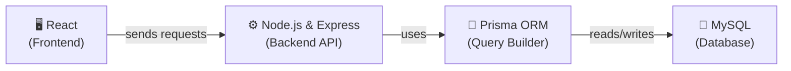
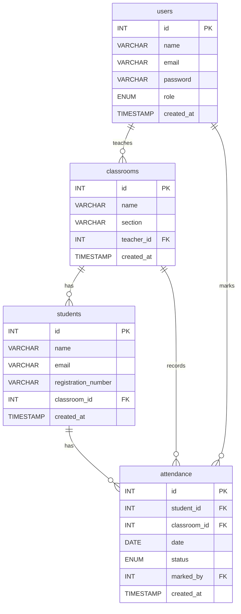

# 📚 Student Attendance Management System — Database Guide (දත්ත සමුදාය)

> **Day 1 of designHer Bootcamp**
> අද අපි මුල සිටම MySQL Database එකක් design කරලා හදන විදිහ ඉගෙන ගනිමු!

---

## 📖 Table of Contents (පටුන)

1. [Project Overview & Tech Stack](#1--project-overview--tech-stack)
2. [Introduction to Databases](#2--introduction-to-databases)
3. [Understanding Relationships (Crow's Foot Notation)](#3--understanding-relationships-crows-foot-notation)
4. [Database Design (ERD)](#4--database-design-erd)
5. [Step-by-Step Table Creation](#5--step-by-step-table-creation)
6. [Adding Sample Data](#6--adding-sample-data)
7. [Fetching Data (SELECT Queries)](#7--fetching-data-select-queries)

---

## 1. 🎯 Project Overview & Tech Stack

### අපි මොකක්ද මේ හදන්නේ?

අපි හදන්නේ **Student Attendance Management System** එකක් (සිසුන්ගේ පැමිණීම සටහන් කරන පද්ධතියක්). මේක හරියට ඩිජිටල් attendance register එකක් වගේ.

- **Admins** ලට පුළුවන් classrooms සහ teacher accounts හදන්න.
- **Teachers** ලව classrooms වලට assign කරනවා. එයාලට පුළුවන් students ලව add කරන්න.
- **Teachers** හැමදාම attendance mark කරනවා — Present, Absent, හෝ Late විදිහට.
- එක student කෙනෙකුට දවසකට තියෙන්න පුළුවන් **එක** attendance record එකක් විතරයි.

### අපේ Tech Stack එක

මේ දවස් 3 ඇතුළත, අපි මේ technologies එකට පාවිච්චි කරනවා:



**මේ flow එක වැඩ කරන්නේ කොහොමද?**

| Layer | කරන්නේ මොකක්ද? | Simple Analogy (උදාහරණයක්) |
|-------|-------------|----------------|
| **React** | මේක තමයි User Interface එක. ඔයාට පේන සහ click කරන දේවල්. | Restaurant එකක තියෙන *menu card* එක වගේ. |
| **Node.js & Express** | මේක තමයි Backend Server එක. මේක requests අරගෙන responses යවනවා. | ඔයාගේ order එක කුස්සියට අරන් යන *waiter* වගේ. |
| **Prisma ORM** | Node.js එකට ලේසියෙන්ම database එකත් එක්ක කතා කරන්න උදව් කරන tool එකක්. | Waiter සහ chef අතර ඉන්න *translator* කෙනෙක් වගේ. |
| **MySQL** | මේක තමයි Database එක. මේකේ අපේ ඔක්කොම data permanent විදිහට store කරනවා. | හැම බඩුම තියලා තියෙන *kitchen storage room* එක වගේ. |

> **අද (Day 1)**, අපි focus කරන්නේ **MySQL Database** layer එක ගැන විතරයි. අපි tables design කරනවා, data add කරනවා, සහ queries ලියනවා.

---

## 2. 🗄️ Introduction to Databases (දත්ත සමුදාය යනු කුමක්ද?)

### Database එකක් කියන්නේ මොකක්ද?

Database එකක් කියන්නේ අපි מסודර විදිහට **data store කරන** තැනක්. මේක හරියට server එකක save කරපු **ලොකු Excel file එකක්** වගේ කියලා හිතන්න.

### Relational Database එකක් කියන්නේ මොකක්ද?

**Relational database** එකක data store කරන්නේ **tables** විදිහට. මේ tables එකිනෙකට **connect** (related) කරන්න පුළුවන්. MySQL කියන්නේ relational database එකක්.

### Table එකක් කියන්නේ මොකක්ද?

Table එකක් පේන්නේ හරියට spreadsheet එකක් වගේ. ඒකේ **rows** සහ **columns** තියෙනවා.

| id | name | email |
|----|------|-------|
| 1 | Nimal | nimal@school.com |
| 2 | Sanduni | sanduni@school.com |

- හැම **column** එකක්ම යම්කිසි තොරතුරු වර්ගයක් (උදා: `name`, `email`).
- හැම **row** එකක්ම එක record එකක් (උදා: එක teacher කෙනෙක්).

### Primary Key (PK) කියන්නේ මොකක්ද?

Primary Key කියන්නේ හැම row එකකටම තියෙන **unique ID** එකක්. කිසිම rows දෙකකට එකම Primary Key එකක් තියෙන්න බෑ.

> 🎯 **Analogy:** ඔයාගේ **ජාතික හැඳුනුම්පත් අංකය** (NIC) ගැන හිතන්න. හැම කෙනාටම තියෙන්නේ වෙනස් එකක්. ඒක Primary Key එකක්.

අපේ tables වල, `id` column එක තමයි Primary Key එක.

### Foreign Key (FK) කියන්නේ මොකක්ද?

Foreign Key එකක් කියන්නේ වෙනත් table එකක තියෙන Primary Key එකකට **point කරන** column එකකට. මේකෙන් tables දෙකක් අතර **connection** එකක් හැදෙනවා.

> 🎯 **Analogy:** ඔයාගේ school ID card එකේ "Class" කියලා තැනක් තියෙනවා. ඒ class name එක ඉස්කෝලේ තියෙන ඇත්තම class එකකට **point කරනවා**. ඒක Foreign Key එකක්.

**Example:** `students` table එකේ `classroom_id` කියලා column එකක් තියෙනවා. මේක point කරන්නේ `classrooms` table එකේ `id` එකට. දැන් අපිට පුළුවන් කොයි student ද කොයි classroom එකේද ඉන්නේ කියලා හොයාගන්න.

---

## 3. 🔗 Understanding Relationships (Crow's Foot Notation)

අපි database design එක බලන්න කලින්, database diagram එකක් **කියවන්නේ** කොහොමද කියලා ඉගෙන ගමු.

අපි මේකට පාවිච්චි කරන්නේ **Crow's Foot Notation**. මේකෙන් පෙන්නනවා tables connect වෙලා තියෙන්නේ කොහොමද කියලා.

### Relationships වර්ග 3

#### 1️⃣ One-to-One (1:1)

Table A එකේ එක record එකක්, Table B එකේ **හරියටම එක** record එකකට connect වෙනවා.

> 🎯 **Analogy:** එක පුද්ගලයෙකුට තියෙන්නේ **එක** passport එකයි. එක passport එකක් අයිති වෙන්නේ **එක** පුද්ගලයෙකුට විතරයි.

#### 2️⃣ One-to-Many (1:N)

Table A එකේ එක record එකක්, Table B එකේ **ගොඩක්** records වලට connect වෙනවා.

> 🎯 **Analogy:** එක **අම්මා** කෙනෙකුට **ළමයි ගොඩක්** ඉන්න පුළුවන්. හැබැයි හැම ළමයෙකුටම ඉන්නේ **එක** අම්මා කෙනෙක් විතරයි.

මේක තමයි **ගොඩක්ම පාවිච්චි වෙන** relationship එක. අපි අපේ system එකේ මේක ගොඩක් පාවිච්චි කරනවා!

#### 3️⃣ Many-to-Many (M:N)

Table A එකේ records ගොඩක්, Table B එකේ records **ගොඩක්** එක්ක connect වෙනවා.

> 🎯 **Analogy:** එක **student** කෙනෙකුට **clubs ගොඩකට** යන්න පුළුවන්. එක **club** එකක **students ලා ගොඩක්** ඉන්න පුළුවන්.

> 💡 Database එකකදී, අපි Many-to-Many handle කරන්නේ මැදින් **තව තුන්වෙනි table එකක්** හදලා (මේකට කියන්නේ junction table කියලා).

### Crow's Foot Symbols කියවන්නේ කොහොමද

| Symbol | තේරුම |
|--------|---------|
| `\|\|` (තනි ඉර) | **එකයි** (හරියටම එකයි) |
| `o\|` | **බිංදුවයි හෝ එකයි** |
| `\|{` හෝ `}o` | **එකයි හෝ ගොඩක්** |
| `o{` | **බිංදුවයි හෝ ගොඩක්** |

ඔයා `||--o{` දැක්කොත් ඒකේ තේරුම: **එකක්**, **බිංදුවකට හෝ ගොඩකට** connect වෙනවා කියන එකයි.

---

## 4. 📊 Database Design (ERD)

ERD කියන්නේ **Entity-Relationship Diagram** කියන එකට. මේකෙන් අපේ database design එකේ පින්තූරයක් පෙන්නනවා.

මේ තියෙන්නේ අපේ Attendance System එකේ ERD එක:



### අපේ System එකේ Relationships විස්තර කිරීම

| Relationship | තේරුම |
|-------------|---------|
| **users → classrooms** | එක teacher කෙනෙකුට classrooms **ගොඩක්** උගන්වන්න පුළුවන්. හැම classroom එකකටම ඉන්නේ **එක** teacher කෙනයි. |
| **classrooms → students** | එක classroom එකක students ලා **ගොඩක්** ඉන්න පුළුවන්. හැම student කෙනෙක්ම අයිති වෙන්නේ **එක** classroom එකකට විතරයි. |
| **students → attendance** | එක student කෙනෙකුට attendance records **ගොඩක්** තියෙන්න පුළුවන් (දවසකට එක ගානේ). හැම attendance record එකක්ම අයිති වෙන්නේ **එක** student කෙනෙකුට විතරයි. |
| **classrooms → attendance** | එක classroom එකක attendance records **ගොඩක්** තියෙන්න පුළුවන්. හැම record එකක්ම අයිති වෙන්නේ **එක** classroom එකකට විතරයි. |
| **users → attendance** | එක teacher කෙනෙකුට attendance records **ගොඩක්** mark කරන්න පුළුවන්. හැම record එකක්ම mark කරන්නේ **එක** teacher කෙනෙක් විතරයි. |

---

## 5. 🛠️ Step-by-Step Table Creation (පියවරෙන් පියවර Tables සෑදීම)

> 💡 **මේ section එක පාවිච්චි කරන්නේ කොහොමද:**
> 1. **MySQL Workbench** open කරන්න.
> 2. පල්ලෙහා තියෙන හැම code block එකක්ම copy කරන්න.
> 3. ඒක paste කරලා ⚡ lightning bolt button එක click කරලා run කරන්න.
> 4. ඒ හැම line එකකින්ම මොකක්ද කරන්නේ කියලා තේරුම් ගන්න පල්ලෙහා තියෙන විස්තරය කියවන්න.

### Step 0: Database එක හදලා Select කිරීම

```sql
CREATE DATABASE IF NOT EXISTS attendance_system_db;
USE attendance_system_db;
```

| Line | කරන්නේ මොකක්ද? |
|------|-------------|
| `CREATE DATABASE IF NOT EXISTS attendance_system_db;` | `attendance_system_db` කියලා අලුත් database එකක් හදනවා. `IF NOT EXISTS` කෑල්ලෙන් කියන්නේ: මේක දැනටමත් නැත්නම් විතරක් හදන්න කියලා. මේකෙන් errors එන එක වළක්වනවා. |
| `USE attendance_system_db;` | MySQL එකට කියනවා: "මට දැන් මේ database එක ඇතුලේ වැඩ කරන්න ඕනේ" කියලා. මින්පස්සේ දෙන ඔක්කොම commands run වෙන්නේ `attendance_system_db` ඇතුළේ. |

---

### Step 1: `users` Table එක හැදීම

```sql
CREATE TABLE users (
    id INT AUTO_INCREMENT PRIMARY KEY,
    name VARCHAR(100) NOT NULL,
    email VARCHAR(150) NOT NULL UNIQUE,
    password VARCHAR(255) NOT NULL,
    role ENUM('admin', 'teacher') NOT NULL DEFAULT 'teacher',
    created_at TIMESTAMP DEFAULT CURRENT_TIMESTAMP
);
```

**Line-by-line විස්තරය:**

| Line | කරන්නේ මොකක්ද? |
|------|-------------|
| `id INT AUTO_INCREMENT PRIMARY KEY` | `id` column එකක් හදනවා. `INT` = පූර්ණ සංඛ්‍යා (whole numbers). `AUTO_INCREMENT` = MySQL එකෙන් ඉබේම ඊළඟ අංකය දෙනවා (1, 2, 3...). `PRIMARY KEY` = මේක තමයි හැම row එකකටම තියෙන unique ID එක. |
| `name VARCHAR(100) NOT NULL` | `name` column එකක් හදනවා. `VARCHAR(100)` = අකුරු 100ක් දක්වා ලියන්න පුළුවන්. `NOT NULL` = මේ field එක හිස්ව (empty) තියන්න **බෑ**. |
| `email VARCHAR(150) NOT NULL UNIQUE` | `UNIQUE` = users දෙන්නෙකුට එකම email එක තියෙන්න බෑ. |
| `password VARCHAR(255) NOT NULL` | Password එක store කරනවා. අපි `VARCHAR(255)` පාවිච්චි කරන්නේ hashed passwords ගොඩක් දිග නිසා. |
| `role ENUM('admin', 'teacher') NOT NULL DEFAULT 'teacher'` | `ENUM` = value එක වෙන්න පුළුවන් `'admin'` හෝ `'teacher'` **විතරයි**. වෙන මුකුත් බෑ. `DEFAULT 'teacher'` = role එකක් දුන්නේ නැත්නම්, ඒක ඉබේම `'teacher'` වෙනවා. |
| `created_at TIMESTAMP DEFAULT CURRENT_TIMESTAMP` | මේ record එක හැදුවේ කවදද කියලා store කරනවා. `DEFAULT CURRENT_TIMESTAMP` = MySQL එකෙන් ඉබේම දැනට තියෙන දවස සහ වෙලාව save කරනවා. |

---

### Step 2: `classrooms` Table එක හැදීම

```sql
CREATE TABLE classrooms (
    id INT AUTO_INCREMENT PRIMARY KEY,
    name VARCHAR(100) NOT NULL,
    section VARCHAR(50),
    teacher_id INT NOT NULL,
    created_at TIMESTAMP DEFAULT CURRENT_TIMESTAMP,
    FOREIGN KEY (teacher_id) REFERENCES users(id) ON DELETE CASCADE
);
```

**Line-by-line විස්තරය:**

| Line | කරන්නේ මොකක්ද? |
|------|-------------|
| `id INT AUTO_INCREMENT PRIMARY KEY` | කලින් වගේමයි — හැම classroom එකකටම unique ID එකක්. |
| `name VARCHAR(100) NOT NULL` | Classroom එකේ නම (උදා: "Batch 2026 - Web Development"). |
| `section VARCHAR(50)` | අමතර section info එකක් (උදා: "Morning", "Evening"). `NOT NULL` නැති නිසා මේක හිස්ව තියන්න **පුළුවන්**. |
| `teacher_id INT NOT NULL` | මේ classroom එකට assign කරලා ඉන්න teacher ගේ `id` එක මේකේ store කරනවා. |
| `FOREIGN KEY (teacher_id) REFERENCES users(id)` | මේකෙන් MySQL එකට කියනවා: "මේ `teacher_id` එක අනිවාර්යයෙන්ම `users` table එකේ `id` column එකේ **තියෙන්නම ඕනේ**" කියලා. මේක තමයි tables දෙක අතර තියෙන **connection** එක. |
| `ON DELETE CASCADE` | `users` table එකෙන් teacher කෙනෙක්ව delete කරොත්, එයාලගේ classrooms ඔක්කොම **ඉබේම delete වෙනවා**. |

---

### Step 3: `students` Table එක හැදීම

```sql
CREATE TABLE students (
    id INT AUTO_INCREMENT PRIMARY KEY,
    name VARCHAR(100) NOT NULL,
    email VARCHAR(150) NOT NULL UNIQUE,
    registration_number VARCHAR(50) NOT NULL UNIQUE,
    classroom_id INT NOT NULL,
    created_at TIMESTAMP DEFAULT CURRENT_TIMESTAMP,
    FOREIGN KEY (classroom_id) REFERENCES classrooms(id) ON DELETE CASCADE
);
```

**Line-by-line විස්තරය:**

| Line | කරන්නේ මොකක්ද? |
|------|-------------|
| `id INT AUTO_INCREMENT PRIMARY KEY` | හැම student කෙනෙකුටම unique ID එකක්. |
| `name VARCHAR(100) NOT NULL` | Student ගේ සම්පූර්ණ නම. හිස්ව තියන්න බෑ. |
| `email VARCHAR(150) NOT NULL UNIQUE` | Student ගේ email එක. අනිවාර්යයෙන්ම unique වෙන්න ඕනේ. |
| `registration_number VARCHAR(50) NOT NULL UNIQUE` | හැම student කෙනෙකුටම තියෙන විශේෂ code එකක් (උදා: "STU-2026-001"). Unique වෙන්න ඕනේ. |
| `classroom_id INT NOT NULL` | මේ student අයිති වෙන්නේ කොයි classroom එකටද කියන එක. |
| `FOREIGN KEY (classroom_id) REFERENCES classrooms(id) ON DELETE CASCADE` | `classrooms` table එකට connect කරනවා. Classroom එකක් delete කරොත්, ඒකේ ඉන්න students ලත් delete වෙනවා. |

---

### Step 4: `attendance` Table එක හැදීම

```sql
CREATE TABLE attendance (
    id INT AUTO_INCREMENT PRIMARY KEY,
    student_id INT NOT NULL,
    classroom_id INT NOT NULL,
    date DATE NOT NULL,
    status ENUM('present', 'absent', 'late') NOT NULL,
    marked_by INT NOT NULL,
    created_at TIMESTAMP DEFAULT CURRENT_TIMESTAMP,
    FOREIGN KEY (student_id) REFERENCES students(id) ON DELETE CASCADE,
    FOREIGN KEY (classroom_id) REFERENCES classrooms(id) ON DELETE CASCADE,
    FOREIGN KEY (marked_by) REFERENCES users(id) ON DELETE CASCADE,
    UNIQUE KEY unique_attendance (student_id, date)
);
```

**Line-by-line විස්තරය:**

| Line | කරන්නේ මොකක්ද? |
|------|-------------|
| `student_id INT NOT NULL` | මේ attendance record එක කොයි student ටද අදාළ වෙන්නේ. |
| `classroom_id INT NOT NULL` | මේ attendance එක ගත්තේ කොයි classroom එකේද කියන එක. |
| `date DATE NOT NULL` | Attendance ගත්ත දවස (උදා: "2026-04-28"). |
| `status ENUM('present', 'absent', 'late') NOT NULL` | Attendance status එක. මේ values 3 විතරයි දෙන්න පුළුවන්. |
| `marked_by INT NOT NULL` | මේ attendance එක mark කරපු teacher. `users.id` එකට point කරනවා. |
| `FOREIGN KEY (student_id) REFERENCES students(id) ON DELETE CASCADE` | `students` table එකට connect කරනවා. |
| `FOREIGN KEY (classroom_id) REFERENCES classrooms(id) ON DELETE CASCADE` | `classrooms` table එකට connect කරනවා. |
| `FOREIGN KEY (marked_by) REFERENCES users(id) ON DELETE CASCADE` | `users` table එකට (teacher ට) connect කරනවා. |
| `UNIQUE KEY unique_attendance (student_id, date)` | ⭐ **ගොඩක් වැදගත්!** මේකෙන් make sure කරනවා එක student කෙනෙකුට දවසකට තියෙන්න පුළුවන් **එක** attendance record එකක් විතරයි කියලා. ඔයා එකම දවසේ එකම student ට දෙවෙනි record එකක් add කරන්න හැදුවොත්, MySQL එකෙන් error එකක් දෙනවා. |

---

## 6. 📝 Adding Sample Data (Sample Data එකතු කිරීම)

දැන් අපි queries practice කරන්න ලේසි වෙන්න fake data ටිකක් add කරමු. පල්ලෙහා තියෙන හැම block එකක්ම copy කරලා MySQL Workbench එකේ paste කරලා run කරන්න.

> ⚠️ **Important:** මේවා run කරන්න ඕනේ tables ඔක්කොම හැදුවට **පස්සේ**. Foreign Keys තියෙන නිසා මේක කරන පිළිවෙළ ගොඩක් වැදගත්!

### Users Insert කිරීම

```sql
INSERT INTO users (name, email, password, role) VALUES
('Amara Silva', 'amara@school.com', '$2b$10$isLvFMyeuL4eyEczQYTiVOKLdsauzrvKPq/iBj4eJXTgqPEwx4Ry2', 'admin'),
('Nimal Perera', 'nimal@school.com', '$2b$10$VxB/Z1jcdUDt2rNG7V6bWenRA0afyXCPPxyMwRJ6RxX7gKWQzkl4e', 'teacher'),
('Sanduni Fernando', 'sanduni@school.com', '$2b$10$VxB/Z1jcdUDt2rNG7V6bWenRA0afyXCPPxyMwRJ6RxX7gKWQzkl4e', 'teacher');
```

**මොකක්ද වෙන්නේ:**
- අපි users ලා 3ක් add කරනවා: admin කෙනෙක් 1යි, teachers ලා 2යි.
- `Amara` තමයි admin. `Nimal` සහ `Sanduni` කියන්නේ teachers ලා.
- අපි `id` එක type කරන්නේ නෑ — MySQL එකෙන් ඉබේම (1, 2, 3) දෙනවා.

**🔐 Passwords ගැන:**

Passwords දැක්කම නිකන් random අකුරු ගොඩක් වගේ පේන්නේ. ඒකට හේතුව තමයි ඒවා **bcrypt** කියන library එක පාවිච්චි කරලා **hash** කරලා තියෙන්නේ. අපි **කවදාවත්** plain text passwords (සාමාන්‍ය අකුරු) database එකක store කරන්නේ නෑ. ඒක ලොකු security අවදානමක්.

අපේ Node.js backend එකේදී (Day 2), අපි passwords save කරන්න කලින් `bcrypt` npm package එක පාවිච්චි කරලා ඒව hash කරනවා.

Testing වලට පාවිච්චි කරන්න පුළුවන් **plain text passwords** ටික මෙන්න:

| User | Email | Plain Text Password |
|------|-------|-------------------|
| Amara (Admin) | amara@school.com | `admin123` |
| Nimal (Teacher) | nimal@school.com | `teacher123` |
| Sanduni (Teacher) | sanduni@school.com | `teacher123` |

> 💡 මේ hashes ජනනය කරලා තියෙන්නේ bcrypt එකේ **10 salt rounds** පාවිච්චි කරලයි. අපි login system එක හදනකොට, `bcrypt.compare()` එකෙන් check කරනවා ඔයා type කරන password එක මේ store කරලා තියෙන hash එකට match වෙනවද කියලා.

### Classrooms Insert කිරීම

```sql
INSERT INTO classrooms (name, section, teacher_id) VALUES
('Batch 2026 - Web Development', 'Morning', 2),
('Batch 2026 - Mobile Development', 'Evening', 3);
```

**මොකක්ද වෙන්නේ:**
- Classroom 1 එක assign කරලා තියෙන්නේ `teacher_id = 2` (Nimal) ට.
- Classroom 2 එක assign කරලා තියෙන්නේ `teacher_id = 3` (Sanduni) ට.

### Students Insert කිරීම

```sql
INSERT INTO students (name, email, registration_number, classroom_id) VALUES
('Tharindu Jayasinghe', 'tharindu@student.com', 'STU-2026-001', 1),
('Nethmi Dissanayake', 'nethmi@student.com', 'STU-2026-002', 1),
('Kavinda Rajapaksha', 'kavinda@student.com', 'STU-2026-003', 2),
('Ishara Madushani', 'ishara@student.com', 'STU-2026-004', 2);
```

**මොකක්ද වෙන්නේ:**
- Tharindu සහ Nethmi ඉන්නේ Classroom 1 (Web Development) එකේ.
- Kavinda සහ Ishara ඉන්නේ Classroom 2 (Mobile Development) එකේ.

### Attendance Records Insert කිරීම

```sql
-- Day 1: Monday, April 28
INSERT INTO attendance (student_id, classroom_id, date, status, marked_by) VALUES
(1, 1, '2026-04-28', 'present', 2),
(2, 1, '2026-04-28', 'late', 2),
(3, 2, '2026-04-28', 'present', 3),
(4, 2, '2026-04-28', 'absent', 3);

-- Day 2: Tuesday, April 29
INSERT INTO attendance (student_id, classroom_id, date, status, marked_by) VALUES
(1, 1, '2026-04-29', 'present', 2),
(2, 1, '2026-04-29', 'present', 2),
(3, 2, '2026-04-29', 'late', 3),
(4, 2, '2026-04-29', 'present', 3);

-- Day 3: Wednesday, April 30
INSERT INTO attendance (student_id, classroom_id, date, status, marked_by) VALUES
(1, 1, '2026-04-30', 'present', 2),
(2, 1, '2026-04-30', 'absent', 2),
(3, 2, '2026-04-30', 'present', 3),
(4, 2, '2026-04-30', 'present', 3);
```

**මොකක්ද වෙන්නේ:**
- අපි දවස් 3ක attendance add කරා.
- `marked_by = 2` කියන්නේ Teacher Nimal තමයි mark කරේ. `marked_by = 3` කියන්නේ Teacher Sanduni තමයි mark කරේ.
- හැම දවසකම students ලට වෙනස් statuses තියෙනවා — සමහරු present, සමහරු late, සමහරු absent.

---

## 7. 🔍 Fetching Data (SELECT Queries)

දැන් තමයි නියම වැඩේ! අපි අර add කරපු data **read** කරලා බලමු. මේකට අපි පාවිච්චි කරන්නේ `SELECT` queries.

---

### 🟢 Part A: Basic SELECT Queries

මේවා **එක table එකකින්** data ගන්න පාවිච්චි කරන සරල queries.

---

**Query 1: හැම user කෙනෙක්වම ගන්න**

```sql
SELECT * FROM users;
```

| Part | තේරුම |
|------|---------|
| `SELECT *` | **ඔක්කොම columns** තෝරන්න. `*` එකෙන් කියන්නේ "ඔක්කොම" කියන එක. |
| `FROM users` | `users` table එකෙන්. |

---

**Query 2: Teacher ගේ නම් සහ emails විතරක් ගන්න**

```sql
SELECT name, email FROM users WHERE role = 'teacher';
```

| Part | තේරුම |
|------|---------|
| `SELECT name, email` | `name` සහ `email` columns විතරක් ගන්න (ඔක්කොම නෙවෙයි). |
| `WHERE role = 'teacher'` | **Filter:** Role එක `'teacher'` වෙන rows විතරක් පෙන්නන්න. |

---

**Query 3: හැම student කෙනෙක්වම ගන්න**

```sql
SELECT * FROM students;
```

මේකෙන් අපිට හැම student කෙනෙක්ගෙම ඔක්කොම details හම්බවෙනවා.

---

**Query 4: Registration number එකෙන් student කෙනෙක්ව හොයන්න**

```sql
SELECT * FROM students WHERE registration_number = 'STU-2026-001';
```

| Part | තේරුම |
|------|---------|
| `WHERE registration_number = 'STU-2026-001'` | හරියටම මේ registration number එක තියෙන student ව හොයන්න. |

---

**Query 5: දෙන ලද දවසක attendance records ඔක්කොම ගන්න**

```sql
SELECT * FROM attendance WHERE date = '2026-04-28';
```

මේකෙන් පෙන්නන්නේ April 28 වෙනිදා තියෙන ඔක්කොම attendance records.

---

**Query 6: මුළු students ලා ගාණ count කරන්න**

```sql
SELECT COUNT(*) AS total_students FROM students;
```

| Part | තේරුම |
|------|---------|
| `COUNT(*)` | Rows කීයක් තියෙනවද කියලා count කරනවා. |
| `AS total_students` | Result column එකේ නම `total_students` විදිහට වෙනස් කරනවා, කියවන්න ලේසි වෙන්න. |

---

**Query 7: Students ලගේ නම් අනුව පිළිවෙළට (A ඉඳන් Z ට) ගන්න**

```sql
SELECT * FROM students ORDER BY name ASC;
```

| Part | තේරුම |
|------|---------|
| `ORDER BY name ASC` | `name` එක අනුව **ascending** (ආරෝහණ) පිළිවෙළට (A → Z) sort කරන්න. Z → A වලට `DESC` පාවිච්චි කරන්න. |

---

**Query 8: හැම status එකක්ම කී පාරක් තියෙනවද කියලා count කරන්න**

```sql
SELECT status, COUNT(*) AS count FROM attendance GROUP BY status;
```

| Part | තේරුම |
|------|---------|
| `GROUP BY status` | එකම `status` එක තියෙන rows ඔක්කොම එකට group කරනවා. |
| `COUNT(*)` | හැම group එකකම rows කීයක් තියෙනවද කියලා count කරනවා. |

මේකෙන් පෙන්වන්නේ මෙන්න මේ වගේ එකක්: `present: 8, absent: 2, late: 2`.

---

### 🔵 Part B: JOIN Queries (Tables එකතු කිරීම)

JOINs වලින් අපිට පුළුවන් **tables දෙකකින් හෝ ඊට වැඩි ගාණකින් data එකතු කරන්න**. මේක ගොඩක් ප්‍රයෝජනවත්!

> 🎯 **Analogy:** ඔයා ගාව Excel sheets දෙකක් තියෙනවා කියලා හිතන්න — එකක student නම්, අනිත් එකේ classroom නම්. JOIN එකක් කියන්නේ හරියට හැම student ගෙම නම ගාවින් VLOOKUP එකක් දාලා classroom එකේ නම ගේනවා වගේ වැඩක්.

ගොඩක්ම පාවිච්චි වෙන වර්ගය තමයි `INNER JOIN`. මේකෙන් අපිට tables දෙකේම **match වෙන data** තියෙන rows දෙනවා.

**Basic JOIN syntax:**
```sql
SELECT columns
FROM table_a
INNER JOIN table_b ON table_a.foreign_key = table_b.primary_key;
```

---

**Query 1: Students ලගේ විස්තරත් එක්ක එයාලගේ classroom එකේ නමත් ගන්න**

```sql
SELECT
    students.name AS student_name,
    students.registration_number,
    classrooms.name AS classroom_name
FROM students
INNER JOIN classrooms ON students.classroom_id = classrooms.id;
```

| Part | තේරුම |
|------|---------|
| `students.name AS student_name` | `students` table එකෙන් `name` එක අරගෙන ඒකට `student_name` කියලා නම දාන්න. |
| `classrooms.name AS classroom_name` | `classrooms` table එකෙන් `name` එක අරගෙන ඒකට `classroom_name` කියලා නම දාන්න. |
| `INNER JOIN classrooms ON students.classroom_id = classrooms.id` | Classroom එකේ `id` එකට `classroom_id` එක match වෙන විදිහට මේ tables දෙක connect කරන්න. |

---

**Query 2: Classrooms වල විස්තරත් එක්ක ඒකේ teacher ගේ නමත් ගන්න**

```sql
SELECT
    classrooms.name AS classroom_name,
    classrooms.section,
    users.name AS teacher_name
FROM classrooms
INNER JOIN users ON classrooms.teacher_id = users.id;
```

මේකෙන් `classrooms` සහ `users` connect කරලා, කොයි teacher ද කොයි class එක උගන්වන්නේ කියලා පෙන්නනවා.

---

**Query 3: Attendance records එක්ක student ගේ නමත් ගන්න**

```sql
SELECT
    attendance.date,
    students.name AS student_name,
    attendance.status
FROM attendance
INNER JOIN students ON attendance.student_id = students.id
ORDER BY attendance.date;
```

දැන් අපිට `student_id = 1` කියලා පේනවා වෙනුවට, ඇත්තම student ගේ නම පේනවා!

---

**Query 4: සම්පූර්ණ attendance විස්තර ගන්න (student + classroom + teacher)**

```sql
SELECT
    attendance.date,
    students.name AS student_name,
    classrooms.name AS classroom_name,
    attendance.status,
    users.name AS marked_by_teacher
FROM attendance
INNER JOIN students ON attendance.student_id = students.id
INNER JOIN classrooms ON attendance.classroom_id = classrooms.id
INNER JOIN users ON attendance.marked_by = users.id
ORDER BY attendance.date, students.name;
```

| Part | තේරුම |
|------|---------|
| Multiple `INNER JOIN` | අපි **tables 4ක්** එකට join කරනවා! හැම JOIN එකකින්ම තවත් information එකතු කරනවා. |
| `ORDER BY attendance.date, students.name` | ඉස්සෙල්ලාම date එක අනුව sort කරලා, ඊටපස්සේ student name එක අනුව sort කරන්න. |

> 💡 අපේ **Node.js backend** එකේ සම්පූර්ණ attendance reports පෙන්නන්න අපි පාවිච්චි කරන්නේ මේ වගේ query එකක් තමයි.

---

**Query 5: අදාළ student කෙනෙකුගේ attendance ගන්න**

```sql
SELECT
    attendance.date,
    attendance.status,
    classrooms.name AS classroom_name
FROM attendance
INNER JOIN classrooms ON attendance.classroom_id = classrooms.id
WHERE attendance.student_id = 1
ORDER BY attendance.date;
```

මේකෙන් අපිට `id = 1` (Tharindu) කියන student ගේ ඔක්කොම attendance records හම්බවෙනවා.

---

**Query 6: හැම student කෙනෙක්ගෙම attendance status count එක ගන්න**

```sql
SELECT
    students.name AS student_name,
    attendance.status,
    COUNT(*) AS total
FROM attendance
INNER JOIN students ON attendance.student_id = students.id
GROUP BY students.name, attendance.status
ORDER BY students.name;
```

මේකෙන් පෙන්නනවා හැම student කෙනෙක්ම කී පාරක් present, absent, හෝ late වෙලා තියෙනවද කියලා. Reports හදන්න මේක ගොඩක් ප්‍රයෝජනවත්!

---

**Query 7: අදාළ teacher කෙනෙකුගේ classrooms වල ඉන්න ඔක්කොම students ලව ගන්න**

```sql
SELECT
    students.name AS student_name,
    students.registration_number,
    classrooms.name AS classroom_name,
    users.name AS teacher_name
FROM students
INNER JOIN classrooms ON students.classroom_id = classrooms.id
INNER JOIN users ON classrooms.teacher_id = users.id
WHERE users.id = 2;
```

මේකෙන් හොයාගන්නවා Teacher Nimal ගේ (`id = 2`) classrooms වල ඉන්න ඔක්කොම students ලව.

---

**Query 8: අද absent වෙලා ඉන්න students ලව එයාලගේ classroom info එකත් එක්ක ගන්න**

```sql
SELECT
    students.name AS student_name,
    students.registration_number,
    classrooms.name AS classroom_name
FROM attendance
INNER JOIN students ON attendance.student_id = students.id
INNER JOIN classrooms ON attendance.classroom_id = classrooms.id
WHERE attendance.date = '2026-04-30'
  AND attendance.status = 'absent';
```

| Part | තේරුම |
|------|---------|
| `WHERE attendance.date = '2026-04-30'` | අද දවසට (today's date) අදාළව filter කරන්න. |
| `AND attendance.status = 'absent'` | `AND` කියන එකෙන් තව condition එකක් දානවා. මේ දෙකම true වෙන්න ඕනේ. |

> 💡 අපේ backend එකේදී, අපි මේ `'2026-04-30'` කියන එක කෝඩ් එකෙන් අද දවසේ ඇත්තම date එකට replace කරනවා.

---

## 🎉 You Did It! (ඔයා ඒක කළා!)

ඔයා දැන් ඉගෙන ගත්තා:
- ✅ Relational database එකක් කියන්නේ මොකක්ද
- ✅ ERD diagram එකක් කියවන්නේ කොහොමද
- ✅ Keys සහ constraints පාවිච්චි කරලා tables හදන්නේ කොහොමද
- ✅ Data insert කරන්නේ කොහොමද
- ✅ SELECT පාවිච්චි කරලා data query කරන්නේ කොහොමද
- ✅ JOIN පාවිච්චි කරලා tables එකතු කරන්නේ කොහොමද

> **Next up (Day 2):** අපි ඊළඟට Node.js + Express backend එකක් හදලා, raw SQL ලියනවා වෙනුවට JavaScript වලින් මේ database එකත් එක්ක කතා කරන්න **Prisma ORM** පාවිච්චි කරනවා!

---

> Made with ❤️ for **designHer Bootcamp 2026**
