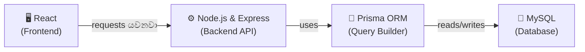
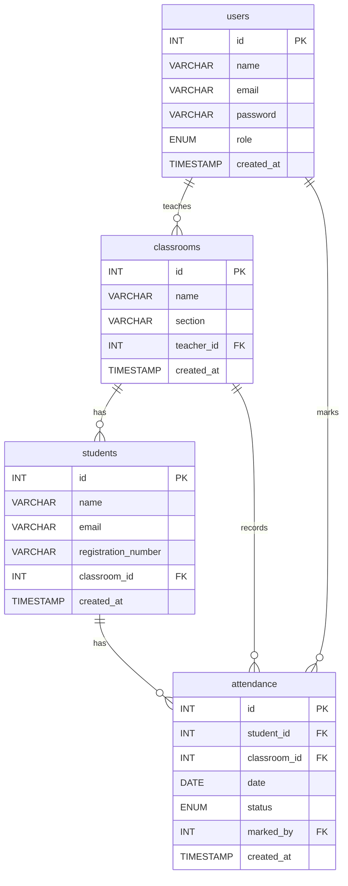

# 📚 Student Attendance Management System — Database Guide

> **designHer Bootcamp එකේ Day 1**
> අද අපි මුල ඉඳන්ම MySQL database එකක් design කරලා build කරන විදිහ ඉගෙනගන්නවා!

---

## 📖 Table of Contents

1. [Project Overview & Tech Stack](#1--project-overview--tech-stack)
2. [Introduction to Databases](#2--introduction-to-databases)
3. [Understanding Relationships (Crow's Foot Notation)](#3--understanding-relationships-crows-foot-notation)
4. [Database Design (ERD)](#4--database-design-erd)
5. [Step-by-Step Table Creation](#5--step-by-step-table-creation)
6. [Adding Sample Data](#6--adding-sample-data)
7. [Fetching Data (SELECT Queries)](#7--fetching-data-select-queries)

---

## 1. 🎯 Project Overview & Tech Stack

### What are we building? (අපි මොකක්ද මේ හදන්නේ?)

අපි හදන්නේ **Student Attendance Management System** එකක්. මේක හරියට digital attendance register එකක් වගේ කියලා හිතන්න.

- **Admins** ලට classrooms සහ teacher accounts හදන්න පුළුවන්.
- **Teachers** ලව classrooms වලට assign කරනවා. එයාලට students ලව add කරන්න පුළුවන්.
- **Teachers** ලා හැමදාම attendance mark කරනවා — Present, Absent, හෝ Late.
- එක student කෙනෙක්ට දවසකට තියෙන්න පුළුවන් **එක** attendance record එකයි.

### Our Tech Stack (අපේ Tech Stack එක)

මේ දවස් 3 ඇතුලත, අපි මේ technologies එකට පාවිච්චි කරනවා:



**How does this flow work? (මේක වැඩ කරන්නේ කොහොමද?)**

| Layer | What it does | Simple Analogy |
|-------|-------------|----------------|
| **React** | User interface එක. ඔයාට පේන සහ ඔයා click කරන දේවල්. | Restaurant එකක තියෙන *menu card* එක වගේ. |
| **Node.js & Express** | Backend server එක. එයා requests භාරගෙන responses යවනවා. | ඔයාගේ order එක කුස්සියට අරන් යන *waiter* වගේ. |
| **Prisma ORM** | Node.js එකට ලේසියෙන් database එකත් එක්ක කතා කරන්න උදව් කරන tool එකක්. | Waiter සහ chef (කෝකියා) අතර ඉන්න *translator* (පරිවර්තකයා) කෙනෙක් වගේ. |
| **MySQL** | Database එක. අපේ ඔක්කොම data ස්ථිරවම (permanently) store කරන්නේ මෙතන. | ඔක්කොම කළමනා තියාගෙන ඉන්න *කුස්සියේ ගබඩාව (storage room)* වගේ. |

> **අද (Day 1)**, අපි අවධානය යොමු කරන්නේ **MySQL Database** layer එක ගැන විතරයි. අපි tables design කරනවා, data ඇතුලත් කරනවා, සහ queries ලියනවා.

---

## 2. 🗄️ Introduction to Databases

### What is a Database? (Database එකක් කියන්නේ මොකක්ද?)

Database එකක් කියන්නේ අපි data පිළිවෙලකට (organized විදිහට) **store කරන** තැනක්. මේක හරියට server එකක save කරලා තියෙන **ලොකු Excel file එකක්** වගේ කියලා හිතන්න.

### What is a Relational Database? (Relational Database එකක් කියන්නේ මොකක්ද?)

**Relational database** එකක් data store කරන්නේ **tables** විදිහටයි. මේ tables එකිනෙකට **connect කරන්න (සම්බන්ධ කරන්න)** පුළුවන්. MySQL කියන්නේ relational database එකක්.

### What is a Table? (Table එකක් කියන්නේ මොකක්ද?)

Table එකක් පේන්නේ හරියට spreadsheet එකක් වගේ. ඒකෙ **rows** සහ **columns** තියෙනවා.

| id | name | email |
|----|------|-------|
| 1 | Nimal | nimal@school.com |
| 2 | Sanduni | sanduni@school.com |

- හැම **column** එකක්ම මොකක් හරි information වර්ගයක් (උදාහරණයක් විදිහට `name`, `email`).
- හැම **row** එකක්ම එක record එකක් (උදාහරණයක් විදිහට එක teacher කෙනෙක්).

### What is a Primary Key (PK)? (Primary Key එකක් කියන්නේ මොකක්ද?)

Primary Key එකක් කියන්නේ හැම row එකකටම තියෙන **unique ID** එකක්. කවදාවත් rows දෙකකට එකම Primary Key එක තියෙන්න බෑ.

> 🎯 **Analogy:** ඔයාගේ **National ID Card number (ජාතික හැඳුනුම්පත් අංකය)** ගැන හිතන්න. හැම කෙනෙක්ටම තියෙන්නේ වෙනස් අංකයක්. ඒක තමයි Primary Key එකක් කියන්නේ.

අපේ tables වල, `id` column එක තමයි Primary Key එක.

### What is a Foreign Key (FK)? (Foreign Key එකක් කියන්නේ මොකක්ද?)

Foreign Key එකක් කියන්නේ වෙන table එකක Primary Key එකට **point කරන (පෙන්වන)** column එකකට. ඒකෙන් tables දෙකක් අතර **connection එකක්** හදනවා.

> 🎯 **Analogy:** ඔයාගේ school ID card එකේ "Class" කියලා field එකක් තියෙනවා. ඒ class name එකෙන් ඉස්කෝලේ තියෙන ඇත්ත class එකකට **point කරනවා**. ඒක තමයි Foreign Key එකක් කියන්නේ.

**Example:** `students` table එකේ `classroom_id` column එකක් තියෙනවා. මේකෙන් `classrooms` table එකේ `id` එකට point කරනවා. දැන් අපි දන්නවා මොන student ඉන්නේ මොන classroom එකේද කියලා.

---

## 3. 🔗 Understanding Relationships (Crow's Foot Notation)

අපේ database design එක බලන්න කලින්, database diagram එකක් **කියවන්නේ කොහොමද** කියලා ඉගෙනගනිමු.

අපි පාවිච්චි කරන්නේ **Crow's Foot Notation** කියලා ක්‍රමයක්. ඒකෙන් පෙන්නනවා tables එකිනෙකට connect වෙලා තියෙන්නේ කොහොමද කියලා.

### The Three Types of Relationships (සම්බන්ධතා වර්ග 3)

#### 1️⃣ One-to-One (1:1)

Table A එකේ තියෙන එක record එකක් Table B එකේ තියෙන **හරියටම එක** record එකකට connect වෙනවා.

> 🎯 **Analogy:** එක මනුස්සයෙක්ට තියෙන්නේ **එක** passport එකයි. එක passport එකක් අයිති **එක** මනුස්සයෙක්ට විතරයි.

#### 2️⃣ One-to-Many (1:N)

Table A එකේ තියෙන එක record එකක් Table B එකේ තියෙන **ගොඩක් (many)** records වලට connect වෙනවා.

> 🎯 **Analogy:** එක **අම්මා කෙනෙක්ට** ළමයි **ගොඩක්** ඉන්න පුළුවන්. හැබැයි හැම ළමයෙක්ටම ඉන්නේ **එක** අම්මා කෙනෙක් විතරයි.

මේක තමයි **ගොඩක්ම පාවිච්චි වෙන** relationship එක. අපි මේක අපේ system එකේ ගොඩක් පාවිච්චි කරනවා!

#### 3️⃣ Many-to-Many (M:N)

Table A එකේ තියෙන ගොඩක් records Table B එකේ තියෙන **ගොඩක්** records වලට connect වෙනවා.

> 🎯 **Analogy:** එක **student** කෙනෙක්ට clubs **ගොඩකට** යන්න පුළුවන්. එක **club** එකක students ලා **ගොඩක්** ඉන්න පුළුවන්.

> 💡 Database එකකදි, අපි Many-to-Many handle කරන්නේ මේ දෙක මැදට **තුන්වෙනි table එකක්** (junction table කියලා කියනවා) හදලයි.

### How to Read Crow's Foot Symbols (Crow's Foot සලකුණු කියවන්නේ කොහොමද)

| Symbol | Meaning |
|--------|---------|
| `\|\|` (තනි ඉරක්) | **One** (හරියටම එකයි) |
| `o\|` | **Zero or One** (බිංදුවක් හෝ එකයි) |
| `\|{` or `}o` | **One or Many** (එකක් හෝ ගොඩක්) |
| `o{` | **Zero or Many** (බිංදුවක් හෝ ගොඩක්) |

ඔයාට `||--o{` කියලා පෙනුණොත් ඒකේ තේරුම: **One** connects to **Zero or Many** කියන එකයි.

---

## 4. 📊 Database Design (ERD)

ERD කියන්නේ **Entity-Relationship Diagram**. ඒක අපේ database design එක පෙන්නන පින්තූරයක් වගේ.

මෙන්න අපේ Attendance System එකේ ERD එක:



### Relationships in Our System Explained (අපේ System එකේ Relationships තේරුම් ගනිමු)

| Relationship | Meaning |
|-------------|---------|
| **users → classrooms** | එක teacher කෙනෙක්ට classrooms **ගොඩක්** උගන්වන්න පුළුවන්. හැම classroom එකකටම ඉන්නේ **එක** teacher කෙනයි. |
| **classrooms → students** | එක classroom එකක students ලා **ගොඩක්** ඉන්න පුළුවන්. හැම student කෙනෙක්ම අයිති **එක** classroom එකකටයි. |
| **students → attendance** | එක student කෙනෙක්ට attendance records **ගොඩක්** තියෙන්න පුළුවන් (දවසකට එක ගානේ). හැම attendance record එකක්ම අයිති **එක** student කෙනෙක්ටයි. |
| **classrooms → attendance** | එක classroom එකක attendance records **ගොඩක්** තියෙන්න පුළුවන්. හැම record එකක්ම අයිති **එක** classroom එකකටයි. |
| **users → attendance** | එක teacher කෙනෙක්ට attendance records **ගොඩක්** mark කරන්න පුළුවන්. හැම record එකක්ම mark කරන්නේ **එක** teacher කෙනෙක්. |

---

## 5. 🛠️ Step-by-Step Table Creation

> 💡 **මේ section එක පාවිච්චි කරන්නේ කොහොමද:**
> 1. **MySQL Workbench** open කරන්න.
> 2. පල්ලෙහා තියෙන හැම code block එකක්ම copy කරගන්න.
> 3. ඒක paste කරලා run කරන්න ⚡ (lightning bolt) button එක click කරන්න.
> 4. හැම line එකකින්ම මොකක්ද කරන්නේ කියලා තේරුම් ගන්න පල්ලෙහා තියෙන විස්තරය කියවන්න.

### Step 0: Create and Select the Database

```sql
CREATE DATABASE IF NOT EXISTS attendance_system_db;
USE attendance_system_db;
```

| Line | What it does |
|------|-------------|
| `CREATE DATABASE IF NOT EXISTS attendance_system_db;` | `attendance_system_db` කියලා අලුත් database එකක් හදනවා. `IF NOT EXISTS` කෑල්ලෙන් කියන්නේ: මේක දැනටමත් නැත්නම් විතරක් හදන්න කියන එකයි. මේකෙන් errors එන එක නවත්තනවා. |
| `USE attendance_system_db;` | MySQL එකට කියනවා: "මට දැන් මේ database එක ඇතුලේ වැඩ කරන්න ඕනේ." මින්පස්සේ run කරන ඔක්කොම commands run වෙන්නේ `attendance_system_db` එක ඇතුලෙයි. |

---

### Step 1: Create the `users` Table

```sql
CREATE TABLE users (
    id INT AUTO_INCREMENT PRIMARY KEY,
    name VARCHAR(100) NOT NULL,
    email VARCHAR(150) NOT NULL UNIQUE,
    password VARCHAR(255) NOT NULL,
    role ENUM('admin', 'teacher') NOT NULL DEFAULT 'teacher',
    created_at TIMESTAMP DEFAULT CURRENT_TIMESTAMP
);
```

**Line-by-line explanation (පේළියෙන් පේළියට විස්තර කිරීම):**

| Line | What it does |
|------|-------------|
| `id INT AUTO_INCREMENT PRIMARY KEY` | `id` column එකක් හදනවා. `INT` = පූර්ණ සංඛ්‍යාවක්. `AUTO_INCREMENT` = MySQL එකෙන් ඉබේම ඊළඟ අංකය දෙනවා (1, 2, 3...). `PRIMARY KEY` = මේක තමයි හැම row එකකටම තියෙන unique ID එක. |
| `name VARCHAR(100) NOT NULL` | `name` column එකක් හදනවා. `VARCHAR(100)` = අකුරු 100ක් දක්වා තියෙන text එකක්. `NOT NULL` = මේ field එක හිස්ව තියන්න **බෑ**. |
| `email VARCHAR(150) NOT NULL UNIQUE` | `UNIQUE` = users ලා දෙන්නෙක්ට එකම email එක තියෙන්න බෑ. |
| `password VARCHAR(255) NOT NULL` | Password එක store කරනවා. අපි `VARCHAR(255)` පාවිච්චි කරන්නේ hash කරපු passwords ගොඩක් දිග නිසයි. |
| `role ENUM('admin', 'teacher') NOT NULL DEFAULT 'teacher'` | `ENUM` = value එක වෙන්න පුළුවන් `'admin'` හෝ `'teacher'` **විතරයි**. වෙන මුකුත් බෑ. `DEFAULT 'teacher'` = role එකක් දුන්නේ නැත්නම්, ඒක ඉබේම `'teacher'` වෙනවා. |
| `created_at TIMESTAMP DEFAULT CURRENT_TIMESTAMP` | Record එක හදපු වෙලාව store කරනවා. `DEFAULT CURRENT_TIMESTAMP` = MySQL එකෙන් ඉබේම දැනට තියෙන දවසයි වෙලාවයි save කරනවා. |

---

### Step 2: Create the `classrooms` Table

```sql
CREATE TABLE classrooms (
    id INT AUTO_INCREMENT PRIMARY KEY,
    name VARCHAR(100) NOT NULL,
    section VARCHAR(50),
    teacher_id INT NOT NULL,
    created_at TIMESTAMP DEFAULT CURRENT_TIMESTAMP,
    FOREIGN KEY (teacher_id) REFERENCES users(id) ON DELETE CASCADE
);
```

**Line-by-line explanation:**

| Line | What it does |
|------|-------------|
| `id INT AUTO_INCREMENT PRIMARY KEY` | කලින් වගේමයි — හැම classroom එකකටම unique ID එකක්. |
| `name VARCHAR(100) NOT NULL` | Classroom එකේ නම (උදා: "Batch 2026 - Web Development"). |
| `section VARCHAR(50)` | අමතර section විස්තර (උදා: "Morning", "Evening"). මෙතන `NOT NULL` නැති නිසා මේක හිස්ව තියන්න **පුළුවන්**. |
| `teacher_id INT NOT NULL` | මේ classroom එකට දාලා ඉන්න teacher ගේ `id` එක store කරනවා. |
| `FOREIGN KEY (teacher_id) REFERENCES users(id)` | මේකෙන් MySQL එකට කියනවා: "මේ `teacher_id` value එක අනිවාර්යයෙන්ම `users` table එකේ `id` column එකේ **තියෙන්නම ඕනේ**." මේක තමයි tables දෙක අතර තියෙන **connection** එක. |
| `ON DELETE CASCADE` | `users` table එකෙන් teacher කෙනෙක්ව delete කරොත්, එයාගේ classrooms ඔක්කොමත් **ඉබේම delete වෙනවා**. |

---

### Step 3: Create the `students` Table

```sql
CREATE TABLE students (
    id INT AUTO_INCREMENT PRIMARY KEY,
    name VARCHAR(100) NOT NULL,
    email VARCHAR(150) NOT NULL UNIQUE,
    registration_number VARCHAR(50) NOT NULL UNIQUE,
    classroom_id INT NOT NULL,
    created_at TIMESTAMP DEFAULT CURRENT_TIMESTAMP,
    FOREIGN KEY (classroom_id) REFERENCES classrooms(id) ON DELETE CASCADE
);
```

**Line-by-line explanation:**

| Line | What it does |
|------|-------------|
| `id INT AUTO_INCREMENT PRIMARY KEY` | හැම student කෙනෙක්ටම unique ID එකක්. |
| `name VARCHAR(100) NOT NULL` | Student ගේ සම්පූර්ණ නම. හිස්ව තියන්න බෑ. |
| `email VARCHAR(150) NOT NULL UNIQUE` | Student ගේ email එක. Unique වෙන්න ඕනේ. |
| `registration_number VARCHAR(50) NOT NULL UNIQUE` | හැම student කෙනෙක්ටම තියෙන විශේෂ code එකක් (උදා: "STU-2026-001"). Unique වෙන්න ඕනේ. |
| `classroom_id INT NOT NULL` | මේ student ඉන්නේ මොන classroom එකේද කියන එක. |
| `FOREIGN KEY (classroom_id) REFERENCES classrooms(id) ON DELETE CASCADE` | `classrooms` table එකට connect කරනවා. Classroom එකක් delete කරොත්, ඒකේ ඉන්න students ලත් අයින් වෙනවා. |

---

### Step 4: Create the `attendance` Table

```sql
CREATE TABLE attendance (
    id INT AUTO_INCREMENT PRIMARY KEY,
    student_id INT NOT NULL,
    classroom_id INT NOT NULL,
    date DATE NOT NULL,
    status ENUM('present', 'absent', 'late') NOT NULL,
    marked_by INT NOT NULL,
    created_at TIMESTAMP DEFAULT CURRENT_TIMESTAMP,
    FOREIGN KEY (student_id) REFERENCES students(id) ON DELETE CASCADE,
    FOREIGN KEY (classroom_id) REFERENCES classrooms(id) ON DELETE CASCADE,
    FOREIGN KEY (marked_by) REFERENCES users(id) ON DELETE CASCADE,
    UNIQUE KEY unique_attendance (student_id, date)
);
```

**Line-by-line explanation:**

| Line | What it does |
|------|-------------|
| `student_id INT NOT NULL` | මේ attendance record එක කාගෙද කියන එක. |
| `classroom_id INT NOT NULL` | මේ attendance එක mark කරේ මොන classroom එකේද කියන එක. |
| `date DATE NOT NULL` | Attendance ගත්ත දවස (උදා: "2026-04-28"). |
| `status ENUM('present', 'absent', 'late') NOT NULL` | Attendance status එක. මේ values 3 විතරයි පාවිච්චි කරන්න පුළුවන්. |
| `marked_by INT NOT NULL` | මේ attendance එක mark කරපු teacher ව පෙන්නනවා. `users.id` එකට point කරනවා. |
| `FOREIGN KEY (student_id) REFERENCES students(id) ON DELETE CASCADE` | `students` table එකට connect කරනවා. |
| `FOREIGN KEY (classroom_id) REFERENCES classrooms(id) ON DELETE CASCADE` | `classrooms` table එකට connect කරනවා. |
| `FOREIGN KEY (marked_by) REFERENCES users(id) ON DELETE CASCADE` | `users` table එකට (teacher ට) connect කරනවා. |
| `UNIQUE KEY unique_attendance (student_id, date)` | ⭐ **ගොඩක් වැදගත්!** මේකෙන් තහවුරු කරනවා එක student කෙනෙක්ට දවසකට තියෙන්න පුළුවන් **එක** attendance record එකක් විතරයි කියලා. ඔයා එකම දවසේ එකම student ට දෙවෙනි record එකක් දාන්න හැදුවොත්, MySQL එකෙන් error එකක් දෙනවා. |

---

## 6. 📝 Adding Sample Data

දැන් අපි queries practice කරන්න පුළුවන් වෙන්න fake data ටිකක් add කරමු. පල්ලෙහා තියෙන හැම block එකක්ම copy කරලා MySQL Workbench එකේ paste කරන්න.

> ⚠️ **Important:** මේවා run කරන්න ඕනේ ඔක්කොම tables හැදුවට **පස්සේ**. Foreign Keys තියෙන නිසා මේවා දාන පිළිවෙල ගොඩක් වැදගත්!

### Insert Users

```sql
INSERT INTO users (name, email, password, role) VALUES
('Amara Silva', 'amara@school.com', '$2b$10$isLvFMyeuL4eyEczQYTiVOKLdsauzrvKPq/iBj4eJXTgqPEwx4Ry2', 'admin'),
('Nimal Perera', 'nimal@school.com', '$2b$10$VxB/Z1jcdUDt2rNG7V6bWenRA0afyXCPPxyMwRJ6RxX7gKWQzkl4e', 'teacher'),
('Sanduni Fernando', 'sanduni@school.com', '$2b$10$VxB/Z1jcdUDt2rNG7V6bWenRA0afyXCPPxyMwRJ6RxX7gKWQzkl4e', 'teacher');
```

**What's happening (මොකද වෙන්නේ):**
- අපි users ලා 3 දෙනෙක්ව add කරනවා: admin කෙනෙක් සහ teachers ලා 2 දෙනෙක්.
- `Amara` තමයි admin. `Nimal` සහ `Sanduni` කියන්නේ teachers ලා.
- අපි `id` එක type කරන්නේ නෑ — MySQL එකෙන් ඉබේම ඒක දෙනවා (1, 2, 3).

**🔐 About the passwords:**

Passwords ටික පේන්නේ නිකම්ම random අකුරු ගොඩක් වගේ. ඒකට හේතුව තමයි ඒවා **bcrypt** කියන library එක පාවිච්චි කරලා **hash** කරලා තියෙන්නේ. අපි **කවදාවත්** plain text passwords database එකක store කරන්නේ නෑ. ඒක ලොකු security ප්‍රශ්නයක්.

අපේ Node.js backend එකේදි (Day 2), අපි passwords save කරන්න කලින් hash කරන්න `bcrypt` npm package එක පාවිච්චි කරනවා.

Testing වලට පාවිච්චි කරන්න පුළුවන් **plain text passwords** ටික මෙන්න:

| User | Email | Plain Text Password |
|------|-------|-------------------|
| Amara (Admin) | amara@school.com | `admin123` |
| Nimal (Teacher) | nimal@school.com | `teacher123` |
| Sanduni (Teacher) | sanduni@school.com | `teacher123` |

> 💡 මේ hashes ජෙනරේට් කරලා තියෙන්නේ bcrypt එකේ **10 salt rounds** පාවිච්චි කරලයි. අපි login system එක හදද්දි, type කරන password එක save කරලා තියෙන hash එකට සමානද කියලා බලන්න `bcrypt.compare()` පාවිච්චි කරනවා.

### Insert Classrooms

```sql
INSERT INTO classrooms (name, section, teacher_id) VALUES
('Batch 2026 - Web Development', 'Morning', 2),
('Batch 2026 - Mobile Development', 'Evening', 3);
```

**What's happening:**
- Classroom 1 එක assign කරලා තියෙන්නේ `teacher_id = 2` (Nimal) ට.
- Classroom 2 එක assign කරලා තියෙන්නේ `teacher_id = 3` (Sanduni) ට.

### Insert Students

```sql
INSERT INTO students (name, email, registration_number, classroom_id) VALUES
('Tharindu Jayasinghe', 'tharindu@student.com', 'STU-2026-001', 1),
('Nethmi Dissanayake', 'nethmi@student.com', 'STU-2026-002', 1),
('Kavinda Rajapaksha', 'kavinda@student.com', 'STU-2026-003', 2),
('Ishara Madushani', 'ishara@student.com', 'STU-2026-004', 2);
```

**What's happening:**
- Tharindu සහ Nethmi ඉන්නේ Classroom 1 එකේ (Web Development).
- Kavinda සහ Ishara ඉන්නේ Classroom 2 එකේ (Mobile Development).

### Insert Attendance Records

```sql
-- Day 1: Monday, April 28
INSERT INTO attendance (student_id, classroom_id, date, status, marked_by) VALUES
(1, 1, '2026-04-28', 'present', 2),
(2, 1, '2026-04-28', 'late', 2),
(3, 2, '2026-04-28', 'present', 3),
(4, 2, '2026-04-28', 'absent', 3);

-- Day 2: Tuesday, April 29
INSERT INTO attendance (student_id, classroom_id, date, status, marked_by) VALUES
(1, 1, '2026-04-29', 'present', 2),
(2, 1, '2026-04-29', 'present', 2),
(3, 2, '2026-04-29', 'late', 3),
(4, 2, '2026-04-29', 'present', 3);

-- Day 3: Wednesday, April 30
INSERT INTO attendance (student_id, classroom_id, date, status, marked_by) VALUES
(1, 1, '2026-04-30', 'present', 2),
(2, 1, '2026-04-30', 'absent', 2),
(3, 2, '2026-04-30', 'present', 3),
(4, 2, '2026-04-30', 'present', 3);
```

**What's happening:**
- අපි දවස් 3කට attendance add කරා.
- `marked_by = 2` කියන්නේ Teacher Nimal තමයි mark කරේ. `marked_by = 3` කියන්නේ Teacher Sanduni තමයි mark කරේ.
- දවසින් දවසට students ලගේ statuses වෙනස් වෙනවා — සමහරු present, සමහරු late, සමහරු absent.

---

## 7. 🔍 Fetching Data (SELECT Queries)

දැන් තමයි හොඳම හරිය! අපි දැන් add කරපු data ටික **read කරමු**. මේකට අපි පාවිච්චි කරන්නේ `SELECT` queries.

---

### 🟢 Part A: Basic SELECT Queries

මේවා **එක table එකකින්** data ගන්න පාවිච්චි කරන සරල queries.

---

**Query 1: Get all users (ඔක්කොම users ලව ගන්නවා)**

```sql
SELECT * FROM users;
```

| Part | Meaning |
|------|---------|
| `SELECT *` | **ඔක්කොම columns** තෝරගන්නවා. `*` එකෙන් කියන්නේ "හැමදේම" කියන එක. |
| `FROM users` | `users` table එකෙන්. |

---

**Query 2: Get only teacher names and emails (Teachers ලගේ නම් සහ emails විතරක් ගන්නවා)**

```sql
SELECT name, email FROM users WHERE role = 'teacher';
```

| Part | Meaning |
|------|---------|
| `SELECT name, email` | `name` සහ `email` columns විතරක් ගන්නවා (ඔක්කොම නෙවෙයි). |
| `WHERE role = 'teacher'` | **Filter:** role එක `'teacher'` වෙන rows විතරක් පෙන්නනවා. |

---

**Query 3: Get all students (ඔක්කොම students ලව ගන්නවා)**

```sql
SELECT * FROM students;
```

මේකෙන් හැම student කෙනෙක්ම එයාලගේ ඔක්කොම විස්තර එක්කම අපිට දෙනවා.

---

**Query 4: Find a student by registration number (Registration number එකෙන් student කෙනෙක්ව හොයනවා)**

```sql
SELECT * FROM students WHERE registration_number = 'STU-2026-001';
```

| Part | Meaning |
|------|---------|
| `WHERE registration_number = 'STU-2026-001'` | Registration number එක හරියටම ගැලපෙන student ව හොයනවා. |

---

**Query 5: Get all attendance records for a specific date (නිශ්චිත දවසකට අදාල ඔක්කොම attendance records ගන්නවා)**

```sql
SELECT * FROM attendance WHERE date = '2026-04-28';
```

මේකෙන් April 28 වෙනිදාට අදාල ඔක්කොම attendance records පෙන්නනවා.

---

**Query 6: Count total students (මුළු students ගාණ ගණන් කරනවා)**

```sql
SELECT COUNT(*) AS total_students FROM students;
```

| Part | Meaning |
|------|---------|
| `COUNT(*)` | Rows ගාණ ගණන් කරනවා. |
| `AS total_students` | Result column එක `total_students` කියලා rename කරනවා, එතකොට කියවන්න ලේසියි. |

---

**Query 7: Get students ordered by name (A to Z) (නමේ පිළිවෙලට A ඉඳන් Z ට students ලව ගන්නවා)**

```sql
SELECT * FROM students ORDER BY name ASC;
```

| Part | Meaning |
|------|---------|
| `ORDER BY name ASC` | `name` එක අනුව **ආරෝහණ (ascending)** පිළිවෙලට (A → Z) results ටික sort කරනවා. Z → A ඕනේ නම් `DESC` පාවිච්චි කරන්න. |

---

**Query 8: Count how many times each status appears (හැම status එකක්ම කී පාරක් තියෙනවද කියලා ගණන් කරනවා)**

```sql
SELECT status, COUNT(*) AS count FROM attendance GROUP BY status;
```

| Part | Meaning |
|------|---------|
| `GROUP BY status` | එකම `status` එක තියෙන ඔක්කොම rows එකට එකතු (group) කරනවා. |
| `COUNT(*)` | හැම group එකකම rows කීයක් තියෙනවද කියලා ගණන් කරනවා. |

මේකෙන් `present: 8, absent: 2, late: 2` වගේ ප්‍රතිඵලයක් පෙන්නයි.

---

### 🔵 Part B: JOIN Queries (Combining Tables)

JOINs වලින් අපිට **tables දෙකකින් හෝ ඊට වැඩි ගාණකින් data එකට එකතු කරන්න** පුළුවන්. මේක ගොඩක් ප්‍රබලයි!

> 🎯 **Analogy:** ඔයා ගාව Excel sheets දෙකක් තියෙනවා කියලා හිතන්න — එකක student names, අනිත් එකේ classroom names. JOIN එකක් කියන්නේ හැම student කෙනෙක් ගාවටම අදාල classroom name එක ගේන්න VLOOKUP පාවිච්චි කරනවා වගේ වැඩක්.

ගොඩක්ම පාවිච්චි වෙන ජාතිය තමයි `INNER JOIN`. ඒකෙන් tables දෙකේම **ගැලපෙන data (matching data)** තියෙන rows විතරක් අපිට දෙනවා.

**Basic JOIN syntax:**
```sql
SELECT columns
FROM table_a
INNER JOIN table_b ON table_a.foreign_key = table_b.primary_key;
```

---

**Query 1: Get students with their classroom name (Students ලව එයාලගේ classroom name එකත් එක්ක ගන්නවා)**

```sql
SELECT
    students.name AS student_name,
    students.registration_number,
    classrooms.name AS classroom_name
FROM students
INNER JOIN classrooms ON students.classroom_id = classrooms.id;
```

| Part | Meaning |
|------|---------|
| `students.name AS student_name` | `students` table එකෙන් `name` එක ගන්නවා, ඒකට `student_name` කියලා කියනවා. |
| `classrooms.name AS classroom_name` | `classrooms` table එකෙන් `name` එක ගන්නවා, ඒකට `classroom_name` කියලා කියනවා. |
| `INNER JOIN classrooms ON students.classroom_id = classrooms.id` | `classroom_id` එක classroom එකේ `id` එකට සමාන වෙන තැනින් tables දෙක connect කරනවා. |

---

**Query 2: Get classrooms with their teacher name (Classrooms ටික ඒවායේ teacher ගේ නමත් එක්ක ගන්නවා)**

```sql
SELECT
    classrooms.name AS classroom_name,
    classrooms.section,
    users.name AS teacher_name
FROM classrooms
INNER JOIN users ON classrooms.teacher_id = users.id;
```

මේකෙන් `classrooms` එකයි `users` එකයි connect කරලා මොන teacher ද මොන පන්තියට උගන්වන්නේ කියලා පෙන්නනවා.

---

**Query 3: Get attendance records with student names (Attendance records ටික student ගේ නමත් එක්ක ගන්නවා)**

```sql
SELECT
    attendance.date,
    students.name AS student_name,
    attendance.status
FROM attendance
INNER JOIN students ON attendance.student_id = students.id
ORDER BY attendance.date;
```

දැන් `student_id = 1` කියලා පේනවා වෙනුවට, අපිට ඇත්ත student ගේ නම පේනවා!

---

**Query 4: Get full attendance details (සම්පූර්ණ attendance විස්තර ගන්නවා - student + classroom + teacher)**

```sql
SELECT
    attendance.date,
    students.name AS student_name,
    classrooms.name AS classroom_name,
    attendance.status,
    users.name AS marked_by_teacher
FROM attendance
INNER JOIN students ON attendance.student_id = students.id
INNER JOIN classrooms ON attendance.classroom_id = classrooms.id
INNER JOIN users ON attendance.marked_by = users.id
ORDER BY attendance.date, students.name;
```

| Part | Meaning |
|------|---------|
| Multiple `INNER JOIN` | අපි **tables 4ක්** එකට join කරනවා! හැම JOIN එකකින්ම අලුත් විස්තර එකතු වෙනවා. |
| `ORDER BY attendance.date, students.name` | මුලින්ම date එක අනුව sort කරලා, ඊටපස්සේ student ගේ නම අනුව sort කරනවා. |

> 💡 අපේ **Node.js backend** එක සම්පූර්ණ attendance reports පෙන්නන්න පාවිච්චි කරන්නේ මේ වගේ query එකක් තමයි.

---

**Query 5: Get attendance for a specific student (නිශ්චිත student කෙනෙක්ගේ attendance ගන්නවා)**

```sql
SELECT
    attendance.date,
    attendance.status,
    classrooms.name AS classroom_name
FROM attendance
INNER JOIN classrooms ON attendance.classroom_id = classrooms.id
WHERE attendance.student_id = 1
ORDER BY attendance.date;
```

මේකෙන් `id = 1` (Tharindu) කියන student ගේ ඔක්කොම attendance records අපිට දෙනවා.

---

**Query 6: Count attendance status for each student (හැම student කෙනෙක්ගේම attendance status එක ගණන් කරනවා)**

```sql
SELECT
    students.name AS student_name,
    attendance.status,
    COUNT(*) AS total
FROM attendance
INNER JOIN students ON attendance.student_id = students.id
GROUP BY students.name, attendance.status
ORDER BY students.name;
```

මේකෙන් පෙන්නනවා හැම student කෙනෙක්ම කී පාරක් present වුණාද, absent වුණාද, නැත්නම් late වුණාද කියලා. Reports හදද්දි මේක ගොඩක් ප්‍රයෝජනවත්!

---

**Query 7: Get all students in a specific teacher's classrooms (නිශ්චිත teacher කෙනෙක්ගේ classrooms වල ඉන්න ඔක්කොම students ලව ගන්නවා)**

```sql
SELECT
    students.name AS student_name,
    students.registration_number,
    classrooms.name AS classroom_name,
    users.name AS teacher_name
FROM students
INNER JOIN classrooms ON students.classroom_id = classrooms.id
INNER JOIN users ON classrooms.teacher_id = users.id
WHERE users.id = 2;
```

මේකෙන් Teacher Nimal ගේ (`id = 2`) classrooms වල ඉන්න ඔක්කොම students ලව හොයනවා.

---

**Query 8: Get today's absent students with their classroom info (අද absent වුණු students ලව එයාලගේ classroom විස්තරත් එක්ක ගන්නවා)**

```sql
SELECT
    students.name AS student_name,
    students.registration_number,
    classrooms.name AS classroom_name
FROM attendance
INNER JOIN students ON attendance.student_id = students.id
INNER JOIN classrooms ON attendance.classroom_id = classrooms.id
WHERE attendance.date = '2026-04-30'
  AND attendance.status = 'absent';
```

| Part | Meaning |
|------|---------|
| `WHERE attendance.date = '2026-04-30'` | අද දවසට අදාලව filter කරනවා. |
| `AND attendance.status = 'absent'` | `AND` එකෙන් දෙවෙනි condition එකකුත් එකතු කරනවා. මේ දෙකම ඇත්ත (true) වෙන්න ඕනේ. |

> 💡 අපේ backend එකේදි, අපි `'2026-04-30'` වෙනුවට code එක පාවිච්චි කරලා අද ඇත්ත දවස දානවා.

---

## 🎉 You Did It!

ඔයා මේ දේවල් ඉගෙනගත්තා:
- ✅ Relational database එකක් කියන්නේ මොකක්ද
- ✅ ERD diagram එකක් කියවන්නේ කොහොමද
- ✅ Keys සහ constraints එක්ක tables හදන්නේ කොහොමද
- ✅ Data insert කරන්නේ කොහොමද
- ✅ SELECT පාවිච්චි කරලා data query කරන්නේ කොහොමද
- ✅ JOIN පාවිච්චි කරලා tables එකට එකතු කරන්නේ කොහොමද

> **Next up (Day 2):** අපි Node.js + Express backend එක හදලා, raw SQL ලියනවා වෙනුවට JavaScript පාවිච්චි කරලා මේ database එකත් එක්ක කතා කරන්න **Prisma ORM** එක පාවිච්චි කරනවා!

---

> Made with ❤️ for **designHer Bootcamp 2026**
