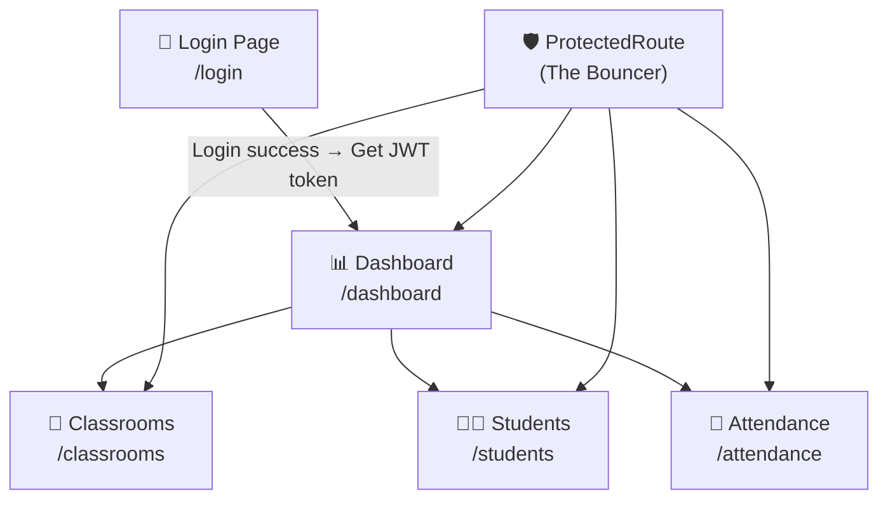
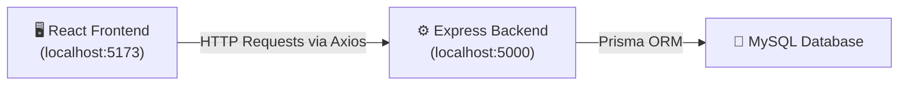
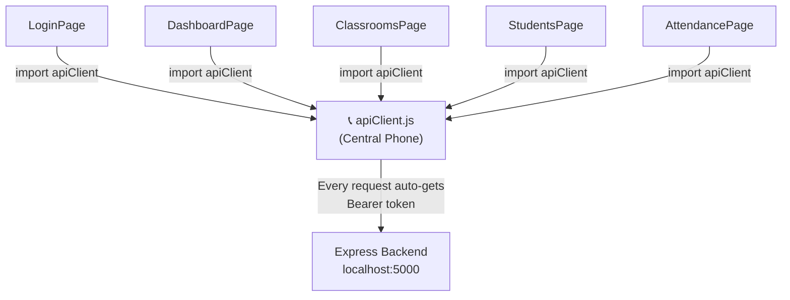
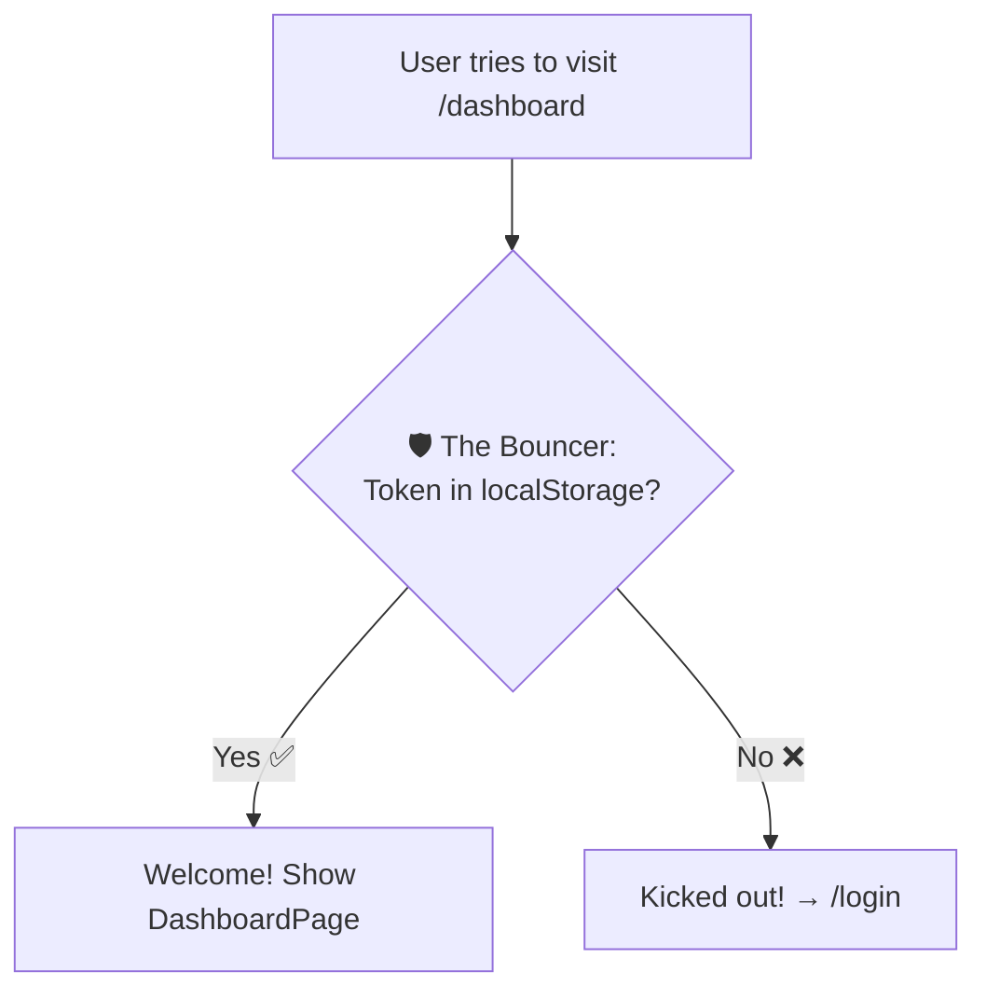
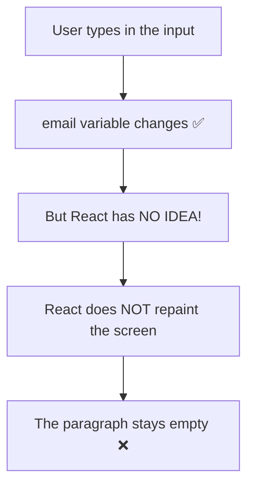
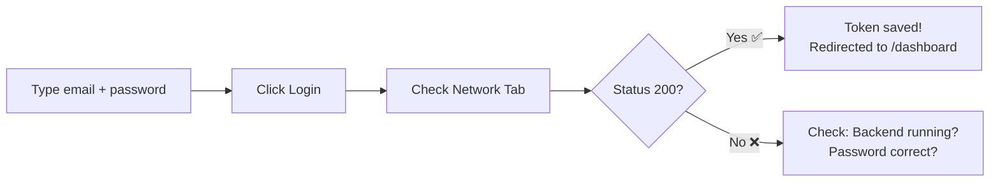
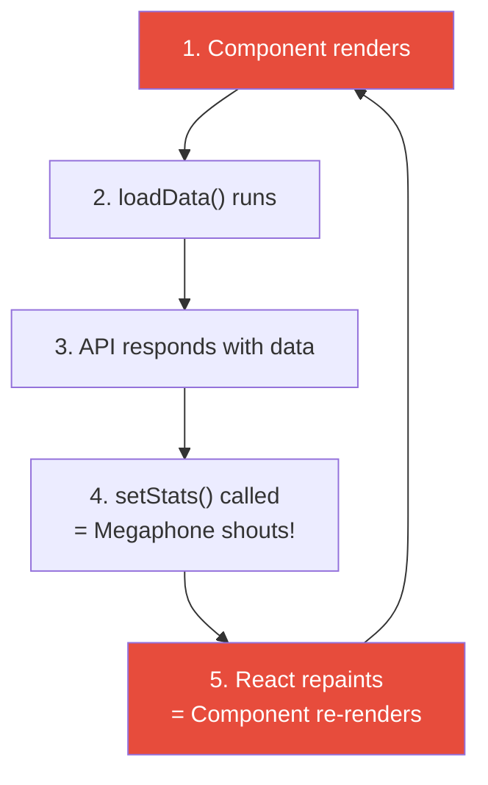
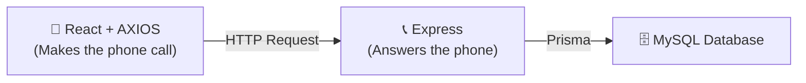
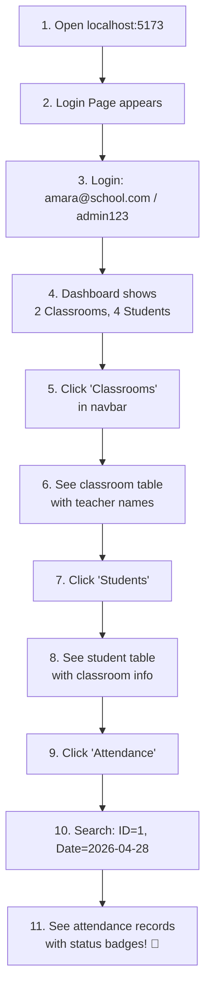
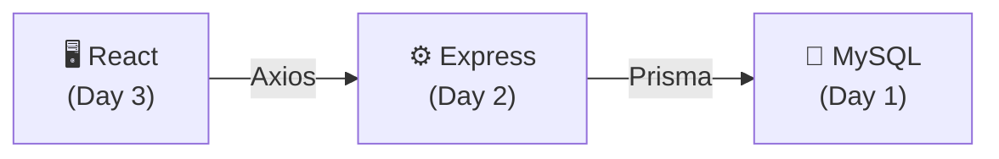

# 🎨 Day 3 — Building the React Frontend (Master Building Guide)

> **Day 3 of designHer 2.0 Bootcamp**
> Today we connect our React frontend to the backend API we built on Day 2!
> We will build this app **piece by piece**, testing each piece before moving on.

---

## 🗺️ Phase 1: The App Architecture & Setup

### The Full System — How Everything Connects



### How React Talks to Our Day 2 Backend



### Page-to-Endpoint Map

| Page File | What It Shows | HTTP Method | Backend Endpoint (Day 2) | Auth Needed? |
|-----------|--------------|-------------|-------------------------|-------------|
| `LoginPage.jsx` | Login form | POST | `/api/auth/login` | ❌ No |
| `DashboardPage.jsx` | Overview stats | GET | `/api/classrooms` + `/api/students` | ✅ Yes |
| `ClassroomsPage.jsx` | Classroom table | GET | `/api/classrooms` | ✅ Yes |
| `StudentsPage.jsx` | Student table | GET | `/api/students` | ✅ Yes |
| `AttendancePage.jsx` | Attendance search | GET | `/api/attendance/classroom/:id?date=...` | ✅ Yes |

### The Folder Structure — The LEGO Box Analogy

Imagine you buy a LEGO set. Inside the box, pieces are sorted into labelled bags. You don't throw 500 pieces into one bag — that would be chaos! Our folders are exactly the same:

```
frontend/src/
├── api/                    ← BAG 1: The "Phone" to call the backend
│   └── apiClient.js
├── components/             ← BAG 2: Reusable LEGO bricks (used on EVERY page)
│   ├── ProtectedRoute.jsx
│   └── Navbar.jsx
├── pages/                  ← BAG 3: Each finished "room" of the house
│   ├── LoginPage.jsx
│   ├── DashboardPage.jsx
│   ├── ClassroomsPage.jsx
│   ├── StudentsPage.jsx
│   └── AttendancePage.jsx
├── App.jsx                 ← The "instruction manual" (which room goes where)
├── App.css                 ← The paint and decorations
└── main.jsx                ← The foundation (starts everything)
```

| Folder | Purpose | LEGO Analogy |
|--------|---------|-------------|
| `api/` | Axios config (base URL + auto token) | The **phone** you use to call the backend |
| `components/` | Pieces used on MULTIPLE pages | **Standard bricks** — same shape, used everywhere |
| `pages/` | One file = one screen the user sees | Each **room** in the house |

### Install & Start

```bash
cd frontend
npm install
npm run dev
```

> ⚠️ **IMPORTANT:** You need TWO terminals running at the same time:
> - Terminal 1: `cd backend && npm run dev` (Port 5000)
> - Terminal 2: `cd frontend && npm run dev` (Port 5173)

---

## 🔌 Phase 2: The Infrastructure (The Hidden Helpers)

These files are "behind the scenes." The user never sees them, but they make everything work.

---

### 📁 File: `src/api/apiClient.js`

#### ❌ The Problem — Writing the Full URL Every Single Time

Without a centralized client, every page would repeat the same ugly code:

```javascript
// ❌ In ClassroomsPage — UGLY AND REPETITIVE
const token = localStorage.getItem("token");
const response = await axios.get("http://localhost:5000/api/classrooms", {
  headers: { Authorization: "Bearer " + token },
});

// ❌ In StudentsPage — SAME ugly code AGAIN!
const token = localStorage.getItem("token");
const response = await axios.get("http://localhost:5000/api/students", {
  headers: { Authorization: "Bearer " + token },
});
```

If your backend URL changes, you must update ALL 5 files. If you forget the token header on ONE page, that page breaks. This is a maintenance nightmare.

#### ✅ The Solution — The "Central Phone" (`apiClient.js`)

Think of `apiClient.js` as a **phone that already has the restaurant's number saved AND automatically says your name (token) every time you call.**

**Logic Piece 1 — Create a pre-configured Axios:**
```javascript
import axios from "axios";

const apiClient = axios.create({
  baseURL: "http://localhost:5000/api",  // The restaurant's number, saved once
});
```

**Logic Piece 2 — Auto-attach the JWT token to every call:**
```javascript
apiClient.interceptors.request.use(function (config) {
  const token = localStorage.getItem("token");
  if (token) {
    config.headers.Authorization = "Bearer " + token;
  }
  return config;
});
```

**Logic Piece 3 — Hand it out through the Locked Room window:**
```javascript
export default apiClient;
```

#### 🚀 FULL CODE (READY TO COPY)

```javascript
import axios from "axios";

const apiClient = axios.create({
  baseURL: "http://localhost:5000/api",
});

apiClient.interceptors.request.use(function (config) {
  const token = localStorage.getItem("token");
  if (token) {
    config.headers.Authorization = "Bearer " + token;
  }
  return config;
});

export default apiClient;
```

#### Line-by-Line "Why?" Table

| Line | What It Does | Why We Need It |
|------|-------------|---------------|
| `import axios from "axios"` | Gets the Axios library | Axios is our HTTP calling tool (better than `fetch`) |
| `axios.create({ baseURL: ... })` | Creates a custom Axios with the backend URL baked in | Now we write `/classrooms` instead of the full URL |
| `interceptors.request.use(...)` | Runs a function **before every single request** | Like a helper who stamps every letter before mailing it |
| `localStorage.getItem("token")` | Reads the JWT token saved during login | The token proves "I am logged in" |
| `config.headers.Authorization` | Adds `Bearer eyJ...` to the request header | Our backend's `verifyToken` middleware expects this exact format |
| `export default apiClient` | Shares this configured Axios with all other files | **Locked Room:** opens the window so pages can grab it |



---

### 📁 File: `src/App.css`

This is all the styling for the entire app. We keep it minimal — today's focus is API integration, not CSS.

Open `src/App.css` in your editor. The file is already created with styles for: login form, navbar, page layout, tables, stat cards, search form, and status badges.

> 💡 You do NOT need to understand every CSS line. Just know it makes things look nice. Focus your energy on the JavaScript logic!

---

## 🛡️ Phase 3: The Security & Routing (The Brain)

---

### 📁 File: `src/App.jsx`

This file is the **brain** of the app. It decides: "When the user goes to `/login`, show the LoginPage. When they go to `/dashboard`, show the DashboardPage." This is called **routing**.

**Logic Piece 1 — Import everything:**
```javascript
import { BrowserRouter, Routes, Route, Navigate } from "react-router-dom";
import LoginPage from "./pages/LoginPage";
import DashboardPage from "./pages/DashboardPage";
import ClassroomsPage from "./pages/ClassroomsPage";
import StudentsPage from "./pages/StudentsPage";
import AttendancePage from "./pages/AttendancePage";
import ProtectedRoute from "./components/ProtectedRoute";
import "./App.css";
```

**Logic Piece 2 — Define the routes:**
```javascript
function App() {
  return (
    <BrowserRouter>
      <Routes>
        <Route path="/login" element={<LoginPage />} />

        <Route path="/dashboard" element={
          <ProtectedRoute><DashboardPage /></ProtectedRoute>
        } />
        <Route path="/classrooms" element={
          <ProtectedRoute><ClassroomsPage /></ProtectedRoute>
        } />
        {/* ... more protected routes ... */}

        <Route path="*" element={<Navigate to="/login" />} />
      </Routes>
    </BrowserRouter>
  );
}
```

| Line | What It Does | Why |
|------|-------------|-----|
| `<BrowserRouter>` | Enables URL-based navigation | Without this, clicking links won't change pages |
| `<Route path="/login" element={...} />` | URL `/login` → show `LoginPage` | Maps a URL to a component |
| `<ProtectedRoute><DashboardPage /></ProtectedRoute>` | Wraps the page in a security check | The Bouncer checks for a token before letting you in |
| `<Route path="*">` | Catches ANY unknown URL | If someone types `/banana`, redirect to login |

#### 🚀 FULL CODE (READY TO COPY)

Open `src/App.jsx` in your editor — the file is already created with all routes.

---

### 📁 File: `src/components/Navbar.jsx`

The Navbar appears on EVERY page (except Login). It has navigation links and a Logout button.

**Logic Piece 1 — Read user info from localStorage:**
```javascript
const user = JSON.parse(localStorage.getItem("user") || "null");
```

**Logic Piece 2 — Logout clears everything:**
```javascript
function handleLogout() {
  localStorage.removeItem("token");
  localStorage.removeItem("user");
  navigate("/login");
}
```

| Line | Why |
|------|-----|
| `JSON.parse(...)` | localStorage stores strings. We saved the user object with `JSON.stringify`, so we parse it back. |
| `localStorage.removeItem("token")` | Throw away the wristband (JWT). The Bouncer won't let you back in. |
| `navigate("/login")` | Send the user back to the login page. |

#### 🚀 FULL CODE (READY TO COPY)

Open `src/components/Navbar.jsx` — already created with links for Dashboard, Classrooms, Students, Attendance, and a Logout button.

---

### 📁 File: `src/components/ProtectedRoute.jsx` — The Bouncer

#### ❌ The Problem — Users Can Cheat!

What if someone types `http://localhost:5173/dashboard` directly in the address bar **without** logging in? They have no token, but React will try to show the page anyway.

#### ✅ The Solution — The Bouncer

A `ProtectedRoute` is a **bouncer at a club**. Before you enter any room, the bouncer asks: "Do you have a wristband (token)?" No wristband? Back to the entrance (login)!



#### 🚀 FULL CODE (READY TO COPY)

```javascript
import { Navigate } from "react-router-dom";

function ProtectedRoute({ children }) {
  const token = localStorage.getItem("token");

  if (!token) {
    return <Navigate to="/login" />;
  }

  return children;
}

export default ProtectedRoute;
```

| Line | What It Does | Why |
|------|-------------|-----|
| `{ children }` | Whatever page is wrapped inside (e.g., `<DashboardPage />`) | The person trying to enter the club |
| `localStorage.getItem("token")` | Check: does the user have a wristband? | Tokens are saved during login |
| `<Navigate to="/login" />` | No wristband → redirect to login | Security! No freeloaders! |
| `return children` | Has wristband → show the actual page | Let them in |

### 🧪 TEST CHECKPOINT — Test the Bouncer!

1. Clear your localStorage: DevTools (F12) → **Application** tab → **Local Storage** → right-click → **Clear**.
2. Type `http://localhost:5173/dashboard` in the address bar.
3. **Expected result:** You are immediately redirected to `/login`. The Bouncer works! ✅

---

## 🔑 Phase 4: The Login Experience (State & Tokens)

---

### 📁 File: `src/pages/LoginPage.jsx`

This is the first page users see. They type their email and password, click Login, and if the backend says "OK", we save the token and go to the Dashboard.

#### ❌ The Problem — Normal Variables Are Silent!

Let's say you try to track what the user types using a normal `let` variable:

```javascript
// ❌ THIS DOES NOT WORK
function LoginPage() {
  let email = "";

  function handleChange(event) {
    email = event.target.value;
    console.log("email =", email); // ✅ This DOES print the new value
  }

  return (
    <div>
      <input onChange={handleChange} />
      <p>You typed: {email}</p>  {/* ❌ This NEVER changes on screen! */}
    </div>
  );
}
```

You type `nimal@school.com`. The console prints it correctly. But the screen shows **nothing**. The `<p>` tag is blank forever. Why?



**The reason:** React is like a painter. The painter only repaints the wall when you SHOUT at them. A normal `let` variable changes **silently** — the painter never hears it, so the wall (screen) never gets repainted.

#### ✅ The Solution — `useState` (The Megaphone)

`useState` is a **megaphone**. When you call `setEmail("new value")`, it SHOUTS at React: "Hey! This value changed! REPAINT THE SCREEN NOW!"

```javascript
import { useState } from "react";

const [email, setEmail] = useState("");
//     ↑ value   ↑ megaphone     ↑ starting value
```

| Part | What It Is | Analogy |
|------|-----------|---------|
| `email` | The current value | What's written on the billboard right now |
| `setEmail` | The updater function | The **megaphone** — shout to repaint the billboard |
| `useState("")` | Starting value | The billboard starts blank |

**The Golden Rule:**

| ❌ Silent (React ignores it) | ✅ Megaphone (React repaints!) |
|---|---|
| `email = "new value"` | `setEmail("new value")` |

#### The API Call — `async/await` (The Waiting Rule)

JavaScript is an **impatient friend**. You ask it to order food (call the API), but it doesn't wait — it immediately moves to dessert before the food arrives.

```javascript
// ❌ WITHOUT await — the impatient friend
function handleLogin() {
  const response = axios.post("/auth/login", { email, password });
  console.log(response); // undefined! Food hasn't arrived yet!
}

// ✅ WITH await — we grab their arm and say "WAIT."
async function handleLogin() {
  const response = await axios.post("/auth/login", { email, password });
  console.log(response.data); // ✅ The food is here! { success: true, token: "..." }
}
```

| Keyword | What It Does | Analogy |
|---------|-------------|---------|
| `async` | Marks the function: "this might need to wait" | Telling your friend "this will take a moment" |
| `await` | STOPS and waits for the result | Grabbing their arm: "SIT. WAIT for the food." |

#### Logic Piece 1 — Imports and State

```javascript
import { useState } from "react";
import { useNavigate } from "react-router-dom";
import apiClient from "../api/apiClient";

function LoginPage() {
  const [email, setEmail] = useState("");
  const [password, setPassword] = useState("");
  const [error, setError] = useState("");
  const [loading, setLoading] = useState(false);
  const navigate = useNavigate();
```

| Line | Why? |
|------|------|
| `useState("")` for email, password | Track what the user types. Start empty. |
| `useState("")` for error | If login fails, we show the backend's error message. |
| `useState(false)` for loading | While the request is flying, show "Logging in..." and disable the button. |
| `useNavigate()` | Returns a function to jump to another page: `navigate("/dashboard")`. |

#### Logic Piece 2 — The Login Function

```javascript
  async function handleLogin(event) {
    event.preventDefault();
    setLoading(true);
    setError("");

    try {
      const response = await apiClient.post("/auth/login", {
        email: email,
        password: password,
      });

      localStorage.setItem("token", response.data.data.token);
      localStorage.setItem("user", JSON.stringify(response.data.data.user));
      navigate("/dashboard");
    } catch (err) {
      if (err.response && err.response.data && err.response.data.message) {
        setError(err.response.data.message);
      } else {
        setError("Something went wrong. Is the backend running?");
      }
    } finally {
      setLoading(false);
    }
  }
```

| Line | Why? |
|------|------|
| `event.preventDefault()` | Stops the browser from refreshing the page when the form submits |
| `setLoading(true)` | Megaphone: "Show 'Logging in...' on the button!" |
| `setError("")` | Clear any old error messages from previous attempts |
| `await apiClient.post(...)` | Call the backend. **WAIT** for the response (The Waiting Rule). |
| `localStorage.setItem("token", ...)` | Save the JWT wristband. We need it for every future request. |
| `JSON.stringify(...)` | localStorage only stores strings. Convert the user object to a string. |
| `navigate("/dashboard")` | Success! Jump to the Dashboard page. |
| `catch (err)` | If the backend returns an error (wrong password, user not found), show it. |
| `finally { setLoading(false) }` | Whether login worked or failed, re-enable the button. |

#### Logic Piece 3 — The Form JSX

```javascript
  return (
    <div className="login-container">
      <h1>designHer 2.0</h1>
      <h2>Attendance System</h2>
      <form onSubmit={handleLogin}>
        <input
          type="email" placeholder="Email" value={email} required
          onChange={function (e) { setEmail(e.target.value); }}
        />
        <input
          type="password" placeholder="Password" value={password} required
          onChange={function (e) { setPassword(e.target.value); }}
        />
        {error && <p className="error">{error}</p>}
        <button type="submit" disabled={loading}>
          {loading ? "Logging in..." : "Login"}
        </button>
      </form>
    </div>
  );
```

| Line | Why? |
|------|------|
| `onSubmit={handleLogin}` | When the form is submitted, run our login function |
| `value={email}` | The input always shows the current state value |
| `onChange={function (e) { setEmail(e.target.value); }}` | Every keystroke → megaphone shouts → screen updates |
| `{error && <p>...</p>}` | Only show the error paragraph IF there IS an error |
| `disabled={loading}` | Prevent double-clicking while the request is in progress |
| `{loading ? "Logging in..." : "Login"}` | Show different text based on the loading state |

#### 🚀 FULL CODE (READY TO COPY)

The complete file is already at `src/pages/LoginPage.jsx`. Open it in your editor.

### 🧪 TEST CHECKPOINT — Test the Login!

1. Open `http://localhost:5173` in your browser.
2. Press **F12** to open DevTools → click the **Network** tab.
3. Type `amara@school.com` and `admin123`.
4. Click **Login**.
5. **In the Network tab**, you should see a `login` request with status **200**.
6. Click on the request → **Response** tab → You should see: `{ "success": true, "data": { "token": "eyJ..." } }`
7. You should be redirected to `/dashboard`.



---

## 📊 Phase 5: The Data Experience (Effects & Loops)

---

### 📁 File: `src/pages/DashboardPage.jsx`

#### ❌ The DISASTER — The Infinite Loop (The Mirror Effect)

You want to load data when the page appears. So you call the API directly inside the component:

```javascript
// ❌ INFINITE LOOP — YOUR BROWSER WILL FREEZE!
function DashboardPage() {
  const [stats, setStats] = useState({ classrooms: 0, students: 0 });

  async function loadData() {
    const res = await apiClient.get("/classrooms");
    setStats({ classrooms: res.data.data.length, students: 0 });
  }
  loadData(); // This runs on EVERY render!

  return <p>{stats.classrooms} classrooms</p>;
}
```

Imagine putting **two mirrors facing each other**. The reflection bounces back and forth FOREVER. That's exactly what happens here:



**Result:** Thousands of API requests per second. Browser freezes. Backend crashes. 💀

#### ✅ The Solution — `useEffect` (The Once-a-Day Alarm)

Think of `useEffect` like an **alarm clock**. You set it to ring ONCE in the morning. It does NOT ring every second.

```javascript
useEffect(function () {
  // This code runs ONCE when the page first appears
  fetchData();
}, []); // ← THIS EMPTY ARRAY = "ring only once"
```

| Code | When It Runs | Alarm Analogy |
|------|-------------|--------------|
| `useEffect(fn, [])` | **Once** — on page load | Alarm rings once in the morning |
| `useEffect(fn, [id])` | When `id` changes | Alarm rings when a specific event happens |
| `useEffect(fn)` | **Every render** — BUG! | Alarm rings every second — disaster! |

#### Logic Piece 1 — State and Effect

```javascript
const [stats, setStats] = useState({ classrooms: 0, students: 0 });
const [loading, setLoading] = useState(true);

useEffect(function () {
  async function fetchStats() {
    try {
      const [classroomRes, studentRes] = await Promise.all([
        apiClient.get("/classrooms"),
        apiClient.get("/students"),
      ]);
      setStats({
        classrooms: classroomRes.data.data.length,
        students: studentRes.data.data.length,
      });
    } catch (err) {
      console.error("Failed to fetch:", err);
    } finally {
      setLoading(false);
    }
  }
  fetchStats();
}, []);
```

| Line | Why? |
|------|------|
| `useEffect(..., [])` | The Alarm — run ONCE on page load. No infinite loop! |
| `Promise.all([...])` | Fetch classrooms AND students **at the same time**. Faster! |
| `setStats(...)` | Megaphone: update the numbers on screen |
| `setLoading(false)` | Data arrived — stop showing "Loading..." |

#### 🚀 FULL CODE (READY TO COPY)

The complete file is at `src/pages/DashboardPage.jsx`. Open it in your editor.

### 🧪 TEST CHECKPOINT — Test the Dashboard!

1. Login with `amara@school.com` / `admin123`.
2. The Dashboard should show real numbers (e.g., **2 Classrooms**, **4 Students**).
3. Open DevTools → Network → You should see GET requests to `/classrooms` and `/students` with status **200**.

---

### 📁 Files: `ClassroomsPage.jsx` & `StudentsPage.jsx`

These follow the **exact same pattern** as the Dashboard:

```
1. Import useState, useEffect, apiClient, Navbar
2. Create state: const [data, setData] = useState([])
3. Fetch inside useEffect (The Alarm — runs once)
4. Display data in a table using .map()
```

**The `.map()` pattern for tables:**

```javascript
{students.map(function (student) {
  return (
    <tr key={student.id}>
      <td>{student.name}</td>
      <td>{student.email}</td>
    </tr>
  );
})}
```

| Part | Why? |
|------|------|
| `.map(function (student) {...})` | Loop through the array and create one `<tr>` per student |
| `key={student.id}` | React needs a unique ID for each item in a list (performance) |

#### 🚀 FULL CODE (READY TO COPY)

Open `src/pages/ClassroomsPage.jsx` and `src/pages/StudentsPage.jsx` in your editor.

---

### 📁 File: `src/pages/AttendancePage.jsx`

This page is different — the user must **search** by entering a Classroom ID and a Date. No useEffect needed because we don't load data automatically.

**The pattern:** User fills a form → clicks Search → we call the API → show results.

| Line | Why? |
|------|------|
| `const [classroomId, setClassroomId] = useState("")` | Track the classroom ID the user types |
| `const [date, setDate] = useState("")` | Track the date the user picks |
| `const [records, setRecords] = useState([])` | Store the attendance results |
| `apiClient.get("/attendance/classroom/" + classroomId + "?date=" + date)` | Build the URL with the user's search values |

#### 🚀 FULL CODE (READY TO COPY)

Open `src/pages/AttendancePage.jsx` in your editor.

---

## 🤔 "Wait! Why Didn't We Use Axios in the Backend (Day 2)?"

> 📞 **The Phone Call Analogy:**
>
> - **Express** is someone who **sits by the phone and WAITS for calls**. It is a **receiver** (server). It doesn't call anyone — it just answers.
> - **Axios** is someone who **picks up the phone and MAKES calls**. It is a **requester** (client). It dials a number and talks.
>
> Our React frontend needs to CALL the backend → uses **Axios** (the caller).
> Our Express backend just WAITS for calls → uses **Express** (the receiver).



| Tool | Role | Used Where | Why |
|------|------|-----------|-----|
| **Express** | Receiver — waits for requests | Backend (Day 2) | The backend IS the server |
| **Axios** | Requester — makes requests | Frontend (Day 3) | The frontend CALLS the server |
| **Prisma** | Database talker | Backend (Day 2) | Talks to MySQL |

A backend would use Axios ONLY if calling **another external API** (Twilio for SMS, Stripe for payments). Ours only talks to its own database via Prisma.

---

## 🚀 Running the Complete App

### Quick Checklist

- [x] MySQL running with `attendance_system_db` (Day 1)
- [x] Backend running on `http://localhost:5000` (Day 2)
- [x] Frontend running on `http://localhost:5173` (Day 3)

### Full Testing Flow



### Common Errors

| Error | Cause | Fix |
|-------|-------|-----|
| `Network Error` | Backend not running | `cd backend && npm run dev` |
| `401 Unauthorized` | Token expired/missing | Login again |
| `CORS error` in console | Backend CORS not set | Check `app.use(cors())` in server.js |
| Browser freezes | Missing `[]` in useEffect | Add the empty dependency array! |
| Blank page | Check browser console (F12) | Look for import errors or typos |

---

## 📋 Quick React & Axios Cheat Sheet

### React Hooks — The Three Amigos

| Hook | Analogy | What It Does | Example |
|------|---------|-------------|---------|
| `useState` | **Megaphone** | Creates a value that repaints the screen when changed | `const [name, setName] = useState("")` |
| `useEffect` | **Alarm Clock** | Runs code once (or on change), prevents infinite loops | `useEffect(fn, [])` |
| `useNavigate` | **Teleporter** | Jumps to another page | `navigate("/dashboard")` |

### Axios Methods

| Method | Action | Example |
|--------|--------|---------|
| `apiClient.get(url)` | Read data | `apiClient.get("/classrooms")` |
| `apiClient.post(url, data)` | Create/Send data | `apiClient.post("/auth/login", { email, password })` |
| `apiClient.put(url, data)` | Update data | `apiClient.put("/students/1", { name: "New" })` |
| `apiClient.delete(url)` | Delete data | `apiClient.delete("/students/1")` |

### localStorage — The Browser's Sticky Note

| Method | Example |
|--------|---------|
| Save a string | `localStorage.setItem("token", "eyJ...")` |
| Read a string | `localStorage.getItem("token")` |
| Save an object | `localStorage.setItem("user", JSON.stringify(userObj))` |
| Read an object | `JSON.parse(localStorage.getItem("user"))` |
| Delete | `localStorage.removeItem("token")` |

### JSX Patterns You'll Use Every Day

```javascript
// Show something only IF a condition is true
{error && <p className="error">{error}</p>}

// Show different text based on state
<button>{loading ? "Loading..." : "Submit"}</button>

// Loop through an array and render each item
{items.map(function (item) {
  return <li key={item.id}>{item.name}</li>;
})}

// Show a fallback if the list is empty
{items.length === 0 ? <p>No data found.</p> : <Table ... />}
```

---

## 🎉 Congratulations! You Built a Full-Stack App!

Over 3 days, you built:

| Day | What You Built | Key Skills |
|-----|---------------|-----------|
| **Day 1** | MySQL Database | Tables, Keys, Relationships, SQL Queries |
| **Day 2** | Express Backend API | REST, JWT, Middleware, Prisma, Layered Architecture |
| **Day 3** | React Frontend | Components, State, Effects, API Calls, Auth Flow |



> **You are now a full-stack developer.** 🚀

---

> Made with ❤️ for **designHer 2.0 Bootcamp 2026**
