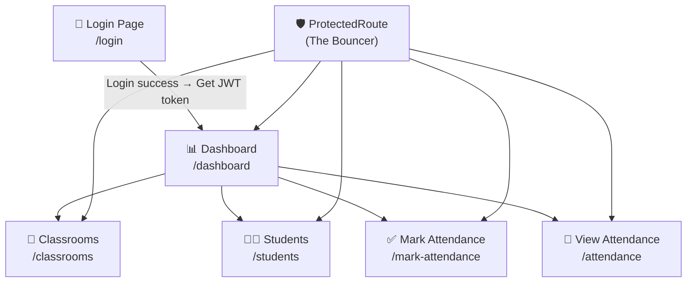
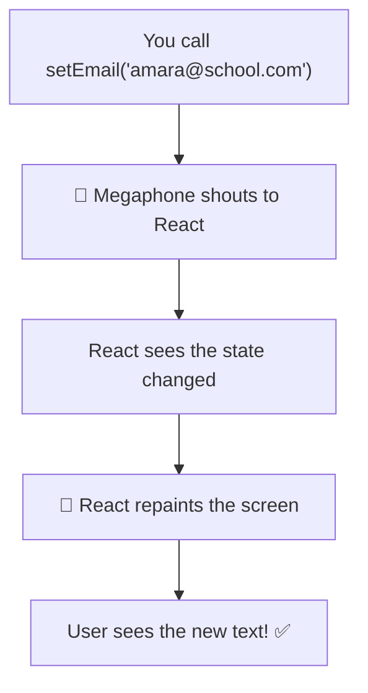
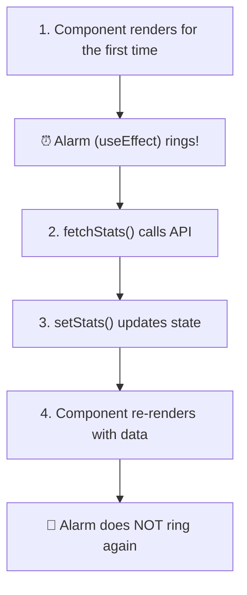
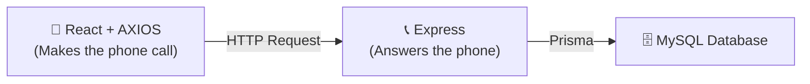

# 🎨 Day 3 — Building the React Frontend (All-In-One Master Guide)

> **Day 3 of designHer 2.0 Bootcamp**
> Today we connect our React frontend to the backend API we built on Day 2!
> We will build this app **piece by piece**, testing each piece before moving on.

> 💡 **How to use this guide:** Every file has a `🚀 FULL CODE (READY TO COPY)` block. Copy it, paste it into the correct file, and save. Then test before moving on. There are ZERO placeholders here.

---

## 🗺️ Phase 1: Foundation & Setup

### The Full System — How Everything Connects



### The Folder Structure — The LEGO Box Analogy

Imagine you buy a LEGO set. Inside the box, pieces are sorted into labelled bags. You don't throw 500 pieces into one bag — that would be chaos! Our folders work the same way:

```
frontend/
├── package.json            ← The shopping list of tools we need
├── src/
│   ├── api/                ← BAG 1: The "Phone" to call the backend
│   │   └── apiClient.js
│   ├── components/         ← BAG 2: Reusable LEGO bricks (used on EVERY page)
│   │   ├── ProtectedRoute.jsx
│   │   └── Navbar.jsx
│   ├── pages/              ← BAG 3: Each finished "room" of the house
│   │   ├── LoginPage.jsx
│   │   ├── DashboardPage.jsx
│   │   ├── ClassroomsPage.jsx
│   │   ├── StudentsPage.jsx
│   │   ├── MarkAttendancePage.jsx
│   │   └── AttendancePage.jsx
│   ├── App.jsx             ← The "instruction manual" (which room goes where)
│   ├── App.css             ← The paint and decorations
│   └── main.jsx            ← The foundation (starts everything)
```

> ⚠️ **What could go wrong?**
> If you put a "Page" file inside the `components` folder, React won't crash, but you will get very confused later. Stick to the LEGO bags!

### Step 1: Initialize the Project

Run these exact commands in your terminal to set up the React app using Vite:

```bash
# Create the Vite project
npm create vite@latest frontend -- --template react

# Go into the folder
cd frontend

# Install necessary libraries
npm install axios react-router-dom
```

### 📁 File: `package.json`

This is our "shopping list". It tells Node.js what libraries our project needs.

#### 🚀 FULL CODE (READY TO COPY)

```json
{
  "name": "designher-attendance-frontend",
  "private": true,
  "version": "1.0.0",
  "type": "module",
  "scripts": {
    "dev": "vite",
    "build": "vite build",
    "preview": "vite preview"
  },
  "dependencies": {
    "axios": "^1.7.9",
    "react": "^19.0.0",
    "react-dom": "^19.0.0",
    "react-router-dom": "^7.1.1"
  },
  "devDependencies": {
    "@vitejs/plugin-react": "^4.3.4",
    "vite": "^6.0.5"
  }
}
```

| Line | Why did we write this? |
|------|------------------------|
| `"dev": "vite"` | Creates the `npm run dev` command to start our local server. |
| `"axios"` | The tool we use to make HTTP requests to our backend. |
| `"react-router-dom"` | The tool that lets us switch between pages (Login, Dashboard, etc.) without reloading the browser. |

---

### 📁 File: `src/api/apiClient.js`

#### 🤔 The Axios vs Fetch Debate (Day 2 vs Day 3)
On Day 2, we mentioned using `fetch()` to avoid installing extra dependencies on the backend. So why are we installing `axios` today?

1. **Industry Standard:** In professional React development, Axios is the industry standard.
2. **Auto-JSON:** `fetch()` requires you to manually run `response.json()` every time. Axios does this automatically.
3. **Interceptors:** Axios allows us to build "Interceptors" (like our Central Phone) to easily attach the JWT token to *every single request* automatically. Doing this with `fetch` requires writing a lot of messy wrapper functions.

#### ✅ The Solution — The "Central Phone"

Think of `apiClient.js` as a **phone that already has the restaurant's number saved AND automatically says your name (token) every time you call.**

#### 🚀 FULL CODE (READY TO COPY)

```javascript
import axios from "axios";

// Create a reusable Axios instance with our backend's base URL
const apiClient = axios.create({
  baseURL: "http://localhost:5000/api",
});

// Automatically attach the JWT token to EVERY request
apiClient.interceptors.request.use(function (config) {
  const token = localStorage.getItem("token");
  if (token) {
    config.headers.Authorization = "Bearer " + token;
  }
  return config;
});

export default apiClient;
```

| Line | Why did we write this? |
|------|------------------------|
| `import axios from "axios"` | Gets the Axios library. |
| `axios.create({ baseURL: ... })` | Creates a custom Axios with the backend URL baked in. Now we write `/classrooms` instead of the full URL. |
| `interceptors.request.use(...)` | Runs a function **before every single request**. Like a helper who stamps every letter before mailing it. |
| `localStorage.getItem("token")` | Reads the JWT token saved during login. The token proves "I am logged in". |
| `config.headers.Authorization` | Adds `Bearer eyJ...` to the request header. Our backend's `verifyToken` middleware expects this exact format. |
| `export default apiClient` | Shares this configured Axios with all other files. |

> ⚠️ **What could go wrong?**
> If you spell `Authorization` wrong (like `Auth` or `authorisation`), the backend will reject every request with a `401 Unauthorized` error because it can't find the token!

---

### 📁 File: `src/main.jsx`

This is the **foundation**. It mounts our entire React app into the HTML page.

#### 🚀 FULL CODE (READY TO COPY)

```javascript
import React from "react";
import ReactDOM from "react-dom/client";
import App from "./App";
import "./App.css";

ReactDOM.createRoot(document.getElementById("root")).render(
  <React.StrictMode>
    <App />
  </React.StrictMode>
);
```

| Line | Why did we write this? |
|------|------------------------|
| `import App from "./App"` | Gets our main App component (the brain). |
| `import "./App.css"` | Loads our global styling. |
| `document.getElementById("root")` | Finds the `<div id="root">` in `index.html`. |
| `<React.StrictMode>` | Helps catch bugs during development (extra warnings). |
| `<App />` | Renders our entire application inside that div. |

---

### 📁 File: `src/App.css`

All styling for the entire app. We keep it minimal — today's focus is API integration, not CSS.

#### 🚀 FULL CODE (READY TO COPY)

```css
* { margin: 0; padding: 0; box-sizing: border-box; }
body { font-family: system-ui, sans-serif; background: #f5f5f5; color: #333; }

.login-container { max-width: 400px; margin: 100px auto; padding: 40px; background: white; border-radius: 8px; box-shadow: 0 2px 12px rgba(0,0,0,0.1); text-align: center; }
.login-container h1 { color: #6c3fc5; margin-bottom: 4px; }
.login-container h2 { color: #999; font-weight: normal; font-size: 1rem; margin-bottom: 30px; }
.login-container form { display: flex; flex-direction: column; gap: 12px; }
.login-container input, .search-form input, .search-form select { padding: 12px; border: 1px solid #ddd; border-radius: 6px; font-size: 1rem; }
.login-container button, .search-form button, .mark-btn { padding: 12px; background: #6c3fc5; color: white; border: none; border-radius: 6px; font-size: 1rem; cursor: pointer; }
.login-container button:hover, .search-form button:hover, .mark-btn:hover { background: #5a32a8; }
.login-container button:disabled, .search-form button:disabled, .mark-btn:disabled { opacity: 0.6; cursor: not-allowed; }
.error { color: #e74c3c; font-size: 0.9rem; }
.success-msg { color: #2ecc71; font-size: 0.9rem; margin-top: 10px; font-weight: bold; text-align: center; }

.navbar { display: flex; align-items: center; justify-content: space-between; background: #6c3fc5; color: white; padding: 12px 24px; }
.navbar-brand { font-weight: bold; font-size: 1.2rem; }
.navbar-links { display: flex; gap: 20px; }
.navbar-links a { color: rgba(255,255,255,0.85); text-decoration: none; font-size: 0.95rem; }
.navbar-links a:hover { color: white; }
.navbar-user { display: flex; align-items: center; gap: 10px; font-size: 0.9rem; }
.navbar-user button { padding: 6px 14px; background: rgba(255,255,255,0.2); color: white; border: 1px solid rgba(255,255,255,0.4); border-radius: 4px; cursor: pointer; }

.page-container { max-width: 950px; margin: 30px auto; padding: 0 20px; }
.page-container h1 { margin-bottom: 20px; color: #6c3fc5; }

.stats-grid { display: flex; gap: 20px; margin-top: 20px; }
.stat-card { flex: 1; background: white; padding: 30px; border-radius: 8px; text-align: center; box-shadow: 0 1px 5px rgba(0,0,0,0.08); }
.stat-card h2 { font-size: 2.5rem; color: #6c3fc5; margin-bottom: 5px; }
.stat-card p { color: #888; }

table { width: 100%; border-collapse: collapse; background: white; border-radius: 8px; overflow: hidden; box-shadow: 0 1px 5px rgba(0,0,0,0.08); margin-top: 20px; }
th, td { padding: 12px 15px; text-align: left; border-bottom: 1px solid #f0f0f0; }
th { background: #6c3fc5; color: white; font-weight: 600; }
tr:hover { background: #f9f5ff; }

.search-form { display: flex; gap: 10px; align-items: center; margin-bottom: 20px; }
.status-badge { padding: 4px 10px; border-radius: 12px; font-size: 0.85rem; font-weight: 600; text-transform: capitalize; }
.status-present { background: #d4edda; color: #155724; }
.status-absent { background: #f8d7da; color: #721c24; }
.status-late { background: #fff3cd; color: #856404; }

/* Toggle switches for marking attendance */
.attendance-toggle { display: flex; gap: 10px; }
.attendance-toggle label { display: flex; align-items: center; gap: 5px; cursor: pointer; }
.mark-btn { width: 100%; margin-top: 20px; }
```

## 🛡️ Phase 2: The Brain & Security

---

### 📁 File: `src/App.jsx`

This is the **brain** of the app. It answers the question: "When the user goes to a URL, which React component should I show?"

#### 🚀 FULL CODE (READY TO COPY)

```javascript
import { BrowserRouter, Routes, Route, Navigate } from "react-router-dom";
import LoginPage from "./pages/LoginPage";
import DashboardPage from "./pages/DashboardPage";
import ClassroomsPage from "./pages/ClassroomsPage";
import StudentsPage from "./pages/StudentsPage";
import MarkAttendancePage from "./pages/MarkAttendancePage";
import AttendancePage from "./pages/AttendancePage";
import ProtectedRoute from "./components/ProtectedRoute";

function App() {
  return (
    <BrowserRouter>
      <Routes>
        {/* Public route */}
        <Route path="/login" element={<LoginPage />} />

        {/* Protected routes */}
        <Route path="/dashboard" element={<ProtectedRoute><DashboardPage /></ProtectedRoute>} />
        <Route path="/classrooms" element={<ProtectedRoute><ClassroomsPage /></ProtectedRoute>} />
        <Route path="/students" element={<ProtectedRoute><StudentsPage /></ProtectedRoute>} />
        <Route path="/mark-attendance" element={<ProtectedRoute><MarkAttendancePage /></ProtectedRoute>} />
        <Route path="/attendance" element={<ProtectedRoute><AttendancePage /></ProtectedRoute>} />

        {/* Catch-all */}
        <Route path="*" element={<Navigate to="/login" />} />
      </Routes>
    </BrowserRouter>
  );
}

export default App;
```

| Line | Why did we write this? |
|------|------------------------|
| `<BrowserRouter>` | Enables URL-based page navigation in React. |
| `<Route path="/login" element={<LoginPage />} />` | When URL is `/login`, show the LoginPage component. |
| `<ProtectedRoute><DashboardPage /></ProtectedRoute>` | Wrap Dashboard in the Bouncer — checks for token first. |
| `<Route path="*">` | Catches any unknown URL (like `/banana`) and redirects to login. |

> ⚠️ **What could go wrong?**
> If you forget the `<BrowserRouter>`, React will crash with a terrifying red screen saying "useRoutes() may be used only in the context of a <Router> component."

---

### 📁 File: `src/components/Navbar.jsx`

The Navbar appears on every page (except Login).

#### 🚀 FULL CODE (READY TO COPY)

```javascript
import { Link, useNavigate } from "react-router-dom";

function Navbar() {
  const navigate = useNavigate();
  const user = JSON.parse(localStorage.getItem("user") || "null");

  function handleLogout() {
    localStorage.removeItem("token");
    localStorage.removeItem("user");
    navigate("/login");
  }

  return (
    <nav className="navbar">
      <div className="navbar-brand">designHer 2.0</div>
      <div className="navbar-links">
        <Link to="/dashboard">Dashboard</Link>
        <Link to="/classrooms">Classrooms</Link>
        <Link to="/students">Students</Link>
        <Link to="/mark-attendance">Mark Attendance</Link>
        <Link to="/attendance">View Attendance</Link>
      </div>
      <div className="navbar-user">
        <span>{user ? user.name : "User"} ({user ? user.role : ""})</span>
        <button onClick={handleLogout}>Logout</button>
      </div>
    </nav>
  );
}

export default Navbar;
```

| Line | Why did we write this? |
|------|------------------------|
| `JSON.parse(...)` | Read the saved user object. If nothing is saved, use `null`. |
| `localStorage.removeItem("token")` | Logout = throw away the wristband (JWT). |
| `navigate("/login")` | After logout, send user back to login page. |
| `<Link to="/dashboard">` | React Router's version of `<a href>`. It navigates instantly without fully reloading the browser. |

> ⚠️ **What could go wrong?**
> Using a standard `<a href="/dashboard">` instead of `<Link>` causes the browser to do a full refresh, which ruins the fast "Single Page App" experience React provides.

---

### 📁 File: `src/components/ProtectedRoute.jsx` — The Bouncer

#### ❌ The Problem — Users Can Cheat!

Someone types `http://localhost:5173/dashboard` directly in the URL bar without logging in. They have no token, but React tries to show the Dashboard anyway. API calls fail, the screen breaks.

#### ✅ The Solution — The Bouncer

A **bouncer at a club** checks: "Do you have a wristband (token)?" No? Back to the entrance!

#### 🚀 FULL CODE (READY TO COPY)

```javascript
import { Navigate } from "react-router-dom";

function ProtectedRoute({ children }) {
  const token = localStorage.getItem("token");

  // If there is no token, redirect to the login page
  if (!token) {
    return <Navigate to="/login" />;
  }

  // If there IS a token, show the actual page
  return children;
}

export default ProtectedRoute;
```

| Line | Why did we write this? |
|------|------------------------|
| `{ children }` | Represents whatever page is wrapped inside (e.g., `<DashboardPage />`). |
| `localStorage.getItem("token")` | Check: does the user have a wristband? |
| `<Navigate to="/login" />` | No wristband → bounce them to login. |
| `return children` | Has wristband → let them in, show the page. |

#### 🧪 TEST: Try the Bouncer!
1. Clear localStorage: DevTools (F12) → **Application** → **Local Storage** → Clear All.
2. Type `http://localhost:5173/dashboard` in the address bar.
3. **Expected:** Immediately redirected to `/login`. ✅

> ⚠️ **What could go wrong?**
> If you clear localStorage while you are already on the Dashboard, the screen won't change until you click a link or refresh. The Bouncer only checks at the door!

---

## 🔑 Phase 3: The Login Experience

---

### 📁 File: `src/pages/LoginPage.jsx`

#### ❌ The Problem — Normal Variables Are Silent!

If you track typing with `let email = ""`, React ignores it. React is a painter. The painter repaints ONLY when you SHOUT. A `let` variable changes silently.

#### ✅ The Solution — `useState` (The Megaphone)

`useState` is a **megaphone**. `setEmail("new value")` SHOUTS: "Hey React! Repaint NOW!"



#### The API Call — `async/await` (The Impatient Friend)

JavaScript is an **impatient friend**. You ask it to call the API, but it doesn't wait — it moves on immediately. `await` grabs their arm: "SIT. WAIT for the backend."

#### 🚀 FULL CODE (READY TO COPY)

```javascript
import { useState } from "react";
import { useNavigate } from "react-router-dom";
import apiClient from "../api/apiClient";

function LoginPage() {
  const [email, setEmail] = useState("");
  const [password, setPassword] = useState("");
  const [error, setError] = useState("");
  const [loading, setLoading] = useState(false);
  const navigate = useNavigate();

  async function handleLogin(event) {
    event.preventDefault();
    setLoading(true);
    setError("");

    try {
      const response = await apiClient.post("/auth/login", { email, password });

      localStorage.setItem("token", response.data.data.token);
      localStorage.setItem("user", JSON.stringify(response.data.data.user));

      navigate("/dashboard");
    } catch (err) {
      if (err.response && err.response.data && err.response.data.message) {
        setError(err.response.data.message);
      } else {
        setError("Something went wrong. Is the backend running?");
      }
    } finally {
      setLoading(false);
    }
  }

  return (
    <div className="login-container">
      <h1>designHer 2.0</h1>
      <h2>Attendance System</h2>

      <form onSubmit={handleLogin}>
        <input
          type="email" placeholder="Email" value={email}
          onChange={function (e) { setEmail(e.target.value); }} required
        />
        <input
          type="password" placeholder="Password" value={password}
          onChange={function (e) { setPassword(e.target.value); }} required
        />
        {error && <p className="error">{error}</p>}
        <button type="submit" disabled={loading}>
          {loading ? "Logging in..." : "Login"}
        </button>
      </form>
    </div>
  );
}

export default LoginPage;
```

| Line | Why did we write this? |
|------|------------------------|
| `useState("")` | Track inputs. Start empty. Megaphone! |
| `event.preventDefault()` | Stop the browser from refreshing on form submit. |
| `setLoading(true)` | Megaphone: show "Logging in..." on the button. |
| `await apiClient.post(...)` | Call backend. WAIT for response. |
| `localStorage.setItem("token", ...)` | Save the JWT wristband. |
| `navigate("/dashboard")` | Jump to Dashboard! |

#### 🧪 TEST: Login Flow
1. Open `http://localhost:5173`.
2. Press **F12** → **Network** tab.
3. Type `amara@school.com` / `admin123` → Click Login.
4. **Network tab:** See `login` request with status **200**. ✅

> ⚠️ **What could go wrong?**
> If you get `ERR_CONNECTION_REFUSED`, your backend (Port 5000) is not running!

---

## 📊 Phase 4: Data Display (Effects & Loops)

---

### 📁 File: `src/pages/DashboardPage.jsx`

#### ❌ The DISASTER — The Infinite Loop (The Mirror Effect)

We want to load stats when the page opens. So we call the API:

```javascript
function DashboardPage() {
  const [stats, setStats] = useState({ classrooms: 0 });
  async function loadData() {
    const res = await apiClient.get("/classrooms");
    setStats({ classrooms: res.data.data.length });
  }
  loadData(); // Runs directly in the component body!
}
```

Imagine putting **two mirrors facing each other**.
`Component renders` → `loadData() runs` → `API responds` → `setStats() shouts` → `Component re-renders` → `loadData() runs again`... FOREVER.
**Result:** Thousands of API requests per second. Browser freezes. Backend crashes. 💀

#### ✅ The Solution — `useEffect` (The Once-a-Day Alarm)

`useEffect` is an **alarm clock**. You set it to ring ONCE in the morning.



```javascript
useEffect(function () {
  fetchData(); // Runs ONCE on page load
}, []); // ← THIS EMPTY ARRAY = "ring only once"
```

#### 🚀 FULL CODE (READY TO COPY)

```javascript
import { useState, useEffect } from "react";
import apiClient from "../api/apiClient";
import Navbar from "../components/Navbar";

function DashboardPage() {
  const [stats, setStats] = useState({ classrooms: 0, students: 0 });
  const [loading, setLoading] = useState(true);

  useEffect(function () {
    async function fetchStats() {
      try {
        const [classroomRes, studentRes] = await Promise.all([
          apiClient.get("/classrooms"),
          apiClient.get("/students"),
        ]);

        setStats({
          classrooms: classroomRes.data.data.length,
          students: studentRes.data.data.length,
        });
      } catch (err) {
        console.error("Failed to fetch stats:", err);
      } finally {
        setLoading(false);
      }
    }

    fetchStats();
  }, []);

  const user = JSON.parse(localStorage.getItem("user") || "null");

  if (loading) {
    return (
      <>
        <Navbar />
        <p style={{ textAlign: "center", marginTop: "50px" }}>Loading...</p>
      </>
    );
  }

  return (
    <>
      <Navbar />
      <div className="page-container">
        <h1>Welcome, {user ? user.name : "User"}!</h1>
        <p>Role: <strong>{user ? user.role : ""}</strong></p>

        <div className="stats-grid">
          <div className="stat-card">
            <h2>{stats.classrooms}</h2>
            <p>Classrooms</p>
          </div>
          <div className="stat-card">
            <h2>{stats.students}</h2>
            <p>Students</p>
          </div>
        </div>
      </div>
    </>
  );
}

export default DashboardPage;
```

| Line | Why did we write this? |
|------|------------------------|
| `useEffect(..., [])` | The Alarm — run ONCE on page load. No infinite loops! |
| `Promise.all([...])` | Fetch classrooms AND students **at the same time**. Faster! |
| `{stats.classrooms}` | Display the actual number fetched from the database. |

> ⚠️ **What could go wrong?**
> Forgetting the `[]` array at the end of `useEffect` is the #1 mistake beginners make. Your computer fans will spin up as your app sends 10,000 requests to the backend!

---

### 📁 File: `src/pages/ClassroomsPage.jsx`

#### 🚀 FULL CODE (READY TO COPY)

```javascript
import { useState, useEffect } from "react";
import apiClient from "../api/apiClient";
import Navbar from "../components/Navbar";

function ClassroomsPage() {
  const [classrooms, setClassrooms] = useState([]);
  const [loading, setLoading] = useState(true);

  useEffect(function () {
    async function fetchClassrooms() {
      try {
        const response = await apiClient.get("/classrooms");
        setClassrooms(response.data.data);
      } catch (err) {
        console.error("Failed to fetch classrooms:", err);
      } finally {
        setLoading(false);
      }
    }
    fetchClassrooms();
  }, []);

  if (loading) return <><Navbar /><p>Loading classrooms...</p></>;

  return (
    <>
      <Navbar />
      <div className="page-container">
        <h1>Classrooms ({classrooms.length})</h1>

        {classrooms.length === 0 ? (
          <p>No classrooms found.</p>
        ) : (
          <table>
            <thead>
              <tr>
                <th>ID</th>
                <th>Name</th>
                <th>Section</th>
                <th>Teacher</th>
              </tr>
            </thead>
            <tbody>
              {classrooms.map(function (classroom) {
                return (
                  <tr key={classroom.id}>
                    <td>{classroom.id}</td>
                    <td>{classroom.name}</td>
                    <td>{classroom.section || "—"}</td>
                    <td>{classroom.teacher ? classroom.teacher.name : "—"}</td>
                  </tr>
                );
              })}
            </tbody>
          </table>
        )}
      </div>
    </>
  );
}

export default ClassroomsPage;
```

| Line | Why did we write this? |
|------|------------------------|
| `.map(function(classroom))` | Loop through the array. Create a `<tr>` for each. |
| `key={classroom.id}` | React requires a unique ID for every item in a list. |
| `{classroom.teacher ? ...}` | If teacher exists, show name. Else, show "—". |

> ⚠️ **What could go wrong?**
> If you forget `key={classroom.id}`, React will yell at you in the console, and updating the table later might cause weird visual bugs.

---

### 📁 File: `src/pages/StudentsPage.jsx`

#### 🚀 FULL CODE (READY TO COPY)

```javascript
import { useState, useEffect } from "react";
import apiClient from "../api/apiClient";
import Navbar from "../components/Navbar";

function StudentsPage() {
  const [students, setStudents] = useState([]);
  const [loading, setLoading] = useState(true);

  useEffect(function () {
    async function fetchStudents() {
      try {
        const response = await apiClient.get("/students");
        setStudents(response.data.data);
      } catch (err) {
        console.error("Failed to fetch students:", err);
      } finally {
        setLoading(false);
      }
    }
    fetchStudents();
  }, []);

  if (loading) return <><Navbar /><p>Loading students...</p></>;

  return (
    <>
      <Navbar />
      <div className="page-container">
        <h1>Students ({students.length})</h1>

        {students.length === 0 ? (
          <p>No students found.</p>
        ) : (
          <table>
            <thead>
              <tr>
                <th>ID</th>
                <th>Name</th>
                <th>Email</th>
                <th>Reg. Number</th>
                <th>Classroom</th>
              </tr>
            </thead>
            <tbody>
              {students.map(function (student) {
                return (
                  <tr key={student.id}>
                    <td>{student.id}</td>
                    <td>{student.name}</td>
                    <td>{student.email}</td>
                    <td>{student.registrationNumber}</td>
                    <td>{student.classroom ? student.classroom.name : "—"}</td>
                  </tr>
                );
              })}
            </tbody>
          </table>
        )}
      </div>
    </>
  );
}

export default StudentsPage;
```

## 📝 Phase 5: The Main Feature - Marking Attendance (Bulk POST)

This is the big one! Instead of marking students one by one, we fetch a whole classroom, toggle Present/Absent for everyone, and send ONE massive list to the backend.

### 📁 File: `src/pages/MarkAttendancePage.jsx`

#### UX Upgrade (Dropdowns)
We don't want teachers typing a random Classroom ID (like `12`). They won't remember it! Instead, we fetch all classrooms on page load and put them in a `<select>` dropdown.

#### 🚀 FULL CODE (READY TO COPY)

```javascript
import { useState, useEffect } from "react";
import apiClient from "../api/apiClient";
import Navbar from "../components/Navbar";

function MarkAttendancePage() {
  const [classrooms, setClassrooms] = useState([]);
  const [selectedClassroomId, setSelectedClassroomId] = useState("");
  const [date, setDate] = useState("");
  const [students, setStudents] = useState([]);
  
  // This object will hold { studentId: "present" } or { studentId: "absent" }
  const [attendanceData, setAttendanceData] = useState({});
  const [loading, setLoading] = useState(false);
  const [message, setMessage] = useState("");

  // Step 1: Fetch classrooms for the Dropdown when page loads
  useEffect(function () {
    async function loadClassrooms() {
      try {
        const response = await apiClient.get("/classrooms");
        setClassrooms(response.data.data);
      } catch (err) {
        console.error("Failed to load classrooms", err);
      }
    }
    loadClassrooms();
  }, []);

  // Step 2: Fetch students when they click "Load Students"
  async function handleLoadStudents(event) {
    event.preventDefault();
    setLoading(true);
    setMessage("");

    try {
      // Fetch ONLY students for the selected classroom using the correct backend endpoint
      const response = await apiClient.get("/students/classroom/" + selectedClassroomId);
      const classroomStudents = response.data.data;
      
      setStudents(classroomStudents);

      // Default everyone to 'present' initially
      const initialData = {};
      classroomStudents.forEach(function(student) {
        initialData[student.id] = "present";
      });
      setAttendanceData(initialData);

      if (classroomStudents.length === 0) {
        setMessage("No students found in this classroom.");
      }
    } catch (err) {
      setMessage("Failed to load students.");
    } finally {
      setLoading(false);
    }
  }

  // Handle radio button changes for a specific student
  function handleStatusChange(studentId, status) {
    setAttendanceData(function(prevData) {
      return { ...prevData, [studentId]: status };
    });
  }

  // Step 3: Submit the bulk data to the backend
  async function handleSubmitAttendance() {
    setLoading(true);
    setMessage("");

    // Convert our object { 1: "present", 2: "absent" } into an array that the backend expects
    const records = Object.keys(attendanceData).map(function(studentId) {
      return {
        studentId: parseInt(studentId),
        classroomId: parseInt(selectedClassroomId),
        date: date,
        status: attendanceData[studentId]
      };
    });

    try {
      await apiClient.post("/attendance/bulk", {
        attendanceList: records
      });
      
      setMessage("✅ Attendance marked successfully!");
      setStudents([]); // Clear the table on success
    } catch (err) {
      if (err.response && err.response.data && err.response.data.message) {
        setMessage("❌ " + err.response.data.message);
      } else {
        setMessage("❌ Failed to mark attendance.");
      }
    } finally {
      setLoading(false);
    }
  }

  return (
    <>
      <Navbar />
      <div className="page-container">
        <h1>Mark Attendance</h1>

        <form onSubmit={handleLoadStudents} className="search-form">
          <select 
            value={selectedClassroomId} 
            onChange={function(e) { setSelectedClassroomId(e.target.value); }}
            required
          >
            <option value="">-- Select Classroom --</option>
            {classrooms.map(function(c) {
              return <option key={c.id} value={c.id}>{c.name}</option>;
            })}
          </select>

          <input
            type="date"
            value={date}
            onChange={function(e) { setDate(e.target.value); }}
            required
          />
          <button type="submit" disabled={loading || !selectedClassroomId || !date}>
            Load Students
          </button>
        </form>

        {message && <p className={message.includes("✅") ? "success-msg" : "error"}>{message}</p>}

        {students.length > 0 && (
          <div style={{ marginTop: "20px" }}>
            <table>
              <thead>
                <tr>
                  <th>Name</th>
                  <th>Reg. Number</th>
                  <th>Attendance Status</th>
                </tr>
              </thead>
              <tbody>
                {students.map(function(student) {
                  return (
                    <tr key={student.id}>
                      <td>{student.name}</td>
                      <td>{student.registrationNumber}</td>
                      <td>
                        <div className="attendance-toggle">
                          <label>
                            <input 
                              type="radio" 
                              name={"status-" + student.id} 
                              value="present"
                              checked={attendanceData[student.id] === "present"}
                              onChange={function() { handleStatusChange(student.id, "present"); }}
                            /> Present
                          </label>
                          <label>
                            <input 
                              type="radio" 
                              name={"status-" + student.id} 
                              value="absent"
                              checked={attendanceData[student.id] === "absent"}
                              onChange={function() { handleStatusChange(student.id, "absent"); }}
                            /> Absent
                          </label>
                          <label>
                            <input 
                              type="radio" 
                              name={"status-" + student.id} 
                              value="late"
                              checked={attendanceData[student.id] === "late"}
                              onChange={function() { handleStatusChange(student.id, "late"); }}
                            /> Late
                          </label>
                        </div>
                      </td>
                    </tr>
                  );
                })}
              </tbody>
            </table>
            
            <button className="mark-btn" onClick={handleSubmitAttendance} disabled={loading}>
              {loading ? "Saving..." : "Submit Attendance"}
            </button>
          </div>
        )}
      </div>
    </>
  );
}

export default MarkAttendancePage;
```

| Line | Why did we write this? |
|------|------------------------|
| `<select>` dropdown | Better UX! We fetch classrooms with `useEffect` and list them as `<option>`s. |
| `attendanceData` object | Stores { studentId: "status" }. Example: `{ 1: "present", 2: "absent" }` |
| `initialData[student.id] = "present"` | We default everyone to 'present' to save the teacher time. |
| `{ ...prevData, [studentId]: status }` | Safely updates the state object with the new radio button choice. |
| `apiClient.post("/attendance/bulk", ...)` | Sends the massive list to our Day 2 Bulk endpoint! |

> ⚠️ **What could go wrong?**
> If you don't use `parseInt()` when sending `classroomId` and `studentId` to the backend, Prisma will throw an error because it expects numbers, but HTML inputs always return strings!

---

## 🔍 Phase 6: Viewing Attendance

### 📁 File: `src/pages/AttendancePage.jsx`

This page is similar to marking, but we use a Dropdown and Date to view existing records.

#### 🚀 FULL CODE (READY TO COPY)

```javascript
import { useState, useEffect } from "react";
import apiClient from "../api/apiClient";
import Navbar from "../components/Navbar";

function AttendancePage() {
  const [classrooms, setClassrooms] = useState([]);
  const [classroomId, setClassroomId] = useState("");
  const [date, setDate] = useState("");
  const [records, setRecords] = useState([]);
  const [loading, setLoading] = useState(false);
  const [message, setMessage] = useState("");

  // Load classrooms for the dropdown
  useEffect(function () {
    async function loadClassrooms() {
      try {
        const response = await apiClient.get("/classrooms");
        setClassrooms(response.data.data);
      } catch (err) {}
    }
    loadClassrooms();
  }, []);

  async function handleSearch(event) {
    event.preventDefault();
    setLoading(true);
    setMessage("");
    setRecords([]);

    try {
      const response = await apiClient.get(
        "/attendance/classroom/" + classroomId + "?date=" + date
      );
      setRecords(response.data.data);

      if (response.data.data.length === 0) {
        setMessage("No attendance records found for this date.");
      }
    } catch (err) {
      console.error("Failed to fetch attendance:", err);
      if (err.response && err.response.data && err.response.data.message) {
        setMessage(err.response.data.message);
      } else {
        setMessage("Failed to fetch attendance records.");
      }
    } finally {
      setLoading(false);
    }
  }

  return (
    <>
      <Navbar />
      <div className="page-container">
        <h1>View Attendance</h1>

        <form onSubmit={handleSearch} className="search-form">
          <select 
            value={classroomId} 
            onChange={function(e) { setClassroomId(e.target.value); }}
            required
          >
            <option value="">-- Select Classroom --</option>
            {classrooms.map(function(c) {
              return <option key={c.id} value={c.id}>{c.name}</option>;
            })}
          </select>

          <input
            type="date"
            value={date}
            onChange={function(e) { setDate(e.target.value); }}
            required
          />
          <button type="submit" disabled={loading}>
            {loading ? "Searching..." : "Search"}
          </button>
        </form>

        {message && <p style={{ marginTop: "15px", color: "#888" }}>{message}</p>}

        {records.length > 0 && (
          <table style={{ marginTop: "20px" }}>
            <thead>
              <tr>
                <th>Student Name</th>
                <th>Reg. Number</th>
                <th>Status</th>
              </tr>
            </thead>
            <tbody>
              {records.map(function (record) {
                return (
                  <tr key={record.id}>
                    <td>{record.student ? record.student.name : "—"}</td>
                    <td>{record.student ? record.student.registrationNumber : "—"}</td>
                    <td>
                      <span className={"status-badge status-" + record.status}>
                        {record.status}
                      </span>
                    </td>
                  </tr>
                );
              })}
            </tbody>
          </table>
        )}
      </div>
    </>
  );
}

export default AttendancePage;
```

| Line | Why did we write this? |
|------|------------------------|
| `apiClient.get("/attendance/classroom/" + classroomId + "?date=" + date)` | Injects user's inputs into the URL (e.g. `/attendance/classroom/1?date=2026-04-28`) |
| `className={"status-badge status-" + record.status}` | Dynamically sets CSS class. If status is "present", class is "status-present" (green badge) |

> ⚠️ **What could go wrong?**
> If you test this and no records appear, make sure you actually submitted the attendance on the **Mark Attendance** page first!

---

## 🤔 "Wait! Why Didn't We Use Axios in the Backend (Day 2)?"

> 📞 **The Phone Call Analogy:**
>
> - **Express** is someone who **sits by the phone and WAITS for calls**. It is a **receiver** (server). It doesn't call anyone — it just answers.
> - **Axios** is someone who **picks up the phone and MAKES calls**. It is a **requester** (client). It dials a number and talks.
>
> Our React frontend needs to CALL the backend → uses **Axios** (the caller).
> Our Express backend just WAITS for calls → uses **Express** (the receiver).



| Tool | Role | Used Where | Why |
|------|------|-----------|-----|
| **Express** | Receiver — waits for requests | Backend (Day 2) | The backend IS the server |
| **Axios** | Requester — makes requests | Frontend (Day 3) | The frontend CALLS the server |
| **Prisma** | Database talker | Backend (Day 2) | Talks to MySQL |

A backend would use Axios ONLY if calling **another external API** (Twilio for SMS, Stripe for payments). Ours only talks to its own database via Prisma.

---

## 🎉 Congratulations! You Built a Full-Stack App!

Over 3 days, you built:

| Day | What You Built | Key Skills |
|-----|---------------|-----------|
| **Day 1** | MySQL Database | Tables, Keys, Relationships, SQL Queries |
| **Day 2** | Express Backend API | REST, JWT, Middleware, Prisma, Layered Architecture |
| **Day 3** | React Frontend | Components, State, Effects, API Calls, Bulk Processing |

> **You are now a full-stack developer.** 🚀

---

## 🏃‍♂️ How to Run the App Locally

To test the complete attendance system on your machine, you must run both the backend and frontend at the same time.

### 1. Start the Backend (Terminal 1)
Open a new terminal window:
```bash
cd backend
npm run dev
```
Wait until you see: `🚀 Server is running on port 5000`

### 2. Start the Frontend (Terminal 2)
Open a **second** terminal window:
```bash
cd frontend
npm run dev
```
Open `http://localhost:5173` in your browser.

### 🧪 Test Credentials (from our Day 1 Database Seed)
Use these exact credentials to log in:
- **Email:** `amara@school.com` (Teacher)
- **Password:** `admin123`

### ❌ Common Errors

| Error | What happened? | How to fix |
|-------|---------------|------------|
| `Network Error` or `ERR_CONNECTION_REFUSED` | Your backend isn't running | Start Terminal 1 (`cd backend && npm run dev`) |
| `401 Unauthorized` | Your token expired or you didn't send one | Log out and log back in |
| Blank White Screen | You have a syntax error in your React code | Press F12 -> Console to see exactly which line is broken |
| `Cannot destructure property 'children' of 'undefined'` | You forgot a curly brace in a component prop | Check `function ProtectedRoute({ children })` |

---

> Made with ❤️ for **designHer 2.0 Bootcamp 2026**
