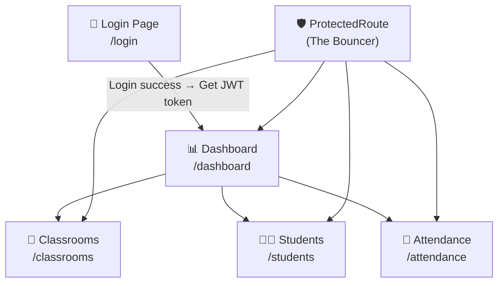
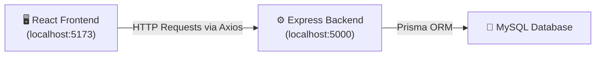
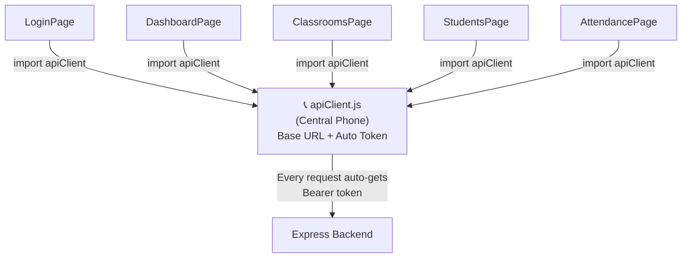
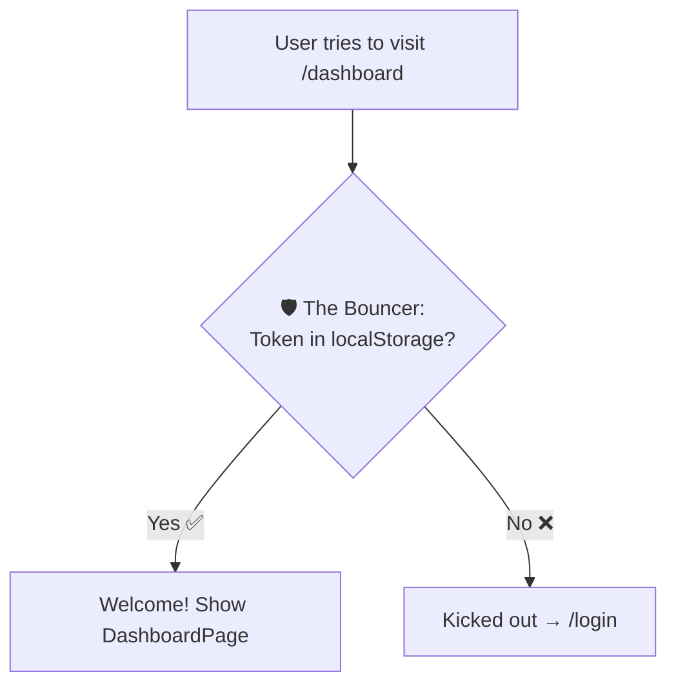
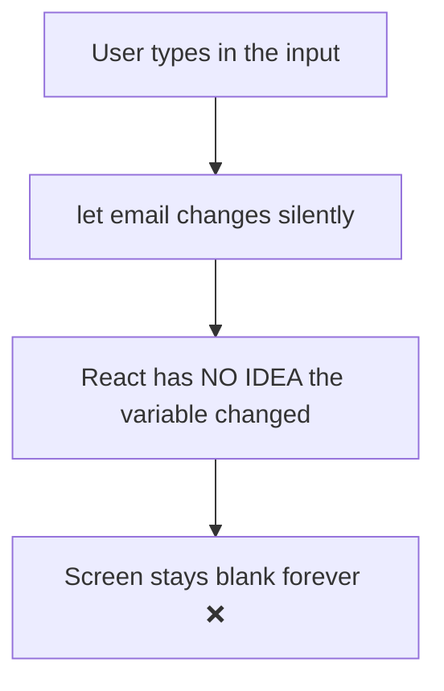
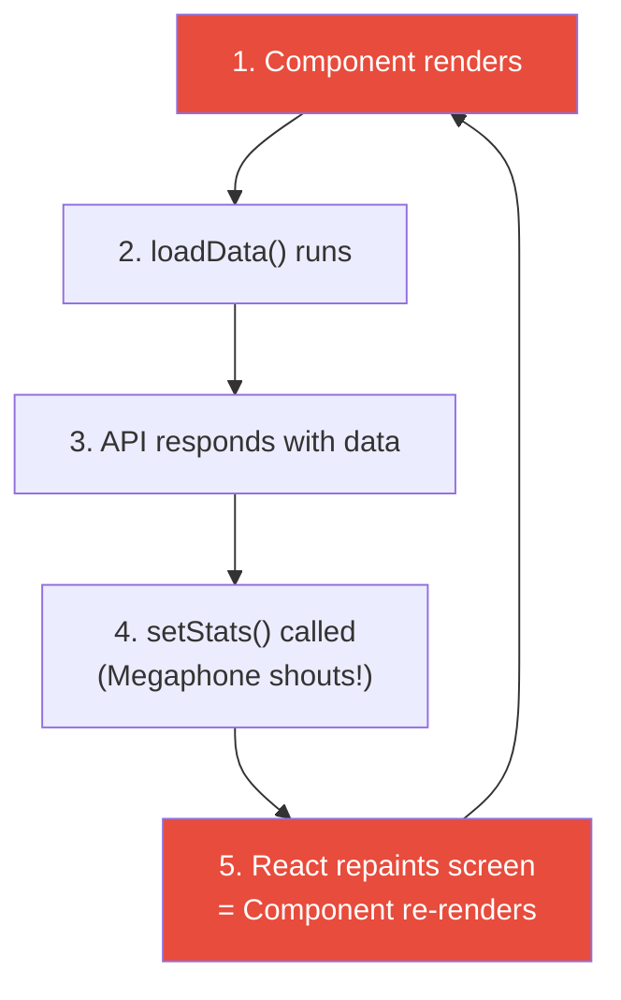
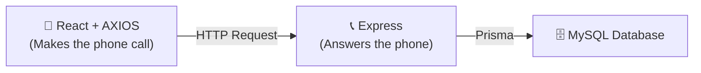

# 🎨 Day 3 — Building the React Frontend (All-In-One Master Guide)

> **Day 3 of designHer 2.0 Bootcamp**
> Today we connect our React frontend to the backend API we built on Day 2!
> We will build this app **piece by piece**, testing each piece before moving on.

> 💡 **How to use this guide:** Every file has a `🚀 FULL CODE (READY TO COPY)` block. Copy it, paste it into the correct file, and save. Then test before moving on.

---

## 🗺️ Phase 1: The App Architecture & Setup

### The Full System — How Everything Connects



### How React Talks to Our Day 2 Backend



### Page-to-Endpoint Map

| Page File | What It Shows | HTTP Method | Backend Endpoint (Day 2) | Auth? |
|-----------|--------------|-------------|-------------------------|-------|
| `LoginPage.jsx` | Login form | POST | `/api/auth/login` | ❌ No |
| `DashboardPage.jsx` | Overview stats | GET | `/api/classrooms` + `/api/students` | ✅ Yes |
| `ClassroomsPage.jsx` | Classroom table | GET | `/api/classrooms` | ✅ Yes |
| `StudentsPage.jsx` | Student table | GET | `/api/students` | ✅ Yes |
| `AttendancePage.jsx` | Attendance search | GET | `/api/attendance/classroom/:id?date=...` | ✅ Yes |

### The Folder Structure — The LEGO Box Analogy

Imagine you buy a LEGO set. Inside the box, pieces are sorted into labelled bags. You don't throw 500 pieces into one bag — that would be chaos! Our folders work the same way:

```
frontend/src/
├── api/                    ← BAG 1: The "Phone" to call the backend
│   └── apiClient.js
├── components/             ← BAG 2: Reusable LEGO bricks (used on EVERY page)
│   ├── ProtectedRoute.jsx
│   └── Navbar.jsx
├── pages/                  ← BAG 3: Each finished "room" of the house
│   ├── LoginPage.jsx
│   ├── DashboardPage.jsx
│   ├── ClassroomsPage.jsx
│   ├── StudentsPage.jsx
│   └── AttendancePage.jsx
├── App.jsx                 ← The "instruction manual" (which room goes where)
├── App.css                 ← The paint and decorations
└── main.jsx                ← The foundation (starts everything)
```

| Folder | Purpose | LEGO Analogy |
|--------|---------|-------------|
| `api/` | Axios config (base URL + auto token) | The **phone** you use to call the backend |
| `components/` | Pieces used on MULTIPLE pages | **Standard bricks** — same shape, used everywhere |
| `pages/` | One file = one screen the user sees | Each **room** in the house |

### Install & Start

```bash
cd frontend
npm install
npm run dev
```

> ⚠️ **IMPORTANT:** You need TWO terminals running:
> - Terminal 1: `cd backend && npm run dev` (Port 5000)
> - Terminal 2: `cd frontend && npm run dev` (Port 5173)

---

## 🔌 Phase 2: The Infrastructure (The Hidden Helpers)

These files work "behind the scenes." The user never sees them, but they make everything work.

---

### 📁 File: `src/api/apiClient.js`

#### ❌ The Problem — Writing the Full URL Every Single Time

Without a centralized client, every page repeats ugly boilerplate:

```javascript
// ❌ In ClassroomsPage — UGLY AND REPETITIVE
const token = localStorage.getItem("token");
const response = await axios.get("http://localhost:5000/api/classrooms", {
  headers: { Authorization: "Bearer " + token },
});

// ❌ In StudentsPage — SAME code AGAIN!
const token = localStorage.getItem("token");
const response = await axios.get("http://localhost:5000/api/students", {
  headers: { Authorization: "Bearer " + token },
});
```

If the backend URL changes, you must update ALL 5 files. If you forget the token on ONE page, it breaks.

#### ✅ The Solution — The "Central Phone"

Think of `apiClient.js` as a **phone that already has the restaurant's number saved AND automatically says your name (token) every time you call.**



#### 🚀 FULL CODE (READY TO COPY)

```javascript
import axios from "axios";

// Create a reusable Axios instance with our backend's base URL
const apiClient = axios.create({
  baseURL: "http://localhost:5000/api",
});

// Automatically attach the JWT token to EVERY request
apiClient.interceptors.request.use(function (config) {
  const token = localStorage.getItem("token");
  if (token) {
    config.headers.Authorization = "Bearer " + token;
  }
  return config;
});

export default apiClient;
```

#### Line-by-Line "Why?" Table

| Line | What It Does | Why We Need It |
|------|-------------|---------------|
| `import axios from "axios"` | Gets the Axios library | Axios is our HTTP calling tool (cleaner than `fetch`) |
| `axios.create({ baseURL: ... })` | Creates a custom Axios with the URL baked in | Write `/classrooms` instead of the full URL every time |
| `interceptors.request.use(...)` | Runs a function **before every request** | Like a helper who stamps every letter before mailing |
| `localStorage.getItem("token")` | Reads the JWT token saved during login | The token proves "I am logged in" |
| `config.headers.Authorization` | Adds `Bearer eyJ...` to the request header | Our backend's `verifyToken` middleware expects this format |
| `export default apiClient` | Shares this with all other files | **Locked Room:** opens the window so pages can grab it |

---

### 📁 File: `src/main.jsx`

This is the **foundation**. It mounts our entire React app into the HTML page.

#### 🚀 FULL CODE (READY TO COPY)

```javascript
import React from "react";
import ReactDOM from "react-dom/client";
import App from "./App";

ReactDOM.createRoot(document.getElementById("root")).render(
  <React.StrictMode>
    <App />
  </React.StrictMode>
);
```

| Line | Why? |
|------|------|
| `import App from "./App"` | Gets our main App component (the brain) |
| `document.getElementById("root")` | Finds the `<div id="root">` in `index.html` |
| `<React.StrictMode>` | Helps catch bugs during development (extra warnings) |
| `<App />` | Renders our entire application inside that div |

---

### 📁 File: `src/App.css`

All styling for the entire app. We keep it minimal — today's focus is API integration, not CSS.

#### 🚀 FULL CODE (READY TO COPY)

```css
/* === Reset === */
* {
  margin: 0;
  padding: 0;
  box-sizing: border-box;
}

body {
  font-family: system-ui, -apple-system, sans-serif;
  background: #f5f5f5;
  color: #333;
}

/* === Login Page === */
.login-container {
  max-width: 400px;
  margin: 100px auto;
  padding: 40px;
  background: white;
  border-radius: 8px;
  box-shadow: 0 2px 12px rgba(0, 0, 0, 0.1);
  text-align: center;
}

.login-container h1 {
  margin-bottom: 4px;
  color: #6c3fc5;
}

.login-container h2 {
  margin-bottom: 30px;
  color: #999;
  font-weight: normal;
  font-size: 1rem;
}

.login-container form {
  display: flex;
  flex-direction: column;
  gap: 12px;
}

.login-container input {
  padding: 12px;
  border: 1px solid #ddd;
  border-radius: 6px;
  font-size: 1rem;
}

.login-container input:focus {
  outline: none;
  border-color: #6c3fc5;
}

.login-container button {
  padding: 12px;
  background: #6c3fc5;
  color: white;
  border: none;
  border-radius: 6px;
  font-size: 1rem;
  cursor: pointer;
  margin-top: 5px;
}

.login-container button:hover {
  background: #5a32a8;
}

.login-container button:disabled {
  opacity: 0.6;
  cursor: not-allowed;
}

.error {
  color: #e74c3c;
  font-size: 0.9rem;
}

/* === Navbar === */
.navbar {
  display: flex;
  align-items: center;
  justify-content: space-between;
  background: #6c3fc5;
  color: white;
  padding: 12px 24px;
}

.navbar-brand {
  font-weight: bold;
  font-size: 1.2rem;
}

.navbar-links {
  display: flex;
  gap: 20px;
}

.navbar-links a {
  color: rgba(255, 255, 255, 0.85);
  text-decoration: none;
  font-size: 0.95rem;
}

.navbar-links a:hover {
  color: white;
}

.navbar-user {
  display: flex;
  align-items: center;
  gap: 10px;
  font-size: 0.9rem;
}

.navbar-user button {
  padding: 6px 14px;
  background: rgba(255, 255, 255, 0.2);
  color: white;
  border: 1px solid rgba(255, 255, 255, 0.4);
  border-radius: 4px;
  cursor: pointer;
  font-size: 0.85rem;
}

.navbar-user button:hover {
  background: rgba(255, 255, 255, 0.3);
}

/* === Page Container === */
.page-container {
  max-width: 950px;
  margin: 30px auto;
  padding: 0 20px;
}

.page-container h1 {
  margin-bottom: 20px;
  color: #6c3fc5;
}

/* === Stats Grid (Dashboard) === */
.stats-grid {
  display: flex;
  gap: 20px;
  margin-top: 20px;
}

.stat-card {
  flex: 1;
  background: white;
  padding: 30px;
  border-radius: 8px;
  text-align: center;
  box-shadow: 0 1px 5px rgba(0, 0, 0, 0.08);
}

.stat-card h2 {
  font-size: 2.5rem;
  color: #6c3fc5;
  margin-bottom: 5px;
}

.stat-card p {
  color: #888;
}

/* === Tables === */
table {
  width: 100%;
  border-collapse: collapse;
  background: white;
  border-radius: 8px;
  overflow: hidden;
  box-shadow: 0 1px 5px rgba(0, 0, 0, 0.08);
}

th, td {
  padding: 12px 15px;
  text-align: left;
  border-bottom: 1px solid #f0f0f0;
}

th {
  background: #6c3fc5;
  color: white;
  font-weight: 600;
}

tr:hover {
  background: #f9f5ff;
}

/* === Search Form (Attendance) === */
.search-form {
  display: flex;
  gap: 10px;
  align-items: center;
}

.search-form input {
  padding: 10px;
  border: 1px solid #ddd;
  border-radius: 6px;
  font-size: 0.95rem;
}

.search-form button {
  padding: 10px 20px;
  background: #6c3fc5;
  color: white;
  border: none;
  border-radius: 6px;
  cursor: pointer;
}

.search-form button:disabled {
  opacity: 0.6;
}

/* === Status Badges === */
.status-badge {
  padding: 4px 10px;
  border-radius: 12px;
  font-size: 0.85rem;
  font-weight: 600;
  text-transform: capitalize;
}

.status-present {
  background: #d4edda;
  color: #155724;
}

.status-absent {
  background: #f8d7da;
  color: #721c24;
}

.status-late {
  background: #fff3cd;
  color: #856404;
}
```

---

## 🛡️ Phase 3: The Security & Routing (The Brain)

---

### 📁 File: `src/App.jsx`

This is the **brain** of the app. It answers the question: "When the user goes to `/login`, which component should I show?"

#### 🚀 FULL CODE (READY TO COPY)

```javascript
import { BrowserRouter, Routes, Route, Navigate } from "react-router-dom";
import LoginPage from "./pages/LoginPage";
import DashboardPage from "./pages/DashboardPage";
import ClassroomsPage from "./pages/ClassroomsPage";
import StudentsPage from "./pages/StudentsPage";
import AttendancePage from "./pages/AttendancePage";
import ProtectedRoute from "./components/ProtectedRoute";
import "./App.css";

function App() {
  return (
    <BrowserRouter>
      <Routes>
        {/* Public route — anyone can access */}
        <Route path="/login" element={<LoginPage />} />

        {/* Protected routes — must be logged in */}
        <Route path="/dashboard" element={
          <ProtectedRoute><DashboardPage /></ProtectedRoute>
        } />
        <Route path="/classrooms" element={
          <ProtectedRoute><ClassroomsPage /></ProtectedRoute>
        } />
        <Route path="/students" element={
          <ProtectedRoute><StudentsPage /></ProtectedRoute>
        } />
        <Route path="/attendance" element={
          <ProtectedRoute><AttendancePage /></ProtectedRoute>
        } />

        {/* Catch-all — redirect unknown URLs to login */}
        <Route path="*" element={<Navigate to="/login" />} />
      </Routes>
    </BrowserRouter>
  );
}

export default App;
```

#### Line-by-Line "Why?" Table

| Line | Why? |
|------|------|
| `<BrowserRouter>` | Enables URL-based page navigation in React |
| `<Route path="/login" element={<LoginPage />} />` | When URL is `/login`, show the LoginPage component |
| `<ProtectedRoute><DashboardPage /></ProtectedRoute>` | Wrap Dashboard in the Bouncer — checks for token first |
| `<Route path="*">` | Catches any unknown URL (like `/banana`) and redirects to login |
| `export default App` | **Locked Room:** hands the App component to `main.jsx` |

---

### 📁 File: `src/components/Navbar.jsx`

The Navbar appears on every page (except Login). It has navigation links and a Logout button.

#### 🚀 FULL CODE (READY TO COPY)

```javascript
import { Link, useNavigate } from "react-router-dom";

function Navbar() {
  const navigate = useNavigate();
  const user = JSON.parse(localStorage.getItem("user") || "null");

  function handleLogout() {
    localStorage.removeItem("token");
    localStorage.removeItem("user");
    navigate("/login");
  }

  return (
    <nav className="navbar">
      <div className="navbar-brand">designHer 2.0</div>
      <div className="navbar-links">
        <Link to="/dashboard">Dashboard</Link>
        <Link to="/classrooms">Classrooms</Link>
        <Link to="/students">Students</Link>
        <Link to="/attendance">Attendance</Link>
      </div>
      <div className="navbar-user">
        <span>{user ? user.name : "User"} ({user ? user.role : ""})</span>
        <button onClick={handleLogout}>Logout</button>
      </div>
    </nav>
  );
}

export default Navbar;
```

| Line | Why? |
|------|------|
| `JSON.parse(localStorage.getItem("user") \|\| "null")` | Read the saved user object. If nothing saved, use `null`. |
| `localStorage.removeItem("token")` | Logout = throw away the wristband (JWT) |
| `navigate("/login")` | After logout, send user back to login page |
| `<Link to="/dashboard">` | React Router's version of `<a href>` — navigates without full page reload |

---

### 📁 File: `src/components/ProtectedRoute.jsx` — The Bouncer

#### ❌ The Problem — Users Can Cheat!

Someone types `http://localhost:5173/dashboard` directly in the URL bar without logging in. They have no token, but React tries to show the Dashboard anyway.

#### ✅ The Solution — The Bouncer

A **bouncer at a club** checks: "Do you have a wristband (token)?" No? Back to the entrance!



#### 🚀 FULL CODE (READY TO COPY)

```javascript
import { Navigate } from "react-router-dom";

function ProtectedRoute({ children }) {
  const token = localStorage.getItem("token");

  // If there is no token, redirect to the login page
  if (!token) {
    return <Navigate to="/login" />;
  }

  // If there IS a token, show the actual page
  return children;
}

export default ProtectedRoute;
```

| Line | Why? |
|------|------|
| `{ children }` | Whatever page is wrapped inside (e.g., `<DashboardPage />`) |
| `localStorage.getItem("token")` | Check: does the user have a wristband? |
| `<Navigate to="/login" />` | No wristband → bounce them to login |
| `return children` | Has wristband → let them in, show the page |

#### 🧪 TEST: Try the Bouncer!

1. Clear localStorage: DevTools (F12) → **Application** → **Local Storage** → Clear All.
2. Type `http://localhost:5173/dashboard` in the address bar.
3. **Expected:** Immediately redirected to `/login`. ✅

---

## 🔑 Phase 4: The Login Experience (State & Tokens)

---

### 📁 File: `src/pages/LoginPage.jsx`

This is the first page users see. They type email and password, click Login, and if the backend says "OK", we save the JWT token and jump to the Dashboard.

#### ❌ The Problem — Normal Variables Are Silent!

```javascript
// ❌ THIS DOES NOT WORK
function LoginPage() {
  let email = "";
  function handleChange(event) {
    email = event.target.value;
    console.log(email); // prints correctly...
  }
  return (
    <div>
      <input onChange={handleChange} />
      <p>You typed: {email}</p>  {/* NEVER updates on screen! */}
    </div>
  );
}
```



**Why?** React is a painter. The painter repaints ONLY when you SHOUT. A `let` variable changes silently — the painter never hears it.

#### ✅ The Solution — `useState` (The Megaphone)

`useState` is a **megaphone**. `setEmail("new value")` SHOUTS: "Hey React! Repaint NOW!"

```javascript
const [email, setEmail] = useState("");
//     ↑ value  ↑ megaphone     ↑ starting value
```

| ❌ Silent (React ignores) | ✅ Megaphone (React repaints!) |
|---|---|
| `email = "new value"` | `setEmail("new value")` |

#### The API Call — `async/await` (The Waiting Rule)

JavaScript is an **impatient friend**. You ask it to order food (API call), but it doesn't wait — it immediately asks "What's for dessert?" before the food arrives.

```javascript
// ❌ WITHOUT await — impatient friend
function handleLogin() {
  const response = axios.post("/auth/login", { email, password });
  console.log(response); // undefined! Food hasn't arrived!
}

// ✅ WITH await — grab their arm: "SIT. WAIT."
async function handleLogin() {
  const response = await axios.post("/auth/login", { email, password });
  console.log(response.data); // ✅ { success: true, token: "..." }
}
```

| Keyword | Analogy |
|---------|---------|
| `async` | "This function might need to wait" |
| `await` | Grab the friend's arm: "SIT. WAIT for the food." |

#### 🚀 FULL CODE (READY TO COPY)

```javascript
import { useState } from "react";
import { useNavigate } from "react-router-dom";
import apiClient from "../api/apiClient";

function LoginPage() {
  const [email, setEmail] = useState("");
  const [password, setPassword] = useState("");
  const [error, setError] = useState("");
  const [loading, setLoading] = useState(false);
  const navigate = useNavigate();

  async function handleLogin(event) {
    event.preventDefault();
    setLoading(true);
    setError("");

    try {
      const response = await apiClient.post("/auth/login", {
        email: email,
        password: password,
      });

      // Save the token and user info in localStorage
      localStorage.setItem("token", response.data.data.token);
      localStorage.setItem("user", JSON.stringify(response.data.data.user));

      // Redirect to the dashboard
      navigate("/dashboard");
    } catch (err) {
      // Show the error message from the backend, or a generic one
      if (err.response && err.response.data && err.response.data.message) {
        setError(err.response.data.message);
      } else {
        setError("Something went wrong. Is the backend running?");
      }
    } finally {
      setLoading(false);
    }
  }

  return (
    <div className="login-container">
      <h1>designHer 2.0</h1>
      <h2>Attendance System</h2>

      <form onSubmit={handleLogin}>
        <input
          type="email"
          placeholder="Email"
          value={email}
          onChange={function (e) { setEmail(e.target.value); }}
          required
        />
        <input
          type="password"
          placeholder="Password"
          value={password}
          onChange={function (e) { setPassword(e.target.value); }}
          required
        />

        {error && <p className="error">{error}</p>}

        <button type="submit" disabled={loading}>
          {loading ? "Logging in..." : "Login"}
        </button>
      </form>
    </div>
  );
}

export default LoginPage;
```

#### Line-by-Line "Why?" Table

| Line | Why? |
|------|------|
| `useState("")` for email, password | Track what the user types. Start empty. Megaphone! |
| `useState("")` for error | If login fails, show the error on screen. |
| `useState(false)` for loading | While request is flying, disable the button. |
| `useNavigate()` | Returns a function to jump pages: `navigate("/dashboard")`. |
| `event.preventDefault()` | Stop the browser from refreshing the page on form submit. |
| `setLoading(true)` | Megaphone: show "Logging in..." on the button. |
| `await apiClient.post(...)` | Call backend. WAIT for response. (The Waiting Rule) |
| `localStorage.setItem("token", ...)` | Save the JWT wristband for future API calls. |
| `JSON.stringify(...)` | localStorage only stores strings. Convert user object to string. |
| `navigate("/dashboard")` | Login success → jump to Dashboard! |
| `catch (err)` | Wrong password? Backend error? Show the error message. |
| `finally { setLoading(false) }` | Re-enable the button whether login worked or failed. |
| `value={email}` | The input always displays the current state value. |
| `onChange={function (e) { setEmail(e.target.value); }}` | Every keystroke → megaphone shouts → screen updates. |
| `{error && <p>...</p>}` | Only show error paragraph IF an error exists. |
| `disabled={loading}` | Prevent double-clicking while request is in progress. |
| `{loading ? "Logging in..." : "Login"}` | Different button text based on loading state. |

#### 🧪 TEST: Login Flow

1. Open `http://localhost:5173`.
2. Press **F12** → **Network** tab.
3. Type `amara@school.com` / `admin123` → Click Login.
4. **Network tab:** See `login` request with status **200**.
5. Click the request → **Response** → See `{ "success": true, "data": { "token": "eyJ..." } }`.
6. You should be redirected to `/dashboard`. ✅

---

## 📊 Phase 5: The Data Experience (Effects & Loops)

---

### 📁 File: `src/pages/DashboardPage.jsx`

#### ❌ The DISASTER — The Infinite Loop (The Mirror Effect)

We want to load stats when the Dashboard opens. So we call the API inside the component:

```javascript
// ❌ INFINITE LOOP — YOUR BROWSER WILL CRASH!
function DashboardPage() {
  const [stats, setStats] = useState({ classrooms: 0, students: 0 });

  async function loadData() {
    const res = await apiClient.get("/classrooms");
    setStats({ classrooms: res.data.data.length, students: 0 });
  }
  loadData(); // Runs directly in the component body!

  return <p>{stats.classrooms} classrooms</p>;
}
```

Imagine putting **two mirrors facing each other**. The reflection bounces forever.



**Result:** Thousands of API requests per second. Browser freezes. Backend crashes. 💀

#### ✅ The Solution — `useEffect` (The Once-a-Day Alarm)

`useEffect` is an **alarm clock**. You set it to ring ONCE in the morning. It does NOT ring every second.

```javascript
useEffect(function () {
  // This code runs ONCE when the page first appears
  fetchData();
}, []); // ← THIS EMPTY ARRAY = "ring only once"
```

| Code | When It Runs | Alarm Analogy |
|------|-------------|--------------|
| `useEffect(fn, [])` | **Once** — on page load | Alarm rings once in the morning |
| `useEffect(fn, [id])` | When `id` changes | Alarm rings when a specific event happens |
| `useEffect(fn)` | **Every render** — BUG! | Alarm rings every second — disaster! |

#### 🚀 FULL CODE (READY TO COPY)

```javascript
import { useState, useEffect } from "react";
import apiClient from "../api/apiClient";
import Navbar from "../components/Navbar";

function DashboardPage() {
  const [stats, setStats] = useState({ classrooms: 0, students: 0 });
  const [loading, setLoading] = useState(true);

  useEffect(function () {
    async function fetchStats() {
      try {
        const [classroomRes, studentRes] = await Promise.all([
          apiClient.get("/classrooms"),
          apiClient.get("/students"),
        ]);

        setStats({
          classrooms: classroomRes.data.data.length,
          students: studentRes.data.data.length,
        });
      } catch (err) {
        console.error("Failed to fetch stats:", err);
      } finally {
        setLoading(false);
      }
    }

    fetchStats();
  }, []);

  const user = JSON.parse(localStorage.getItem("user") || "null");

  if (loading) {
    return (
      <>
        <Navbar />
        <p style={{ textAlign: "center", marginTop: "50px" }}>Loading...</p>
      </>
    );
  }

  return (
    <>
      <Navbar />
      <div className="page-container">
        <h1>Welcome, {user ? user.name : "User"}!</h1>
        <p>Role: <strong>{user ? user.role : ""}</strong></p>

        <div className="stats-grid">
          <div className="stat-card">
            <h2>{stats.classrooms}</h2>
            <p>Classrooms</p>
          </div>
          <div className="stat-card">
            <h2>{stats.students}</h2>
            <p>Students</p>
          </div>
        </div>
      </div>
    </>
  );
}

export default DashboardPage;
```

#### Line-by-Line "Why?" Table

| Line | Why? |
|------|------|
| `useEffect(..., [])` | The Alarm — run ONCE on page load. No infinite loops! |
| `Promise.all([...])` | Fetch classrooms AND students **at the same time**. Much faster than one by one! |
| `setStats(...)` | Megaphone: update the numbers on screen |
| `setLoading(false)` | Data arrived — stop showing "Loading..." |
| `if (loading) return ...` | Show a simple loading message until the data is ready |
| `{stats.classrooms}` | Display the actual number fetched from the database |

#### 🧪 TEST: Test the Dashboard!

1. Login. You should see real numbers (e.g., **2 Classrooms**, **4 Students**).
2. Open DevTools (F12) → **Network**.
3. You should see GET requests to `/classrooms` and `/students` with status **200**. ✅

---

### 📁 File: `src/pages/ClassroomsPage.jsx`

This page follows the exact same pattern: `useState` + `useEffect` + `apiClient`. Then we use `.map()` to draw a table.

#### 🚀 FULL CODE (READY TO COPY)

```javascript
import { useState, useEffect } from "react";
import apiClient from "../api/apiClient";
import Navbar from "../components/Navbar";

function ClassroomsPage() {
  const [classrooms, setClassrooms] = useState([]);
  const [loading, setLoading] = useState(true);

  useEffect(function () {
    async function fetchClassrooms() {
      try {
        const response = await apiClient.get("/classrooms");
        setClassrooms(response.data.data);
      } catch (err) {
        console.error("Failed to fetch classrooms:", err);
      } finally {
        setLoading(false);
      }
    }

    fetchClassrooms();
  }, []);

  if (loading) {
    return (
      <>
        <Navbar />
        <p style={{ textAlign: "center", marginTop: "50px" }}>Loading classrooms...</p>
      </>
    );
  }

  return (
    <>
      <Navbar />
      <div className="page-container">
        <h1>Classrooms ({classrooms.length})</h1>

        {classrooms.length === 0 ? (
          <p>No classrooms found.</p>
        ) : (
          <table>
            <thead>
              <tr>
                <th>ID</th>
                <th>Name</th>
                <th>Section</th>
                <th>Teacher</th>
              </tr>
            </thead>
            <tbody>
              {classrooms.map(function (classroom) {
                return (
                  <tr key={classroom.id}>
                    <td>{classroom.id}</td>
                    <td>{classroom.name}</td>
                    <td>{classroom.section || "—"}</td>
                    <td>{classroom.teacher ? classroom.teacher.name : "—"}</td>
                  </tr>
                );
              })}
            </tbody>
          </table>
        )}
      </div>
    </>
  );
}

export default ClassroomsPage;
```

#### Line-by-Line "Why?" Table

| Line | Why? |
|------|------|
| `useState([])` | Start with an empty array of classrooms |
| `setClassrooms(response.data.data)` | Store the array of classrooms received from backend |
| `{classrooms.length === 0 ? ... : ...}` | If no classrooms exist, show a message. Otherwise, show the table. |
| `.map(function(classroom))` | Loop through the array. For every classroom, create a `<tr>` (table row) |
| `key={classroom.id}` | React requires a unique ID for every item in a list for performance |
| `{classroom.teacher ? ... : ...}` | If the classroom has a teacher, show their name. If not, show "—" |

---

### 📁 File: `src/pages/StudentsPage.jsx`

Identical to ClassroomsPage, but fetches `/students`.

#### 🚀 FULL CODE (READY TO COPY)

```javascript
import { useState, useEffect } from "react";
import apiClient from "../api/apiClient";
import Navbar from "../components/Navbar";

function StudentsPage() {
  const [students, setStudents] = useState([]);
  const [loading, setLoading] = useState(true);

  useEffect(function () {
    async function fetchStudents() {
      try {
        const response = await apiClient.get("/students");
        setStudents(response.data.data);
      } catch (err) {
        console.error("Failed to fetch students:", err);
      } finally {
        setLoading(false);
      }
    }

    fetchStudents();
  }, []);

  if (loading) {
    return (
      <>
        <Navbar />
        <p style={{ textAlign: "center", marginTop: "50px" }}>Loading students...</p>
      </>
    );
  }

  return (
    <>
      <Navbar />
      <div className="page-container">
        <h1>Students ({students.length})</h1>

        {students.length === 0 ? (
          <p>No students found.</p>
        ) : (
          <table>
            <thead>
              <tr>
                <th>ID</th>
                <th>Name</th>
                <th>Email</th>
                <th>Reg. Number</th>
                <th>Classroom</th>
              </tr>
            </thead>
            <tbody>
              {students.map(function (student) {
                return (
                  <tr key={student.id}>
                    <td>{student.id}</td>
                    <td>{student.name}</td>
                    <td>{student.email}</td>
                    <td>{student.registrationNumber}</td>
                    <td>{student.classroom ? student.classroom.name : "—"}</td>
                  </tr>
                );
              })}
            </tbody>
          </table>
        )}
      </div>
    </>
  );
}

export default StudentsPage;
```

---

### 📁 File: `src/pages/AttendancePage.jsx`

This page is different. It does NOT load data automatically on page load. It waits for the user to enter a Classroom ID and a Date, then fetches data on submit. Therefore, **no `useEffect` is needed for the API call!**

#### 🚀 FULL CODE (READY TO COPY)

```javascript
import { useState } from "react";
import apiClient from "../api/apiClient";
import Navbar from "../components/Navbar";

function AttendancePage() {
  const [classroomId, setClassroomId] = useState("");
  const [date, setDate] = useState("");
  const [records, setRecords] = useState([]);
  const [loading, setLoading] = useState(false);
  const [message, setMessage] = useState("");

  async function handleSearch(event) {
    event.preventDefault();
    setLoading(true);
    setMessage("");

    try {
      const response = await apiClient.get(
        "/attendance/classroom/" + classroomId + "?date=" + date
      );
      setRecords(response.data.data);

      if (response.data.data.length === 0) {
        setMessage("No attendance records found for this date.");
      }
    } catch (err) {
      console.error("Failed to fetch attendance:", err);
      if (err.response && err.response.data && err.response.data.message) {
        setMessage(err.response.data.message);
      } else {
        setMessage("Failed to fetch attendance records.");
      }
    } finally {
      setLoading(false);
    }
  }

  return (
    <>
      <Navbar />
      <div className="page-container">
        <h1>Attendance</h1>

        <form onSubmit={handleSearch} className="search-form">
          <input
            type="number"
            placeholder="Classroom ID"
            value={classroomId}
            onChange={function (e) { setClassroomId(e.target.value); }}
            required
          />
          <input
            type="date"
            value={date}
            onChange={function (e) { setDate(e.target.value); }}
            required
          />
          <button type="submit" disabled={loading}>
            {loading ? "Searching..." : "Search"}
          </button>
        </form>

        {message && <p style={{ marginTop: "15px", color: "#888" }}>{message}</p>}

        {records.length > 0 && (
          <table style={{ marginTop: "20px" }}>
            <thead>
              <tr>
                <th>Student Name</th>
                <th>Reg. Number</th>
                <th>Status</th>
              </tr>
            </thead>
            <tbody>
              {records.map(function (record) {
                return (
                  <tr key={record.id}>
                    <td>{record.student ? record.student.name : "—"}</td>
                    <td>{record.student ? record.student.registrationNumber : "—"}</td>
                    <td>
                      <span className={"status-badge status-" + record.status}>
                        {record.status}
                      </span>
                    </td>
                  </tr>
                );
              })}
            </tbody>
          </table>
        )}
      </div>
    </>
  );
}

export default AttendancePage;
```

#### Line-by-Line "Why?" Table

| Line | Why? |
|------|------|
| `useState("")` for classroomId, date | Track the user's search inputs |
| `apiClient.get("/attendance/classroom/" + classroomId + "?date=" + date)` | Inject the user's inputs into the URL (e.g. `/attendance/classroom/1?date=2026-04-28`) |
| `{records.length > 0 && <table>...}` | Only draw the table IF we actually found records |
| `className={"status-badge status-" + record.status}` | Dynamically sets CSS class. If status is "present", class is "status-present" (green badge) |

---

## 🤔 "Wait! Why Didn't We Use Axios in the Backend (Day 2)?"

> 📞 **The Phone Call Analogy:**
>
> - **Express** is someone who **sits by the phone and WAITS for calls**. It is a **receiver** (server). It doesn't call anyone — it just answers.
> - **Axios** is someone who **picks up the phone and MAKES calls**. It is a **requester** (client). It dials a number and talks.
>
> Our React frontend needs to CALL the backend → uses **Axios** (the caller).
> Our Express backend just WAITS for calls → uses **Express** (the receiver).



| Tool | Role | Used Where | Why |
|------|------|-----------|-----|
| **Express** | Receiver — waits for requests | Backend (Day 2) | The backend IS the server |
| **Axios** | Requester — makes requests | Frontend (Day 3) | The frontend CALLS the server |
| **Prisma** | Database talker | Backend (Day 2) | Talks to MySQL |

A backend would use Axios ONLY if calling **another external API** (Twilio for SMS, Stripe for payments). Ours only talks to its own database via Prisma.

---

## 🎉 Congratulations! You Built a Full-Stack App!

Over 3 days, you built:

| Day | What You Built | Key Skills |
|-----|---------------|-----------|
| **Day 1** | MySQL Database | Tables, Keys, Relationships, SQL Queries |
| **Day 2** | Express Backend API | REST, JWT, Middleware, Prisma, Layered Architecture |
| **Day 3** | React Frontend | Components, State, Effects, API Calls, Auth Flow |

> **You are now a full-stack developer.** 🚀

---

> Made with ❤️ for **designHer 2.0 Bootcamp 2026**
