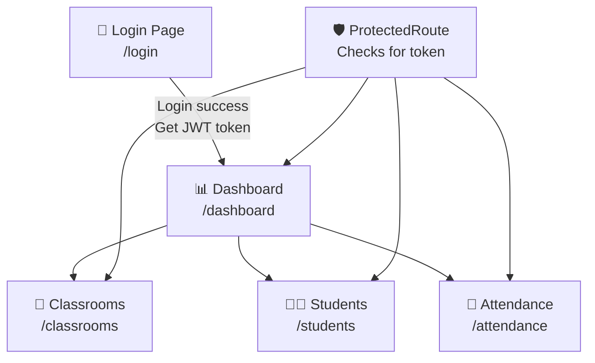
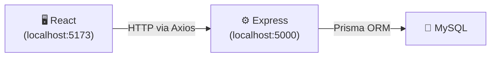
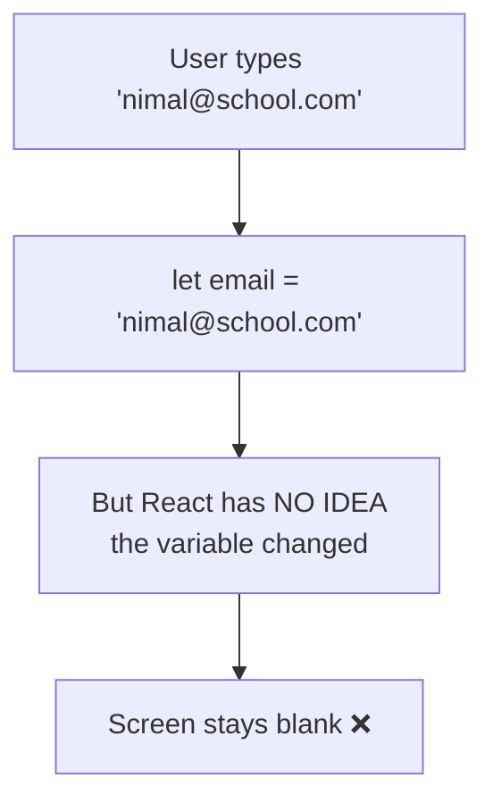
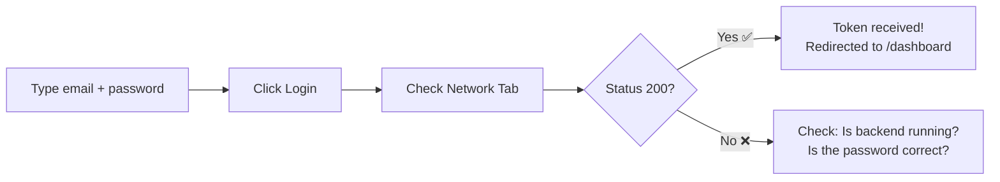
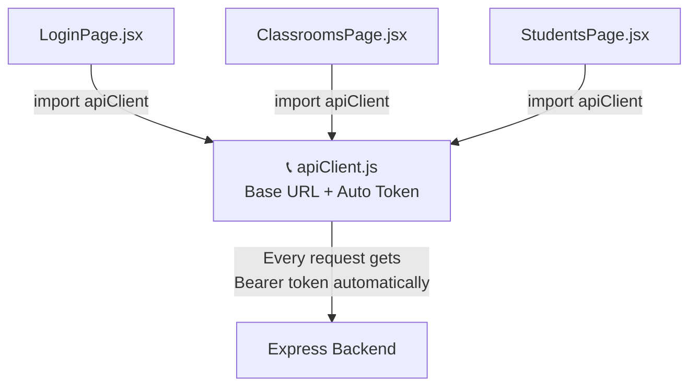
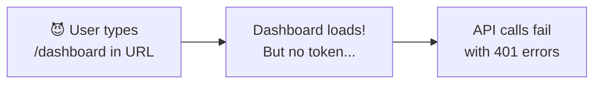
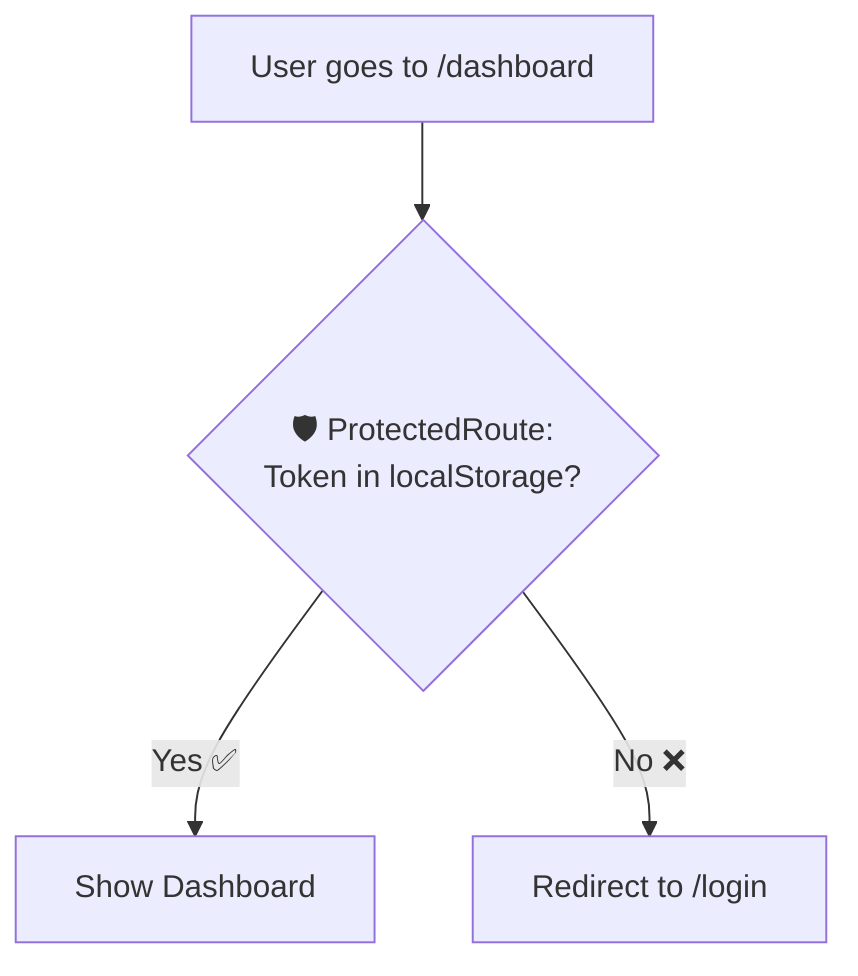
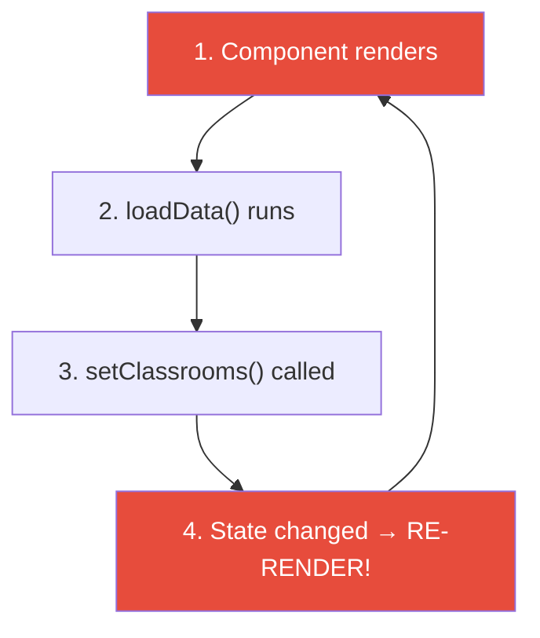
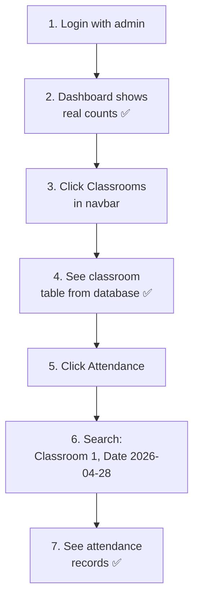
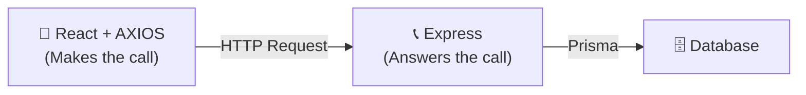

# 🎨 Day 3 — Building the React Frontend

> **Day 3 of designHer 2.0 Bootcamp**
> Today we connect our React frontend to the backend API we built on Day 2!

---

## 🗺️ The Big Picture — How Our Pages Connect



### How React Talks to Our Backend



### Page-to-Endpoint Map

| Page | Method | Backend Endpoint | Auth? |
|------|--------|-----------------|-------|
| LoginPage | POST | `/api/auth/login` | No |
| DashboardPage | GET | `/api/classrooms` + `/api/students` | Yes |
| ClassroomsPage | GET | `/api/classrooms` | Yes |
| StudentsPage | GET | `/api/students` | Yes |
| AttendancePage | GET | `/api/attendance/classroom/:id?date=...` | Yes |

---

## Phase 1: The Foundation (Setup)

### Why Split Code Into Folders? — The LEGO Analogy

Imagine building a LEGO house. You don't throw ALL 500 pieces into one giant bag. You sort them: walls in one bag, roof pieces in another, doors in a third. That is exactly what our folders do:

| Folder | What Goes Here | LEGO Analogy |
|--------|---------------|-------------|
| `api/` | The Axios config (base URL + token) | The **instruction manual** — one shared reference |
| `components/` | Reusable pieces (Navbar, ProtectedRoute) | **Standard bricks** used in every room |
| `pages/` | One file per screen | Each **room** of the house |

### Our Folder Structure

```
frontend/
├── src/
│   ├── api/
│   │   └── apiClient.js
│   ├── components/
│   │   ├── ProtectedRoute.jsx
│   │   └── Navbar.jsx
│   ├── pages/
│   │   ├── LoginPage.jsx
│   │   ├── DashboardPage.jsx
│   │   ├── ClassroomsPage.jsx
│   │   ├── StudentsPage.jsx
│   │   └── AttendancePage.jsx
│   ├── App.jsx
│   ├── App.css
│   └── main.jsx
├── index.html
└── package.json
```

### Install & Run

```bash
cd frontend
npm install
npm run dev
```

> ⚠️ **Keep your backend running too!** Open a second terminal: `cd backend && npm run dev`

---

## Phase 2: The Login Page (Build & Test)

### ❌ Problem — Normal Variables Don't Update the Screen!

```javascript
// ❌ THIS DOES NOT WORK
function LoginPage() {
  let email = "";

  function handleChange(event) {
    email = event.target.value;
    console.log(email); // prints correctly...
  }

  return (
    <div>
      <input onChange={handleChange} />
      <p>You typed: {email}</p>  {/* NEVER updates! */}
    </div>
  );
}
```



### ✅ Solution — `useState` (The Megaphone)

Think of `useState` like a **megaphone**. A normal `let` variable changes silently — nobody hears it. But `useState` SHOUTS: "Hey React! This value changed! Repaint the screen NOW!"

```javascript
import { useState } from "react";

const [email, setEmail] = useState("");
//     ↑ value  ↑ megaphone     ↑ starting value
```

| Part | What It Is | Analogy |
|------|-----------|---------|
| `email` | The current value | The current announcement on the billboard |
| `setEmail` | The updater function | The **megaphone** — shout to update the billboard |
| `useState("")` | The initial value | The billboard starts empty |

**Rule:** NEVER do `email = "new value"`. ALWAYS use `setEmail("new value")`.

### The Impatient Friend — `async/await`

JavaScript is like an **impatient friend**. You ask them to order food (call the API), but they don't wait — they immediately say "What's for dessert?" before the food arrives.

```javascript
// ❌ WITHOUT await — like the impatient friend
function handleLogin() {
  const response = axios.post("/auth/login", { email, password });
  console.log(response); // undefined! The food hasn't arrived yet!
}

// ✅ WITH await — we FORCE the friend to wait
async function handleLogin() {
  const response = await axios.post("/auth/login", { email, password });
  console.log(response.data); // { success: true, token: "..." } ✅
}
```

| Keyword | What It Does | Analogy |
|---------|-------------|---------|
| `async` | Marks the function as "might need to wait" | Telling your friend "this will take a moment" |
| `await` | STOPS and waits for the result | Grabbing your friend's arm: "SIT. WAIT." |

### The Complete LoginPage — Line by Line

Here is `src/pages/LoginPage.jsx`:

```javascript
import { useState } from "react";
import { useNavigate } from "react-router-dom";
import apiClient from "../api/apiClient";
```

| Line | Why? |
|------|------|
| `import { useState }` | We need the Megaphone to track email, password, error, loading |
| `import { useNavigate }` | We need to redirect the user to /dashboard after login |
| `import apiClient` | Our centralized Axios (we build this in Phase 3) |

```javascript
function LoginPage() {
  const [email, setEmail] = useState("");
  const [password, setPassword] = useState("");
  const [error, setError] = useState("");
  const [loading, setLoading] = useState(false);
  const navigate = useNavigate();
```

| Line | Why? |
|------|------|
| `useState("")` for email/password | Track what the user types, start empty |
| `useState("")` for error | If login fails, show the error message |
| `useState(false)` for loading | Disable the button while the request is in progress |
| `useNavigate()` | Returns a function we call later: `navigate("/dashboard")` |

```javascript
  async function handleLogin(event) {
    event.preventDefault();
    setLoading(true);
    setError("");

    try {
      const response = await apiClient.post("/auth/login", {
        email: email,
        password: password,
      });

      localStorage.setItem("token", response.data.data.token);
      localStorage.setItem("user", JSON.stringify(response.data.data.user));
      navigate("/dashboard");
    } catch (err) {
      if (err.response && err.response.data && err.response.data.message) {
        setError(err.response.data.message);
      } else {
        setError("Something went wrong. Is the backend running?");
      }
    } finally {
      setLoading(false);
    }
  }
```

| Line | Why? |
|------|------|
| `event.preventDefault()` | Stops the browser from refreshing the page when the form submits |
| `setLoading(true)` | Show "Logging in..." on the button |
| `setError("")` | Clear any old error message |
| `await apiClient.post(...)` | Send email+password to the backend and WAIT for a response |
| `localStorage.setItem("token", ...)` | Save the JWT token so we can use it on other pages |
| `JSON.stringify(...)` | localStorage only stores strings, so we convert the user object |
| `navigate("/dashboard")` | Redirect to the dashboard on success |
| `catch (err)` | If the backend returns an error (wrong password, etc.), show it |
| `finally { setLoading(false) }` | Re-enable the button whether login succeeded or failed |

> 💡 **Locked Room Analogy (from Day 2):** `LoginPage.jsx` is a locked room. `export default LoginPage` at the bottom opens a window to hand the component out. `App.jsx` grabs it with `import LoginPage from "./pages/LoginPage"`.

### 🧪 TESTING STEP — Test the Login!

1. Make sure backend is running (`cd backend && npm run dev`).
2. Open `http://localhost:5173` in your browser.
3. **Open DevTools:** Press `F12` → Click the **Network** tab.
4. Type `amara@school.com` / `admin123` and click Login.
5. **Check the Network tab:** You should see a `login` request with status `200`.
6. Click on the request → **Response** tab → You should see `{ "success": true, "data": { "token": "eyJ..." } }`.
7. You should be redirected to `/dashboard`.



---

## Phase 3: The Central Phone (`apiClient.js`)

### ❌ Problem — Repeating URLs and Headers EVERYWHERE

Without a centralized client, EVERY page would look like this:

```javascript
// ❌ In ClassroomsPage.jsx
const token = localStorage.getItem("token");
const response = await axios.get("http://localhost:5000/api/classrooms", {
  headers: { Authorization: "Bearer " + token },
});

// ❌ In StudentsPage.jsx — SAME boilerplate again!
const token = localStorage.getItem("token");
const response = await axios.get("http://localhost:5000/api/students", {
  headers: { Authorization: "Bearer " + token },
});
```

5 pages × 3 lines of boilerplate = 15 lines of repeated code. If the backend URL changes, you must update ALL 5 files!

### ✅ Solution — `apiClient.js`

Create ONE shared Axios instance. Set the base URL once. Auto-attach the token to every request.

**`src/api/apiClient.js`:**

```javascript
import axios from "axios";

const apiClient = axios.create({
  baseURL: "http://localhost:5000/api",
});

apiClient.interceptors.request.use(function (config) {
  const token = localStorage.getItem("token");
  if (token) {
    config.headers.Authorization = "Bearer " + token;
  }
  return config;
});

export default apiClient;
```

| Line | Why? |
|------|------|
| `axios.create({ baseURL: ... })` | Creates a custom Axios with the backend URL baked in. Now we write `/classrooms` instead of the full URL. |
| `interceptors.request.use(...)` | An interceptor runs **before every request**. Think of it as a helper who automatically puts a stamp (token) on every letter (request) before it is mailed. |
| `localStorage.getItem("token")` | Reads the JWT token we saved during login. |
| `config.headers.Authorization` | Attaches the token as `Bearer eyJ...` — exactly what our backend's `verifyToken` middleware expects. |
| `export default apiClient` | Hands this configured Axios out through the Locked Room window. |



**Now every page just writes:**

```javascript
const response = await apiClient.get("/classrooms"); // Clean! One line!
```

---

## Phase 4: The Bouncer (`ProtectedRoute.jsx`)

### ❌ Problem — Users Can Cheat!

What if someone types `http://localhost:5173/dashboard` directly in the URL bar WITHOUT logging in? They have no token, but React will still try to show the Dashboard!



### ✅ Solution — The Bouncer

A `ProtectedRoute` is like a **bouncer at a club**. Before letting you into any page, the bouncer checks: "Do you have a wristband (token)?" If not, you get sent back to the entrance (login).

**`src/components/ProtectedRoute.jsx`:**

```javascript
import { Navigate } from "react-router-dom";

function ProtectedRoute({ children }) {
  const token = localStorage.getItem("token");

  if (!token) {
    return <Navigate to="/login" />;
  }

  return children;
}

export default ProtectedRoute;
```

| Line | Why? |
|------|------|
| `{ children }` | Whatever page is wrapped inside ProtectedRoute (e.g., `<DashboardPage />`) |
| `localStorage.getItem("token")` | Check if the user has a wristband (logged in) |
| `<Navigate to="/login" />` | No wristband? Kick them to the login page! |
| `return children` | Wristband found? Let them in — show the actual page |

**In `App.jsx`, we wrap protected pages:**

```javascript
<Route path="/dashboard" element={
  <ProtectedRoute><DashboardPage /></ProtectedRoute>
} />
```



### 🧪 TESTING STEP — Test the Bouncer

1. Open a new browser tab (or clear localStorage: DevTools → Application → Local Storage → Clear All).
2. Type `http://localhost:5173/dashboard` directly.
3. **Expected:** You should be immediately redirected to `/login`. The bouncer kicked you out! ✅

---

## Phase 5: The Dashboard (Build & Test)

### ❌ Problem — The Infinite Loop DISASTER!

You want to load classrooms when the page appears. So you call the API directly:

```javascript
// ❌ INFINITE LOOP — DO NOT DO THIS!
function DashboardPage() {
  const [classrooms, setClassrooms] = useState([]);

  async function loadData() {
    const res = await apiClient.get("/classrooms");
    setClassrooms(res.data.data);
  }
  loadData(); // Runs on EVERY render!

  return <p>{classrooms.length} classrooms</p>;
}
```



**THOUSANDS of requests per second. Browser freezes. Backend crashes.** 💀

### ✅ Solution — `useEffect` (The Once-a-Day Alarm)

Think of `useEffect` like an **alarm clock**. You set it to ring ONCE in the morning. It does NOT ring every single second.

```javascript
useEffect(function () {
  // This code runs ONCE when the page first appears
  loadData();
}, []); // ← THIS EMPTY ARRAY = "ring only once"
```

| Code | When It Runs | Analogy |
|------|-------------|---------|
| `useEffect(fn, [])` | **Once** — when page first appears | Alarm rings once in the morning |
| `useEffect(fn, [id])` | When `id` changes | Alarm rings when a specific event happens |
| `useEffect(fn)` | **Every render** — usually a bug! | Alarm ringing every second — disaster! |

### The Complete DashboardPage — Line by Line

```javascript
import { useState, useEffect } from "react";
import apiClient from "../api/apiClient";
import Navbar from "../components/Navbar";
```

| Line | Why? |
|------|------|
| `useState` | Megaphone for stats and loading state |
| `useEffect` | The alarm — fetch data only ONCE |
| `apiClient` | The central phone with auto-token |
| `Navbar` | The navigation bar component |

```javascript
const [stats, setStats] = useState({ classrooms: 0, students: 0 });
const [loading, setLoading] = useState(true);
```

| Line | Why? |
|------|------|
| `stats` object | Holds both counts in one state variable |
| `loading = true` | Start as loading — data hasn't arrived yet |

```javascript
useEffect(function () {
  async function fetchStats() {
    try {
      const [classroomRes, studentRes] = await Promise.all([
        apiClient.get("/classrooms"),
        apiClient.get("/students"),
      ]);
      setStats({
        classrooms: classroomRes.data.data.length,
        students: studentRes.data.data.length,
      });
    } catch (err) {
      console.error("Failed to fetch stats:", err);
    } finally {
      setLoading(false);
    }
  }
  fetchStats();
}, []);
```

| Line | Why? |
|------|------|
| `useEffect(..., [])` | Run ONCE when page appears — no infinite loop! |
| `Promise.all([...])` | Fetch classrooms AND students at the SAME TIME — faster than one-by-one |
| `setStats(...)` | Update both counts, triggering a re-render to show them |
| `setLoading(false)` | Data arrived — stop showing "Loading..." |

### 🧪 TESTING STEP — Test the Dashboard

1. Login with `amara@school.com` / `admin123`.
2. You should see the Dashboard with real numbers (e.g., "2 Classrooms", "4 Students").
3. Open DevTools → Network tab. You should see TWO GET requests: `/classrooms` and `/students`, both with status `200`.
4. Click "Classrooms" in the navbar → see the table. Click "Students" → see students.



---

## 🤔 "Wait! Why Didn't We Use Axios in the Backend (Day 2)?"

> 📞 **The Phone Call Analogy:**
>
> - **Express** is someone who **sits by the phone and WAITS for calls**. It is a **receiver** (server).
> - **Axios** is someone who **picks up the phone and MAKES calls**. It is a **requester** (client).
>
> React needs to CALL the backend → uses **Axios**.
> Express just WAITS for calls → uses **Express** (not Axios).



| Tool | Role | Used Where |
|------|------|-----------|
| **Express** | Receiver — listens for requests | Backend (Day 2) |
| **Axios** | Requester — makes requests | Frontend (Day 3) |
| **Prisma** | Database communicator | Backend (Day 2) |

A backend would use Axios ONLY if it needs to call **another** API (e.g., Twilio for SMS, Stripe for payments). Ours only talks to its own database via Prisma.

---

## 📋 Quick React & Axios Cheat Sheet

### React Hooks

| Hook | Analogy | Example |
|------|---------|---------|
| `useState(init)` | **Megaphone** — shout when data changes | `const [name, setName] = useState("")` |
| `useEffect(fn, [])` | **Alarm** — run code once on page load | Fetching data from API |
| `useNavigate()` | **Teleporter** — jump to another page | `navigate("/dashboard")` |

### Axios via apiClient

| Method | Action | Example |
|--------|--------|---------|
| `apiClient.get(url)` | Read | `apiClient.get("/classrooms")` |
| `apiClient.post(url, data)` | Create | `apiClient.post("/auth/login", { email, password })` |
| `apiClient.put(url, data)` | Update | `apiClient.put("/students/1", { name: "New" })` |
| `apiClient.delete(url)` | Delete | `apiClient.delete("/students/1")` |

### localStorage

| Method | Example |
|--------|---------|
| Save a string | `localStorage.setItem("token", "eyJ...")` |
| Read a string | `localStorage.getItem("token")` |
| Save an object | `localStorage.setItem("user", JSON.stringify(userObj))` |
| Read an object | `JSON.parse(localStorage.getItem("user"))` |
| Delete | `localStorage.removeItem("token")` |

### Common Errors

| Error | Cause | Fix |
|-------|-------|-----|
| `Network Error` | Backend not running | `cd backend && npm run dev` |
| `401 Unauthorized` | Token missing/expired | Login again |
| `CORS error` | Backend CORS not enabled | Check `app.use(cors())` in server.js |
| Infinite loop / browser freeze | Missing `[]` in useEffect | Add the empty dependency array |

---

> Made with ❤️ for **designHer 2.0 Bootcamp 2026**
