# 🎨 Day 3 — Building the React Frontend

> **Day 3 of designHer 2.0 Bootcamp**
> Today we connect our React frontend to the backend API we built on Day 2!

> 🎯 **Today's focus:** API Integration, State Management, and Authentication. We are NOT focused on building complex UI. We are focused on learning how React talks to a backend.

---

## 📖 Table of Contents

1. [Architecture — The Full Picture](#1--architecture--the-full-picture)
2. [Project Setup](#2--project-setup)
3. [Step 1 — The Login Page & `useState`](#3--step-1--the-login-page--usestate)
4. [Step 2 — Talking to the Backend: `fetch` vs `axios` & `async/await`](#4--step-2--talking-to-the-backend-fetch-vs-axios--asyncawait)
5. [Step 3 — Loading Data on Page Load: `useEffect`](#5--step-3--loading-data-on-page-load-useeffect)
6. [Step 4 — Authentication: JWT, localStorage & Protected Routes](#6--step-4--authentication-jwt-localstorage--protected-routes)
7. [Step 5 — Building the Remaining Pages](#7--step-5--building-the-remaining-pages)
8. ["Wait! Why didn't we use Axios in the Backend?"](#8--wait-why-didnt-we-use-axios-in-the-backend)
9. [Running the App](#9--running-the-app)
10. [Quick React & Axios Cheat Sheet](#10--quick-react--axios-cheat-sheet)

---

## 1. 🏗️ Architecture — The Full Picture

Here is how ALL three layers work together:

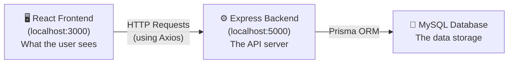

**The flow when a user logs in:**

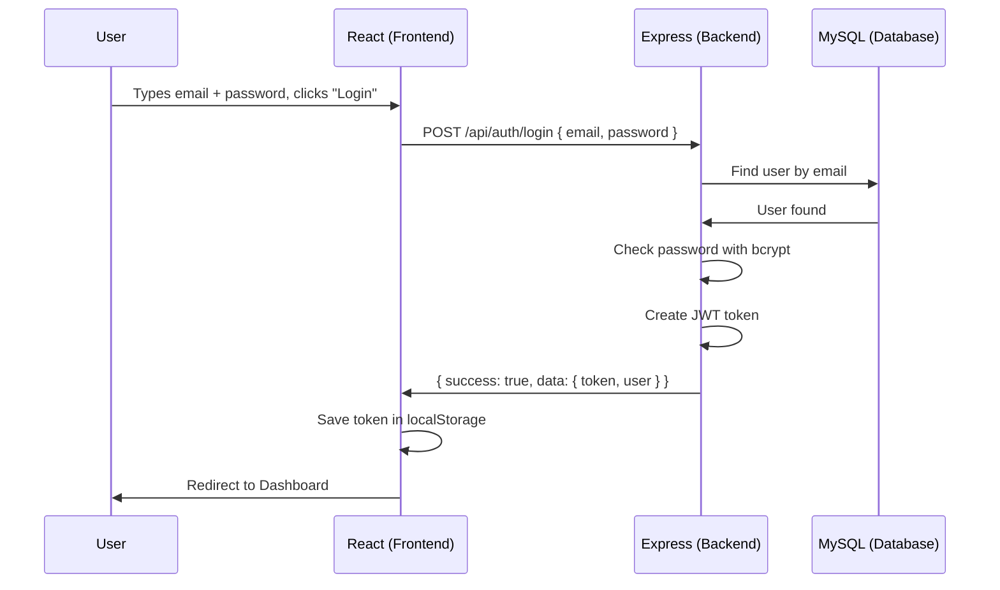

### API Endpoints We Will Use Today

| # | Method | URL | Who can use it | What it does |
|---|--------|-----|---------------|-------------|
| 1 | POST | `/api/auth/login` | Anyone | Login and get JWT token |
| 2 | GET | `/api/classrooms` | Logged-in users | Get all classrooms |
| 3 | GET | `/api/students` | Logged-in users | Get all students |
| 4 | GET | `/api/attendance/classroom/:id?date=...` | Logged-in users | Get attendance by classroom and date |

---

## 2. 🛠️ Project Setup

### Our Folder Structure

```
frontend/
├── src/
│   ├── api/
│   │   └── apiClient.js          ← Centralized Axios config (one place for the base URL + token)
│   ├── components/
│   │   ├── ProtectedRoute.jsx    ← Redirects to login if no token
│   │   └── Navbar.jsx            ← Navigation bar + Logout button
│   ├── pages/
│   │   ├── LoginPage.jsx         ← The login form
│   │   ├── DashboardPage.jsx     ← Overview with stats
│   │   ├── ClassroomsPage.jsx    ← List of classrooms
│   │   ├── StudentsPage.jsx      ← List of students
│   │   └── AttendancePage.jsx    ← Search attendance by date
│   ├── App.jsx                   ← Route definitions
│   ├── App.css                   ← All styles
│   └── main.jsx                  ← Entry point
├── index.html
├── package.json
└── vite.config.js
```

**Why this structure?**

| Folder | Purpose | Analogy |
|--------|---------|---------|
| `api/` | Holds the Axios configuration. One single place to set the backend URL and attach the JWT token. | Like the **phone** your app uses to call the backend. |
| `components/` | Reusable pieces that appear on MULTIPLE pages (Navbar, ProtectedRoute). | Like **furniture** you put in every room. |
| `pages/` | One file per screen the user sees. Each page is a complete view. | Like the individual **rooms** in a house. |

### Install Dependencies

```bash
cd frontend
npm install
```

This installs: `react`, `react-dom`, `react-router-dom`, `axios`, and `vite`.

### Start the Dev Server

```bash
npm run dev
```

Open `http://localhost:5173` in your browser.

> ⚠️ **Make sure your backend is also running** on `http://localhost:5000`. Open a SECOND terminal and run `npm run dev` in the `backend/` folder.

---

## 3. 🏗️ Step 1 — The Login Page & `useState`

### ❌ The Problem — Variables Don't Update the Screen!

Let's say you try to build a login form like this:

```javascript
// ❌ THIS DOES NOT WORK!
function LoginPage() {
  let email = "";

  function handleChange(event) {
    email = event.target.value;
    console.log("email is now:", email); // ✅ This DOES print the new value!
  }

  return (
    <div>
      <input type="email" onChange={handleChange} />
      <p>You typed: {email}</p>  {/* ❌ This NEVER updates on screen! */}
    </div>
  );
}
```

You type "nimal@school.com" in the input. The `console.log` prints it. But the screen STILL shows an empty paragraph. **Why?!**

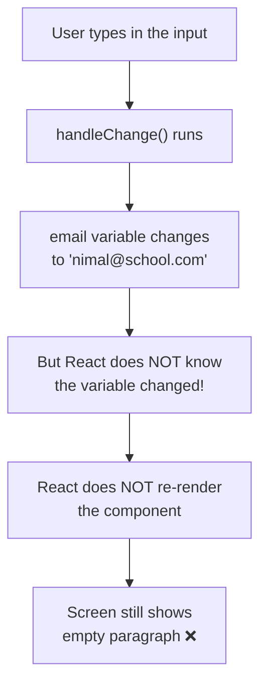

**The core issue:** React only re-renders (repaints the screen) when you use its **special** state system. Normal `let` variables are invisible to React.

### ✅ The Solution — `useState`

`useState` is React's way of saying: "I am watching this variable. When it changes, **re-render the screen!**"

```javascript
import { useState } from "react";

function LoginPage() {
  const [email, setEmail] = useState("");
  //     ↑ value    ↑ updater      ↑ initial value

  function handleChange(event) {
    setEmail(event.target.value); // Tell React: "email changed! Re-render!"
  }

  return (
    <div>
      <input type="email" onChange={handleChange} />
      <p>You typed: {email}</p>  {/* ✅ Updates instantly! */}
    </div>
  );
}
```

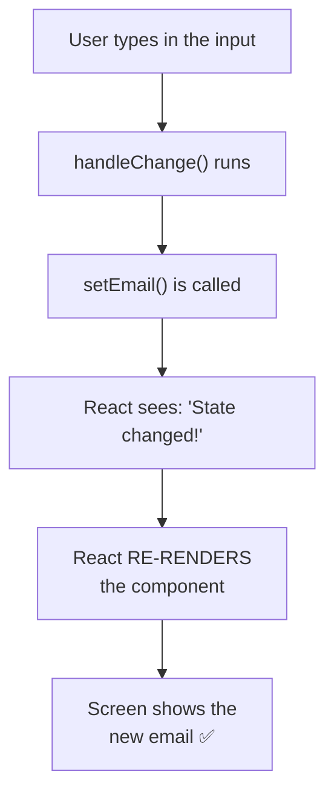

**The rule:**

| ❌ Wrong | ✅ Right | Why |
|---------|---------|-----|
| `let email = ""` | `const [email, setEmail] = useState("")` | React can't see `let` changes |
| `email = "new value"` | `setEmail("new value")` | `setEmail` triggers a re-render |

### The Login Page File — `src/pages/LoginPage.jsx`

Now look at our actual `LoginPage.jsx`. It uses `useState` for four things:

```javascript
const [email, setEmail] = useState("");       // What the user types in the email field
const [password, setPassword] = useState(""); // What the user types in the password field
const [error, setError] = useState("");       // Error message to show on screen
const [loading, setLoading] = useState(false); // Is the login request in progress?
```

> 💡 **The Locked Room Analogy (from Day 2):** Remember every `.js` file is a "Locked Room." `LoginPage.jsx` is a locked room. At the bottom, `export default LoginPage` opens the window and hands the component outside. In `App.jsx`, `import LoginPage from "./pages/LoginPage"` grabs it through the window.

Open `src/pages/LoginPage.jsx` to see the complete code. We will add the API call in the next step!

---

## 4. 🔌 Step 2 — Talking to the Backend: `fetch` vs `axios` & `async/await`

### ❌ Problem 1 — JavaScript is IMPATIENT (We learned this on Day 2!)

Remember from Day 2? JavaScript does NOT wait for slow things like API calls. It runs the next line immediately:

```javascript
// ❌ THIS DOES NOT WORK!
function handleLogin() {
  const response = axios.post("http://localhost:5000/api/auth/login", {
    email: "nimal@school.com",
    password: "teacher123",
  });

  console.log(response); // ❌ undefined! The request hasn't finished yet!
}
```

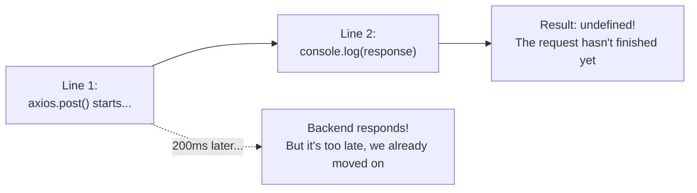

### ✅ Solution — `async/await`

```javascript
// ✅ THIS WORKS!
async function handleLogin() {
  const response = await axios.post("http://localhost:5000/api/auth/login", {
    email: "nimal@school.com",
    password: "teacher123",
  });

  console.log(response.data); // ✅ { success: true, data: { token: "..." } }
}
```

| Keyword | What it does |
|---------|-------------|
| `async` | Marks the function as asynchronous. Required to use `await` inside it. |
| `await` | Tells JavaScript: **"STOP. Wait here until this finishes. Then continue."** |

---

### ❌ Problem 2 — `fetch` is Messy!

JavaScript has a built-in tool called `fetch`. Let's try using it:

```javascript
// Using fetch — it works, but look how ugly and verbose it is!
async function handleLogin() {
  const response = await fetch("http://localhost:5000/api/auth/login", {
    method: "POST",                                    // You must manually specify the method
    headers: { "Content-Type": "application/json" },   // You must manually set headers
    body: JSON.stringify({ email, password }),          // You must manually convert to JSON string
  });

  const data = await response.json(); // You must manually parse the response!

  if (!response.ok) {                // You must manually check for errors!
    throw new Error(data.message);
  }

  console.log(data);
}
```

**Problems with `fetch`:**

| # | Problem | fetch | axios |
|---|---------|-------|-------|
| 1 | Sending JSON data | Must wrap in `JSON.stringify()` | Just pass the object directly |
| 2 | Reading JSON response | Must call `.json()` manually | Automatic — `response.data` is ready |
| 3 | Setting Content-Type | Must set manually | Automatic |
| 4 | Error handling | Does NOT throw on 404/500! | Throws automatically on 4xx/5xx |
| 5 | Base URL | Must type the full URL every time | Set it once, reuse everywhere |

### ✅ Solution — Axios + Centralized `apiClient.js`

Instead of repeating the full URL and headers in EVERY page, we create ONE shared Axios instance:

**`src/api/apiClient.js`:**

```javascript
import axios from "axios";

const apiClient = axios.create({
  baseURL: "http://localhost:5000/api",
});

// Automatically attach JWT token to EVERY request
apiClient.interceptors.request.use(function (config) {
  const token = localStorage.getItem("token");
  if (token) {
    config.headers.Authorization = "Bearer " + token;
  }
  return config;
});

export default apiClient;
```

**Now every page just does:**

```javascript
import apiClient from "../api/apiClient";

// Clean! Short! No manual headers!
const response = await apiClient.post("/auth/login", { email, password });
const response = await apiClient.get("/classrooms"); // Token attached automatically!
```

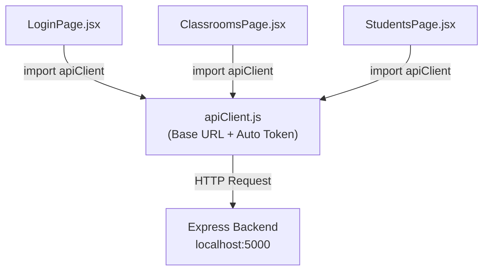

> 💡 **Locked Room:** `apiClient.js` is a locked room. It creates a configured Axios instance and `export default apiClient` hands it out the window. Every page file imports it through that window.

---

## 5. 🔄 Step 3 — Loading Data on Page Load: `useEffect`

### ❌ The Problem — The Infinite Loop DISASTER!

You want to load classrooms when the page appears. So you call `axios.get()` directly inside the component:

```javascript
// ❌ DISASTER! DO NOT DO THIS!
function ClassroomsPage() {
  const [classrooms, setClassrooms] = useState([]);

  // This code runs EVERY time the component renders
  async function loadData() {
    const response = await apiClient.get("/classrooms");
    setClassrooms(response.data.data); // This triggers a re-render!
  }
  loadData(); // Calling it directly in the component body!

  return <div>{classrooms.length} classrooms</div>;
}
```

**What happens:**

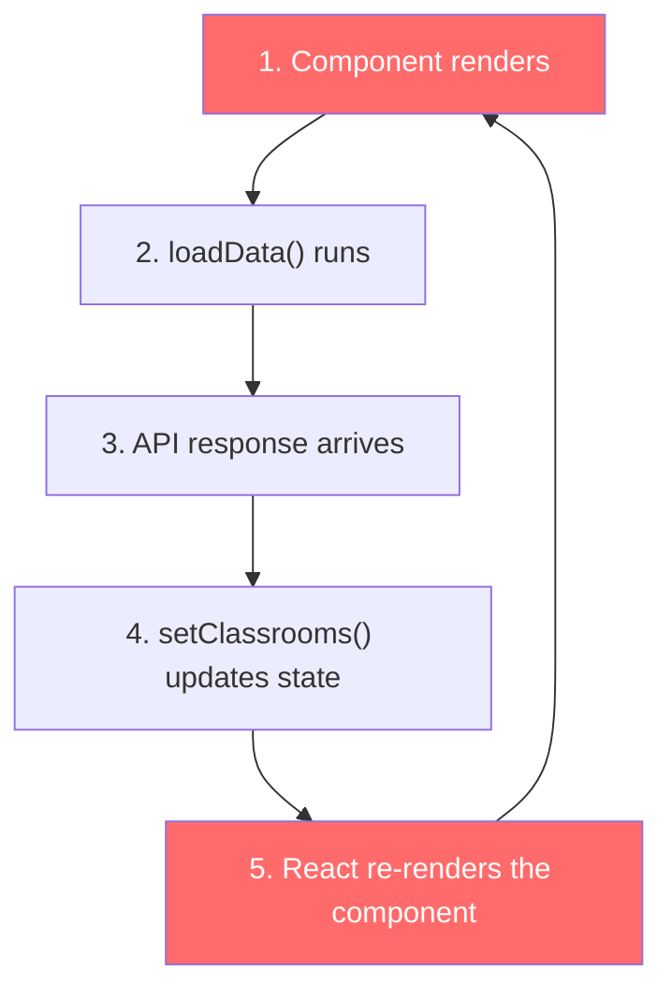

**It's an INFINITE LOOP!** Render → fetch → setState → render → fetch → setState → render... Your app sends THOUSANDS of requests per second and the browser freezes!

### ✅ The Solution — `useEffect`

`useEffect` tells React: **"Run this code ONLY at the right time, not on every render."**

```javascript
import { useState, useEffect } from "react";

function ClassroomsPage() {
  const [classrooms, setClassrooms] = useState([]);

  // ✅ This runs ONCE when the component first appears
  useEffect(function () {
    async function loadData() {
      const response = await apiClient.get("/classrooms");
      setClassrooms(response.data.data);
    }
    loadData();
  }, []); // <-- THIS EMPTY ARRAY IS THE KEY!

  return <div>{classrooms.length} classrooms</div>;
}
```

**The empty array `[]`** is called the **dependency array**. It tells React: "Run this effect only ONCE — when the component first mounts (appears on screen). Never again."

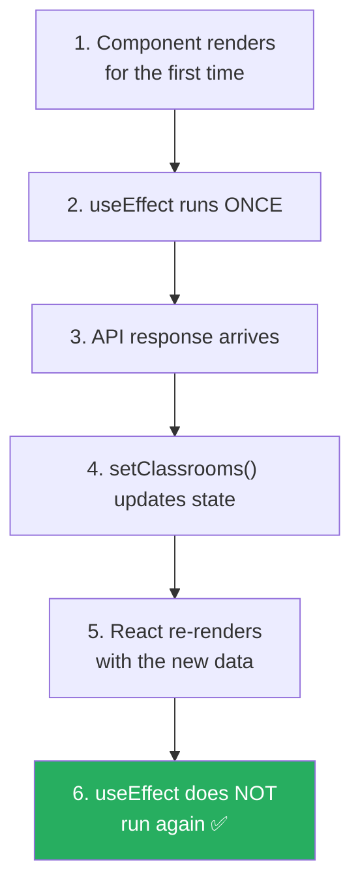

| Code | When it runs |
|------|-------------|
| `useEffect(fn, [])` | **Once** — when component first appears (mount) |
| `useEffect(fn, [id])` | When component mounts AND whenever `id` changes |
| `useEffect(fn)` | ❌ **Every single render** — usually a mistake! |

---

## 6. 🔐 Step 4 — Authentication: JWT, localStorage & Protected Routes

### ❌ The Problem — 401 Unauthorized!

You log in successfully. You navigate to the Dashboard. The Dashboard tries to fetch classrooms:

```javascript
const response = await apiClient.get("/classrooms");
// ❌ 401 Unauthorized! The backend rejects the request!
```

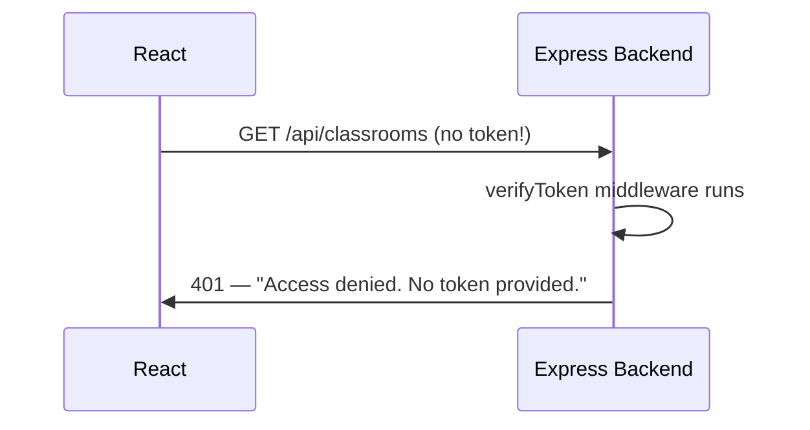

**Why?** On Day 2, we added `verifyToken` middleware to our routes. The backend demands a JWT token in the `Authorization` header. We are not sending one!

### ✅ The Solution — localStorage + Auto-Attach Token

**Step 1: Save the token when logging in** (`LoginPage.jsx`):

```javascript
const response = await apiClient.post("/auth/login", { email, password });

// Save to localStorage (survives page refresh!)
localStorage.setItem("token", response.data.data.token);
localStorage.setItem("user", JSON.stringify(response.data.data.user));
```

**Step 2: Auto-attach it to every request** (`apiClient.js` — already done!):

```javascript
apiClient.interceptors.request.use(function (config) {
  const token = localStorage.getItem("token");
  if (token) {
    config.headers.Authorization = "Bearer " + token;
  }
  return config;
});
```

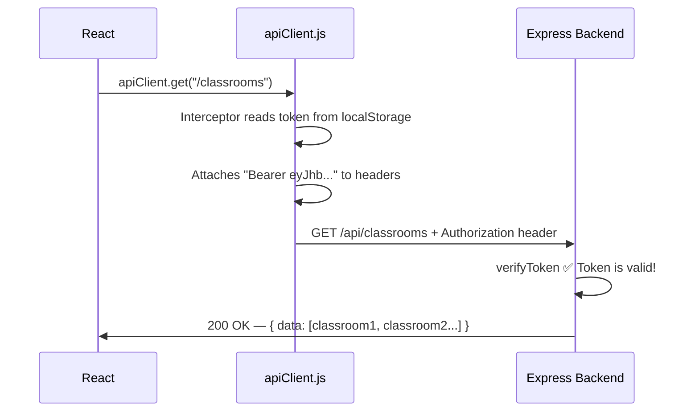

### The ProtectedRoute Component — `src/components/ProtectedRoute.jsx`

But what if someone types `http://localhost:5173/dashboard` in the URL bar WITHOUT logging in? They have no token. They should be sent back to the login page!

```javascript
import { Navigate } from "react-router-dom";

function ProtectedRoute({ children }) {
  const token = localStorage.getItem("token");

  if (!token) {
    return <Navigate to="/login" />;  // Redirect to login!
  }

  return children; // Show the actual page
}
```

**In `App.jsx`, we wrap protected pages:**

```javascript
<Route path="/dashboard" element={
  <ProtectedRoute><DashboardPage /></ProtectedRoute>
} />
```

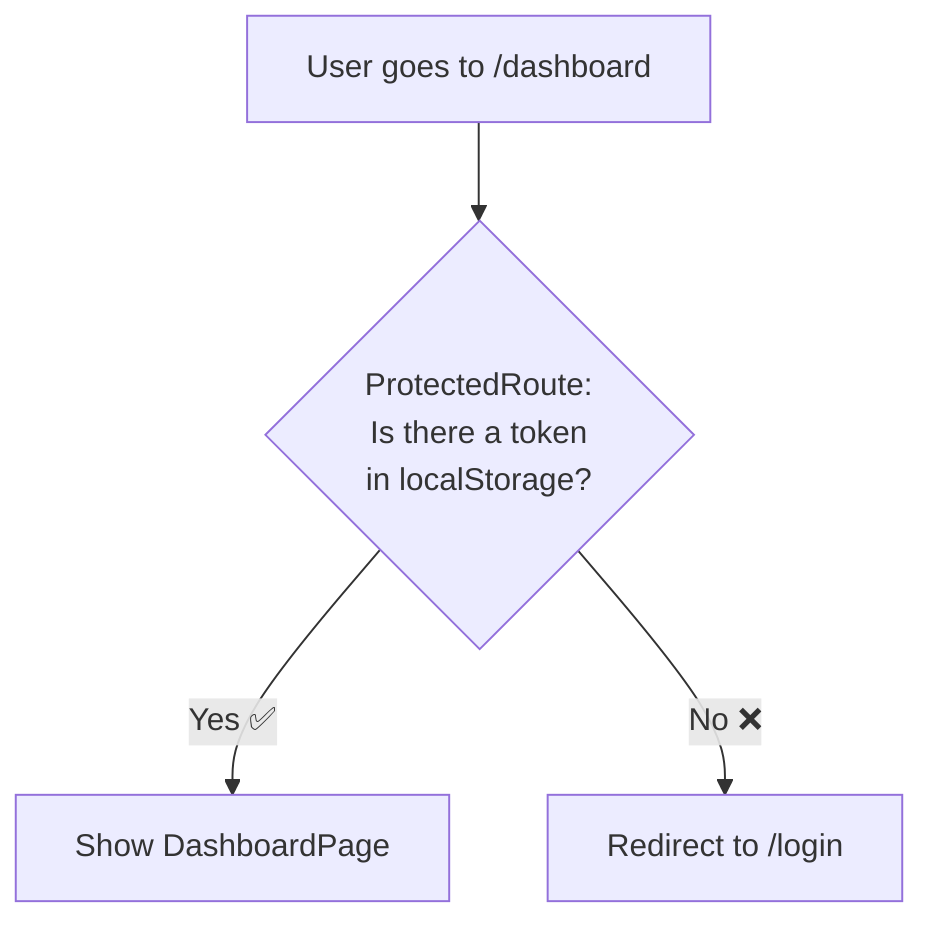

---

## 7. 📄 Step 5 — Building the Remaining Pages

Now that you understand `useState`, `useEffect`, `apiClient`, and `ProtectedRoute`, all remaining pages follow the **exact same pattern**:

```
1. Import useState, useEffect, apiClient, Navbar
2. Create state variables with useState
3. Fetch data inside useEffect (runs once)
4. Display data in JSX (tables, cards, etc.)
```

Open each file in `src/pages/` to see the complete code:

| File | What It Does | API Endpoint |
|------|-------------|-------------|
| `DashboardPage.jsx` | Shows classroom and student counts | `GET /classrooms` + `GET /students` |
| `ClassroomsPage.jsx` | Lists all classrooms in a table | `GET /classrooms` |
| `StudentsPage.jsx` | Lists all students in a table | `GET /students` |
| `AttendancePage.jsx` | Search attendance by classroom ID + date | `GET /attendance/classroom/:id?date=...` |

> 💡 **`Promise.all`** — In `DashboardPage.jsx`, we use `Promise.all([apiClient.get("/classrooms"), apiClient.get("/students")])` to fetch BOTH at the same time. This is faster than fetching one, waiting, then fetching the other.

---

## 8. 🤔 "Wait! Why didn't we use Axios in the Backend?"

Great question! On Day 2, our Express backend did NOT use Axios. On Day 3, our React frontend DOES use Axios. Why?

> 📞 **The Phone Call Analogy:**
>
> Think of HTTP communication like a **phone call**.
>
> - **Express** is the person who **sits by the phone and WAITS for calls**. It is a **receiver** (server). It listens for incoming requests and responds to them.
> - **Axios** is the **person who MAKES the call**. It is a **requester** (client). It sends requests to a server.
>
> Our React app needs to CALL the backend → it uses **Axios**.
> Our Express backend just WAITS for calls → it uses **Express** (not Axios).

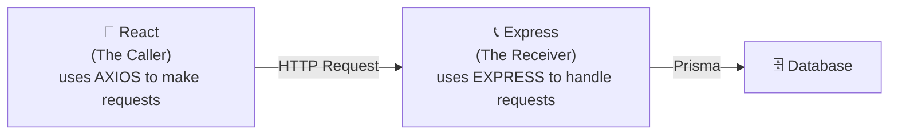

**When WOULD a backend use Axios?**

Only if it needs to call **another external API**. For example:
- Sending an SMS via Twilio API
- Calling a payment gateway like Stripe
- Fetching weather data from a third-party API

Our backend only talks to its OWN database (using Prisma), so it doesn't need a "caller" tool like Axios.

| Tool | Role | Used In | Why |
|------|------|---------|-----|
| **Express** | Receiver — listens for requests | Backend (Day 2) | The backend IS the server |
| **Axios** | Requester — makes requests | Frontend (Day 3) | The frontend CALLS the server |
| **Prisma** | Database communicator | Backend (Day 2) | Talks to MySQL directly |

---

## 9. 🚀 Running the App

### Quick Checklist

- [x] MySQL running with `attendance_system_db` (from Day 1)
- [x] Backend running on `http://localhost:5000` (from Day 2)
- [x] All frontend files created

### Start the Frontend

```bash
cd frontend
npm install
npm run dev
```

Open `http://localhost:5173` in your browser.

### Test Login

Use the seed data from Day 1:

| User | Email | Password |
|------|-------|----------|
| Admin | amara@school.com | admin123 |
| Teacher | nimal@school.com | teacher123 |

### Testing Flow

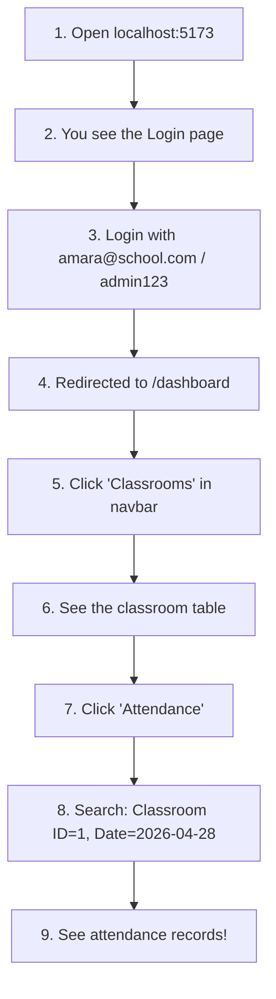

### Common Errors

| Error | Cause | Fix |
|-------|-------|-----|
| `Network Error` or blank screen | Backend is not running | Start backend: `cd backend && npm run dev` |
| `401 Unauthorized` on dashboard | Token expired or missing | Login again |
| `CORS error` in browser console | Backend CORS not enabled | Check `app.use(cors())` in backend `server.js` |
| Page refreshes and goes to login | Token cleared from localStorage | Login again — this is expected after clearing storage |

---

## 10. 📋 Quick React & Axios Cheat Sheet

### React Hooks

| Hook | What It Does | Example |
|------|-------------|---------|
| `useState(initial)` | Creates a state variable that triggers re-renders when changed | `const [name, setName] = useState("")` |
| `useEffect(fn, [])` | Runs code ONCE when component appears (mount) | Fetching data on page load |
| `useEffect(fn, [id])` | Runs code when `id` changes | Re-fetching when a filter changes |
| `useNavigate()` | Returns a function to navigate to different pages | `navigate("/dashboard")` |

### Axios Methods

| Method | What It Does | Example |
|--------|-------------|---------|
| `apiClient.get(url)` | GET request — read data | `apiClient.get("/classrooms")` |
| `apiClient.post(url, data)` | POST request — create data | `apiClient.post("/auth/login", { email, password })` |
| `apiClient.put(url, data)` | PUT request — update data | `apiClient.put("/students/1", { name: "New Name" })` |
| `apiClient.delete(url)` | DELETE request — remove data | `apiClient.delete("/students/1")` |

### Axios Response Structure

```javascript
const response = await apiClient.get("/classrooms");

// Our backend always returns: { success, message, data }
response.data           // The full response body: { success: true, message: "...", data: [...] }
response.data.data      // The actual data array: [classroom1, classroom2, ...]
response.data.message   // The message string: "Classrooms retrieved successfully."
response.status         // HTTP status code: 200
```

### localStorage Methods

| Method | What It Does | Example |
|--------|-------------|---------|
| `localStorage.setItem(key, value)` | Save a string | `localStorage.setItem("token", "eyJ...")` |
| `localStorage.getItem(key)` | Read a string | `localStorage.getItem("token")` |
| `localStorage.removeItem(key)` | Delete an item | `localStorage.removeItem("token")` |

> ⚠️ localStorage can ONLY store strings. To store an object, use `JSON.stringify()`. To read it back, use `JSON.parse()`.

### JSX Patterns

```javascript
// Conditional rendering — show error only if it exists
{error && <p className="error">{error}</p>}

// Rendering a list — use .map() and always provide a key
{students.map(function (student) {
  return <tr key={student.id}><td>{student.name}</td></tr>;
})}

// Conditional text — show different button text based on state
<button>{loading ? "Loading..." : "Submit"}</button>
```

---

> Made with ❤️ for **designHer 2.0 Bootcamp 2026**
