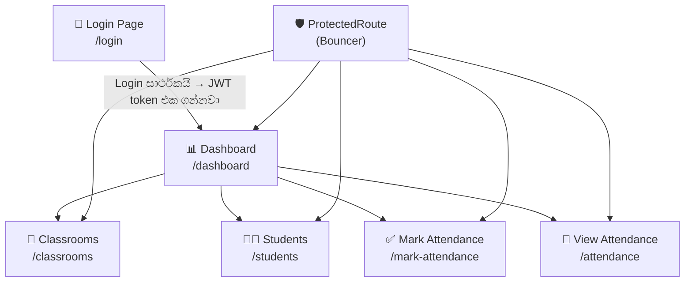
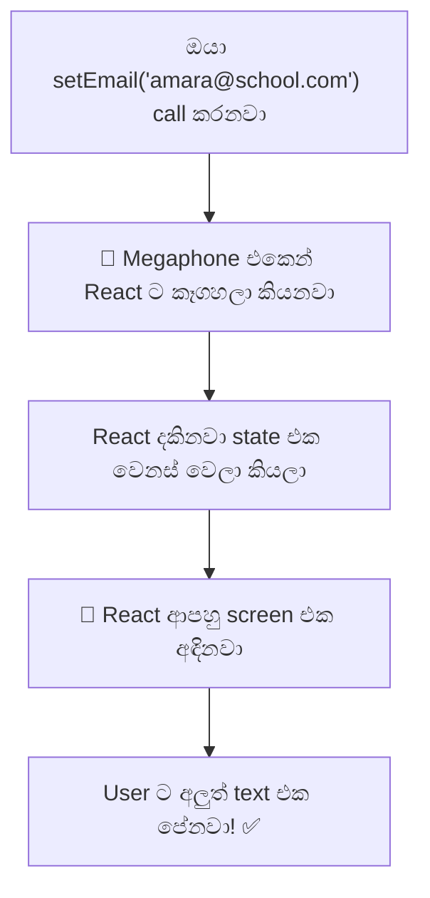
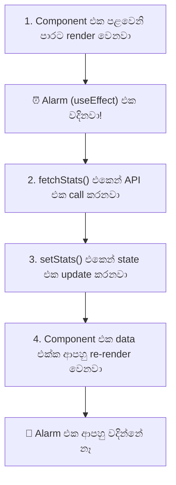
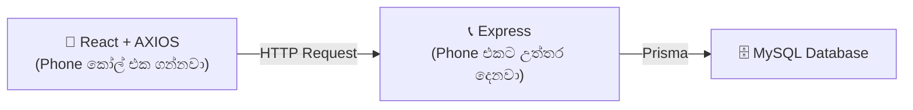

# 🎨 Day 3 — Building the React Frontend (සම්පූර්ණ මාර්ගෝපදේශය)

> **Day 3 of designHer 2.0 Bootcamp**
> අද අපි අපේ React frontend එක ඊයේ (Day 2) හදපු backend API එකට සම්බන්ධ කරනවා!
> අපි මේ app එක හදන්නේ **කොටසින් කොටස**, ඊළඟ කොටසට යන්න කලින් හැම එකක්ම test කරමිනුයි.

> 💡 **මේ guide එක පාවිච්චි කරන්නේ කොහොමද:** හැම file එකකම `🚀 FULL CODE (READY TO COPY)` කියලා block එකක් තියෙනවා. ඒක copy කරලා, හරි file එකට paste කරලා save කරන්න. ඊළඟ එකට යන්න කලින් අනිවාර්යයෙන්ම test කරන්න. මෙතන placeholders (හිස් තැන්) මුකුත් නෑ.

---

## 🗺️ Phase 1: Foundation & Setup

### සම්පූර්ණ System එක — ඔක්කොම Connect වෙන්නේ කොහොමද



### Folder Structure එක — LEGO Box Analogy එක

හිතන්න ඔයා LEGO සෙට් එකක් ගෙනාවා කියලා. පෙට්ටිය ඇතුළේ, කෑලි ටික වෙනම බෑග් වලට දාලා ලේබල් කරලා තියෙන්නේ. ඔයා කෑලි 500ම එකම බෑග් එකකට දාන්නේ නෑනේ — එහෙම කරොත් පිස්සු හැදෙයි! අපේ folders වැඩ කරන්නේත් ඒ විදිහටමයි:

```
frontend/
├── package.json            ← අපිට ඕන කරන tools වල shopping list එක
├── src/
│   ├── api/                ← BAG 1: Backend එකට කතා කරන "Phone" එක
│   │   └── apiClient.js
│   ├── components/         ← BAG 2: හැමතැනම පාවිච්චි වෙන LEGO bricks (හැම page එකකම තියෙනවා)
│   │   ├── ProtectedRoute.jsx
│   │   └── Navbar.jsx
│   ├── pages/              ← BAG 3: හදලා ඉවර වෙච්ච "කාමර"
│   │   ├── LoginPage.jsx
│   │   ├── DashboardPage.jsx
│   │   ├── ClassroomsPage.jsx
│   │   ├── StudentsPage.jsx
│   │   ├── MarkAttendancePage.jsx
│   │   └── AttendancePage.jsx
│   ├── App.jsx             ← "උපදෙස් මාලාව" (කොයි කාමරේ කොතනටද යන්නේ)
│   ├── App.css             ← පාට සහ හැඩවැඩ කිරීම්
│   └── main.jsx            ← අත්තිවාරම (ඔක්කොම පටන් ගන්නේ මෙතනින්)
```

> ⚠️ **මොනවද වැරදෙන්න පුළුවන්?**
> ඔයා "Page" file එකක් `components` folder එක ඇතුළට දැම්මොත්, React crash වෙන්නේ නෑ, හැබැයි පස්සේ ඔයාටම පැටලෙයි. ඒ නිසා LEGO බෑග් වලට අදාළව දේවල් දාන්න!
> 
> ඔයාගේ backend එක 5000 නෙවෙයි වෙන port එකක නම් තියෙන්නේ, ඔයාට CORS error එකක් එයි. apiClient.js එක open කරලා baseURL port එක වෙනස් කරන්න.

### Step 1: Project එක Initialize කරන්න

Vite පාවිච්චි කරලා React app එක හදන්න ඔයාගේ terminal එකේ මේ විධානයන් හරියටම run කරන්න:

> 🚨 වෙන කිසිම file එකක් හදන්න කලින් ඉස්සෙල්ලාම මේක කරන්න:
> npm create vite@latest frontend -- --template react
> cd frontend
> npm install axios react-router-dom
> npm install -D tailwindcss@3 postcss autoprefixer
> npx tailwindcss init -p
>
> ඔයා මේක මඟහැරියොත්, මුකුත්ම වැඩ කරන්නේ නැති වෙයි. හැම import එකක්ම fail වෙයි.

```bash
# Vite project එක හදන්න
npm create vite@latest frontend -- --template react

# Folder එක ඇතුළට යන්න
cd frontend

# අවශ්‍ය libraries සහ Tailwind CSS install කරන්න
npm install axios react-router-dom
npm install -D tailwindcss@3 postcss autoprefixer
npx tailwindcss init -p
```

### 📁 File: `tailwind.config.js`

මේ file එකෙන් Tailwind එකට කියනවා CSS generate කරන්න අපේ HTML සහ React කෝඩ් එක තියෙන්නේ කොහෙද කියලා.

#### 🚀 FULL CODE (READY TO COPY)

```javascript
export default {
  content: ["./index.html", "./src/**/*.{js,jsx}"],
  theme: { extend: { fontFamily: { sans: ['Inter', 'system-ui', 'sans-serif'] } } },
  plugins: [],
}
```

| Line | ඇයි අපි මේක ලිව්වේ? |
|------|------------------------|
| `content` | Tailwind එකට කියනවා අපේ ඔක්කොම `.jsx` files scan කරලා අපි පාවිච්චි කරන CSS විතරක් generate කරන්න කියලා. |
| `fontFamily` | 'Inter' කියන font එක primary font එක විදිහට සකස් කරනවා ලස්සන modern පෙනුමක් ගන්න. |

### 📁 File: `package.json`

මේක තමයි අපේ "shopping list" එක. මේකෙන් Node.js එකට කියනවා අපේ project එකට ඕන libraries මොනවද කියලා.

#### 🚀 FULL CODE (READY TO COPY)

```json
{
  "name": "designher-attendance-frontend",
  "private": true,
  "version": "1.0.0",
  "type": "module",
  "scripts": {
    "dev": "vite",
    "build": "vite build",
    "preview": "vite preview"
  },
  "dependencies": {
    "axios": "^1.7.9",
    "react": "^19.0.0",
    "react-dom": "^19.0.0",
    "react-router-dom": "^7.1.1"
  },
  "devDependencies": {
    "@vitejs/plugin-react": "^4.3.4",
    "autoprefixer": "^10.5.0",
    "postcss": "^8.5.13",
    "tailwindcss": "^3.4.19",
    "vite": "^6.0.5"
  }
}
```

| Line | ඇයි අපි මේක ලිව්වේ? |
|------|------------------------|
| `"dev": "vite"` | අපේ local server එක පටන් ගන්න `npm run dev` කියන command එක හදනවා. |
| `"axios"` | අපේ backend එකට HTTP requests යවන්න පාවිච්චි කරන tool එක. |
| `"react-router-dom"` | Browser එක reload කරන්නේ නැතුව pages අතරේ මාරු වෙන්න (Login, Dashboard, ආදිය) දෙන tool එක. |

---

### 📁 File: `src/api/apiClient.js`

#### 🤔 Axios ද Fetch ද? (Day 2 සහ Day 3)
Day 2 වලදී, backend එකට අමතර දේවල් install කරන එක නවත්වන්න අපි කිව්වා `fetch()` පාවිච්චි කරනවා කියලා. එහෙනම් අද අපි ඇයි `axios` install කරන්නේ?

1. **Industry Standard (කර්මාන්ත ප්‍රමිතිය):** Professional React development වලදී, Axios තමයි industry standard එක.
2. **Auto-JSON:** `fetch()` වලදී ඔයාට හැමවෙලේම `response.json()` කියන එක අතින් ලියන්න වෙනවා. Axios ඒක ඉබේම කරනවා.
3. **Interceptors:** Axios වලින් අපිට "Interceptors" (අපේ Central Phone එක වගේ) හදන්න පුළුවන්. ඒකෙන් *යවන හැම request එකකටම* JWT token එක ලේසියෙන්ම අමුණන්න පුළුවන්. `fetch` වලින් මේක කරන්න ගියොත් පැටලිලි සහගත කෝඩ් ගොඩක් ලියන්න වෙනවා.

#### ✅ The Solution — "Central Phone" එක

හිතන්න `apiClient.js` කියන්නේ **කලින්ම restaurant එකේ number එක save කරලා තියෙන වගේම ඔයා කතා කරන හැමවෙලේම ඔයාගේ නම (token එක) ඉබේම කියන ෆෝන් එකක්** කියලා.

#### 🚀 FULL CODE (READY TO COPY)

```javascript
import axios from "axios";

// අපේ backend එකේ base URL එකත් එක්ක reusable Axios instance එකක් හදන්න
const apiClient = axios.create({
  baseURL: "http://localhost:5000/api",
});

// හැම request එකකටම JWT token එක ඉබේම අමුණන්න
apiClient.interceptors.request.use(function (config) {
  const token = localStorage.getItem("token");
  if (token) {
    config.headers.Authorization = "Bearer " + token;
  }
  return config;
});

export default apiClient;
```

| Line | ඇයි අපි මේක ලිව්වේ? |
|------|------------------------|
| `import axios from "axios"` | Axios library එක ගන්නවා. |
| `axios.create({ baseURL: ... })` | Backend URL එක කලින්ම දාලා custom Axios එකක් හදනවා. දැන් අපි සම්පූර්ණ URL එක ලියන්නේ නැතුව `/classrooms` කියලා ලියනවා. |
| `interceptors.request.use(...)` | **හැම request එකකටම කලින්** function එකක් run කරනවා. හරියට ලියුම් යවන්න කලින් හැම ලියුමකටම මුද්දර ගහනවා වගේ වැඩක්. |
| `localStorage.getItem("token")` | Login වෙනකොට save කරපු JWT token එක කියවනවා. Token එකෙන් "මම login වෙලා ඉන්නේ" කියලා ඔප්පු කරනවා. |
| `config.headers.Authorization` | Request header එකට `Bearer eyJ...` කියන එක එකතු කරනවා. අපේ backend එකේ `verifyToken` middleware එක බලාපොරොත්තු වෙන්නේ හරියටම මේ විදිහටයි. |
| `export default apiClient` | මේ හදාගත්ත Axios එක අනිත් ඔක්කොම files එක්ක share කරනවා. |

> ⚠️ **මොනවද වැරදෙන්න පුළුවන්?**
> ඔයා `Authorization` කියන එකේ අකුරක් හරි වැරදියට ලිව්වොත් (උදා: `Auth` හෝ `authorisation`), backend එක token එක හොයාගන්න බැරුව හැම request එකක්ම `401 Unauthorized` error එකක් දීලා ප්‍රතික්ෂේප කරනවා!
> 
> ඔයාට 'Cannot find module axios' කියලා ආවොත්, ඒ කියන්නේ ඔයා npm install axios run කරලා නෑ. Server එක නවත්වලා, ඒක run කරලා, ආපහු restart කරන්න.

---

### 📁 File: `src/main.jsx`

මේක තමයි **අත්තිවාරම**. මේකෙන් අපේ සම්පූර්ණ React app එක HTML page එක ඇතුළට දානවා (mount කරනවා).

#### 🚀 FULL CODE (READY TO COPY)

```jsx
import React from "react";
import ReactDOM from "react-dom/client";
import App from "./App";
import "./App.css";

ReactDOM.createRoot(document.getElementById("root")).render(
  <React.StrictMode>
    <App />
  </React.StrictMode>
);
```

| Line | ඇයි අපි මේක ලිව්වේ? |
|------|------------------------|
| `import App from "./App"` | අපේ main App component එක (මොළය) ගන්නවා. |
| `import "./App.css"` | අපේ global styling ටික ලෝඩ් කරනවා. |
| `document.getElementById("root")` | `index.html` එකේ තියෙන `<div id="root">` එක හොයාගන්නවා. |
| `<React.StrictMode>` | Development කාලේදී bugs අල්ලගන්න උදව් වෙනවා (අමතර warnings දෙනවා). |
| `<App />` | ඒ div එක ඇතුළේ අපේ සම්පූර්ණ application එක render කරනවා. |

---

### 📁 File: `src/App.css`

සම්පූර්ණ app එකටම අදාළ styling. අපි මේක සරලව තියාගන්නවා — අද අපේ අරමුණ API එක connect කරන එක මිසක්, CSS නෙවෙයි.

#### 🚀 FULL CODE (READY TO COPY)

```css
@tailwind base;
@tailwind components;
@tailwind utilities;

@import url('https://fonts.googleapis.com/css2?family=Inter:wght@300;400;500;600;700&display=swap');

@layer base {
  * {
    box-sizing: border-box;
  }
  body {
    font-family: 'Inter', system-ui, sans-serif;
    @apply bg-gray-50 text-gray-900;
  }
}

@layer components {
  .btn-primary {
    @apply bg-indigo-600 text-white px-4 py-2 rounded-lg font-medium hover:bg-indigo-700 transition-colors duration-150 disabled:opacity-50 disabled:cursor-not-allowed text-sm;
  }
  .btn-secondary {
    @apply bg-gray-100 text-gray-700 px-4 py-2 rounded-lg font-medium hover:bg-gray-200 transition-colors duration-150 text-sm;
  }
  .btn-danger {
    @apply bg-red-50 text-red-600 px-4 py-2 rounded-lg font-medium hover:bg-red-100 transition-colors duration-150 text-sm;
  }
  .input-field {
    @apply w-full border border-gray-200 rounded-lg px-3 py-2.5 text-sm focus:outline-none focus:ring-2 focus:ring-indigo-500 focus:border-transparent transition-all duration-150 bg-white;
  }
  .card {
    @apply bg-white rounded-xl shadow-sm border border-gray-100 p-6;
  }
  .badge-present {
    @apply inline-flex items-center px-2.5 py-0.5 rounded-full text-xs font-medium bg-emerald-50 text-emerald-700;
  }
  .badge-absent {
    @apply inline-flex items-center px-2.5 py-0.5 rounded-full text-xs font-medium bg-red-50 text-red-700;
  }
  .badge-late {
    @apply inline-flex items-center px-2.5 py-0.5 rounded-full text-xs font-medium bg-amber-50 text-amber-700;
  }
  .badge-admin {
    @apply inline-flex items-center px-2.5 py-0.5 rounded-full text-xs font-medium bg-violet-50 text-violet-700;
  }
  .badge-teacher {
    @apply inline-flex items-center px-2.5 py-0.5 rounded-full text-xs font-medium bg-blue-50 text-blue-700;
  }
  .page-header {
    @apply text-2xl font-semibold text-gray-900 mb-1;
  }
  .page-subheader {
    @apply text-sm text-gray-500 mb-6;
  }
}
```

## 🛡️ Phase 2: The Brain & Security

---

### 📁 File: `src/App.jsx`

මේක තමයි app එකේ **මොළය**. මේකෙන් තමයි මේ ප්‍රශ්නෙට උත්තර දෙන්නේ: "User කෙනෙක් URL එකකට ගියාම, මම පෙන්නන්න ඕනේ කොයි React component එකද?"

#### 🚀 FULL CODE (READY TO COPY)

```jsx
import { BrowserRouter, Routes, Route, Navigate } from "react-router-dom";
import LoginPage from "./pages/LoginPage";
import DashboardPage from "./pages/DashboardPage";
import ClassroomsPage from "./pages/ClassroomsPage";
import StudentsPage from "./pages/StudentsPage";
import MarkAttendancePage from "./pages/MarkAttendancePage";
import AttendancePage from "./pages/AttendancePage";
import AdminPage from "./pages/AdminPage";
import ProtectedRoute from "./components/ProtectedRoute";

function App() {
  return (
    <BrowserRouter>
      <Routes>
        {/* Public (ඕනෑම කෙනෙකුට) */}
        <Route path="/login" element={<LoginPage />} />

        {/* Protected (ලොගින් වෙච්ච අයට විතරයි) */}
        <Route path="/dashboard" element={<ProtectedRoute><DashboardPage /></ProtectedRoute>} />
        <Route path="/classrooms" element={<ProtectedRoute><ClassroomsPage /></ProtectedRoute>} />
        <Route path="/students" element={<ProtectedRoute><StudentsPage /></ProtectedRoute>} />
        <Route path="/mark-attendance" element={<ProtectedRoute><MarkAttendancePage /></ProtectedRoute>} />
        <Route path="/attendance" element={<ProtectedRoute><AttendancePage /></ProtectedRoute>} />
        <Route path="/admin" element={<ProtectedRoute><AdminPage /></ProtectedRoute>} />

        {/* Catch-all (වැරදි URL එකකට ගියොත්) */}
        <Route path="*" element={<Navigate to="/login" />} />
      </Routes>
    </BrowserRouter>
  );
}

export default App;
```

| Line | ඇයි අපි මේක ලිව්වේ? |
|------|------------------------|
| `<BrowserRouter>` | React වල URL-based page navigation එකට ඉඩ දෙනවා. |
| `<Route path="/login" element={<LoginPage />} />` | URL එක `/login` වුණාම, LoginPage component එක පෙන්නනවා. |
| `<ProtectedRoute><DashboardPage /></ProtectedRoute>` | Dashboard එක Bouncer කෙනෙක්ගෙන් වට කරනවා — මුලින්ම token එක තියෙනවද බලනවා. |
| `<Route path="*">` | දන්නේ නැති ඕනෑම URL එකක් (`/banana` වගේ) ආවොත් අල්ලගෙන login එකට හරවලා යවනවා. |

> ⚠️ **මොනවද වැරදෙන්න පුළුවන්?**
> ඔයාට `<BrowserRouter>` එක අමතක වුණොත්, React එක බය හිතෙන රතු පාට screen එකකින් "useRoutes() may be used only in the context of a <Router> component." කියලා error එකක් දීලා crash වෙයි.

---

### 📁 File: `src/components/Layout.jsx`

මේ wrapper component එකෙන් sidebar එකයි content area එකයි හැම page එකකම එකම විදිහට තියෙනවා කියලා තහවුරු කරනවා.

#### 🚀 FULL CODE (READY TO COPY)

```jsx
import Navbar from "./Navbar";

function Layout({ children }) {
  return (
    <div className="flex min-h-screen bg-gray-50">
      <Navbar />
      <main className="flex-1 ml-56 p-8 min-h-screen">
        {children}
      </main>
    </div>
  );
}

export default Layout;
```

| Line | ඇයි අපි මේක ලිව්වේ? |
|------|------------------------|
| `{ children }` | `<Layout> ... </Layout>` tags ඇතුළට දාන ඕනෑම දෙයක් නියෝජනය කරන special React prop එකක්. |
| `ml-56` | `margin-left: 14rem` කියන එකට Tailwind පාවිච්චි කරන නම. මේකෙන් main content එක දකුණට තල්ලු කරනවා එතකොට ඒක fixed වෙලා තියෙන sidebar එක උඩට එන්නේ නෑ. |

---

### 📁 File: `src/components/Navbar.jsx`

Navbar එක හැම page එකකම (Login එකේ ඇරෙන්න) පෙන්නනවා.

#### 🚀 FULL CODE (READY TO COPY)

```jsx
import { Link, useNavigate, useLocation } from "react-router-dom";

const navLinks = [
  { to: "/dashboard", label: "Dashboard", icon: "🏠" },
  { to: "/classrooms", label: "Classrooms", icon: "🏫" },
  { to: "/students", label: "Students", icon: "👩‍🎓" },
  { to: "/mark-attendance", label: "Mark Attendance", icon: "✅" },
  { to: "/attendance", label: "View Attendance", icon: "📋" },
];

function Navbar() {
  const navigate = useNavigate();
  const location = useLocation();
  const user = JSON.parse(localStorage.getItem("user") || "null");
  const isAdmin = user && user.role === "admin";

  function handleLogout() {
    localStorage.removeItem("token");
    localStorage.removeItem("user");
    navigate("/login");
  }

  return (
    <aside className="fixed top-0 left-0 h-full w-56 bg-white border-r border-gray-100 flex flex-col z-30 shadow-sm">
      {/* Brand */}
      <div className="px-5 py-5 border-b border-gray-100">
        <p className="text-indigo-600 font-bold text-lg tracking-tight">designHer 2.0</p>
        <p className="text-gray-400 text-xs mt-0.5">Attendance System</p>
      </div>

      {/* Nav links */}
      <nav className="flex-1 px-3 py-4 space-y-0.5 overflow-y-auto">
        {navLinks.map(function (link) {
          const active = location.pathname === link.to;
          return (
            <Link
              key={link.to}
              to={link.to}
              className={`flex items-center gap-3 px-3 py-2.5 rounded-lg text-sm font-medium transition-colors duration-150 ${
                active
                  ? "bg-indigo-50 text-indigo-700"
                  : "text-gray-600 hover:bg-gray-50 hover:text-gray-900"
              }`}
            >
              <span className="text-base">{link.icon}</span>
              {link.label}
            </Link>
          );
        })}

        {/* Admin-only link */}
        {isAdmin && (
          <Link
            to="/admin"
            className={`flex items-center gap-3 px-3 py-2.5 rounded-lg text-sm font-medium transition-colors duration-150 mt-2 ${
              location.pathname === "/admin"
                ? "bg-violet-50 text-violet-700"
                : "text-gray-600 hover:bg-gray-50 hover:text-gray-900"
            }`}
          >
            <span className="text-base">⚙️</span>
            Admin Panel
          </Link>
        )}
      </nav>

      {/* User info + logout */}
      <div className="px-4 py-4 border-t border-gray-100">
        <div className="mb-2">
          <p className="text-sm font-medium text-gray-900 truncate">{user ? user.name : "User"}</p>
          <span className={`text-xs font-medium ${isAdmin ? "text-violet-600" : "text-blue-600"}`}>
            {user ? user.role.charAt(0).toUpperCase() + user.role.slice(1) : ""}
          </span>
        </div>
        <button
          onClick={handleLogout}
          className="w-full text-left text-xs text-gray-500 hover:text-red-500 transition-colors duration-150 py-1"
        >
          → Logout
        </button>
      </div>
    </aside>
  );
}

export default Navbar;
```

| Line | ඇයි අපි මේක ලිව්වේ? |
|------|------------------------|
| `JSON.parse(...)` | Save කරපු user object එක කියවනවා. මුකුත් save වෙලා නැත්නම්, `null` පාවිච්චි කරනවා. |
| `localStorage.removeItem("token")` | Logout වෙනවා = wristband එක (JWT) විසි කරලා දානවා. |
| `navigate("/login")` | Logout වුණාට පස්සේ, user ව login page එකට යවනවා. |
| `<Link to="/dashboard">` | සාමාන්‍ය `<a href>` එක වෙනුවට React Router එක පාවිච්චි කරන විදිහ. මේකෙන් browser එක සම්පූර්ණයෙන්ම reload කරන්නේ නැතුව ක්ෂණිකව page එක මාරු කරනවා. |

> ⚠️ **මොනවද වැරදෙන්න පුළුවන්?**
> `<Link>` වෙනුවට සාමාන්‍ය `<a href="/dashboard">` පාවිච්චි කරොත් browser එක සම්පූර්ණයෙන්ම refresh වෙනවා, ඒකෙන් React වලින් දෙන වේගවත් "Single Page App" අත්දැකීම නැති වෙලා යනවා.

---

### 📁 File: `src/components/ProtectedRoute.jsx` — Bouncer

#### ❌ The Problem — Users ලට හොර කරන්න පුළුවන්!

කවුරුහරි ලොගින් වෙන්නේ නැතුව කෙලින්ම URL bar එකේ `http://localhost:5173/dashboard` කියලා type කරනවා. එයාලට token එකක් නෑ, හැබැයි React ඒත් Dashboard එක පෙන්නන්න හදනවා. API calls fail වෙනවා, screen එක කැඩෙනවා.

#### ✅ The Solution — The Bouncer

**Club එකක ඉන්න bouncer කෙනෙක්** අහනවා: "ඔයාට wristband (token) එකක් තියෙනවද?" නැද්ද? ආපහු දොරටුව ගාවට යන්න!

#### 🚀 FULL CODE (READY TO COPY)

```jsx
import { Navigate } from "react-router-dom";

function ProtectedRoute({ children }) {
  const token = localStorage.getItem("token");
  if (!token) {
    return <Navigate to="/login" />;
  }
  return children;
}

export default ProtectedRoute;
```

| Line | ඇයි අපි මේක ලිව්වේ? |
|------|------------------------|
| `{ children }` | මේක ඇතුළේ දාලා තියෙන ඕනෑම page එකක් නියෝජනය කරනවා (උදා: `<DashboardPage />`). |
| `localStorage.getItem("token")` | Check කරනවා: user ගාව wristband එකක් තියෙනවද? |
| `<Navigate to="/login" />` | Wristband එකක් නෑ → එයාලව login එකට හරවලා යවනවා (bounce කරනවා). |
| `return children` | Wristband එකක් තියෙනවා → ඇතුළට යන්න දෙනවා, page එක පෙන්නනවා. |

#### 🧪 TEST: Bouncer ව Try කරලා බලන්න!
1. localStorage එක Clear කරන්න: DevTools (F12) → **Application** → **Local Storage** → Clear All.
2. Address bar එකේ `http://localhost:5173/dashboard` කියලා type කරන්න.
3. **බලාපොරොත්තු වෙන දේ:** ක්ෂණිකවම `/login` එකට හරවලා යවන්න ඕනේ. ✅

> ⚠️ **මොනවද වැරදෙන්න පුළුවන්?**
> ඔයා දැනටමත් Dashboard එකේ ඉන්න ගමන් localStorage එක clear කරොත්, ඔයා link එකක් click කරනකන් හරි refresh කරනකන් හරි screen එක වෙනස් වෙන්නේ නෑ. Bouncer check කරන්නේ දොරටුව ගාවදී විතරයි!

---

## 🔑 Phase 3: The Login Experience

---

### 📁 File: `src/pages/LoginPage.jsx`

#### ❌ The Problem — සාමාන්‍ය Variables සද්ද නෑ!

ඔයා `let email = ""` කියලා type කරන එක track කරන්න හැදුවොත්, React ඒක ගණන් ගන්නේ නෑ. React කියන්නේ චිත්‍ර ශිල්පියෙක් වගේ. මේ චිත්‍ර ශිල්පියා ආපහු චිත්‍රය අඳින්නේ ඔයා කෑගැහුවොත් (SHOUT) විතරයි. `let` variable එකක් වෙනස් වෙන්නේ සද්ද නැතුවයි.

#### ✅ The Solution — `useState` (Megaphone එක)

`useState` කියන්නේ **megaphone** එකක් වගේ. `setEmail("new value")` කියන එක කෑගහලා කියනවා: "ඒයි React! දැන්ම ආපහු අඳින්න!"



#### 🚀 FULL CODE (READY TO COPY)

```jsx
import { useState } from "react";
import { useNavigate } from "react-router-dom";
import apiClient from "../api/apiClient";

function LoginPage() {
  const [email, setEmail] = useState("");
  const [password, setPassword] = useState("");
  const [error, setError] = useState("");
  const [loading, setLoading] = useState(false);
  const navigate = useNavigate();

  async function handleLogin(event) {
    event.preventDefault();
    setLoading(true);
    setError("");

    try {
      const response = await apiClient.post("/auth/login", { email, password });
      localStorage.setItem("token", response.data.data.token);
      localStorage.setItem("user", JSON.stringify(response.data.data.user));
      navigate("/dashboard");
    } catch (err) {
      if (err.response && err.response.data && err.response.data.message) {
        setError(err.response.data.message);
      } else {
        setError("මොකක්දෝ වැරදීමක් වුණා. Backend එක run වෙනවද?");
      }
    } finally {
      setLoading(false);
    }
  }

  return (
    <div className="min-h-screen bg-gray-50 flex items-center justify-center p-4">
      <div className="w-full max-w-sm">
        {/* Logo / Brand */}
        <div className="text-center mb-8">
          <div className="inline-flex items-center justify-center w-12 h-12 rounded-2xl bg-indigo-600 mb-4">
            <span className="text-white text-2xl">✦</span>
          </div>
          <h1 className="text-2xl font-bold text-gray-900">designHer 2.0</h1>
          <p className="text-gray-500 text-sm mt-1">Student Attendance System</p>
        </div>

        {/* Card */}
        <div className="bg-white rounded-2xl shadow-sm border border-gray-100 p-8">
          <h2 className="text-base font-semibold text-gray-900 mb-5">ඔයාගේ ගිණුමට ඇතුළු වෙන්න</h2>

          <form onSubmit={handleLogin} className="space-y-4">
            <div>
              <label className="block text-xs font-medium text-gray-600 mb-1.5">Email address</label>
              <input
                id="email"
                type="email"
                placeholder="name@school.com"
                value={email}
                onChange={function (e) { setEmail(e.target.value); }}
                required
                className="input-field"
              />
            </div>

            <div>
              <label className="block text-xs font-medium text-gray-600 mb-1.5">Password</label>
              <input
                id="password"
                type="password"
                placeholder="••••••••"
                value={password}
                onChange={function (e) { setPassword(e.target.value); }}
                required
                className="input-field"
              />
            </div>

            {error && (
              <div className="bg-red-50 border border-red-100 rounded-lg px-3 py-2.5">
                <p className="text-red-600 text-xs font-medium">{error}</p>
              </div>
            )}

            <button
              id="login-btn"
              type="submit"
              disabled={loading}
              className="btn-primary w-full justify-center py-2.5 mt-2"
            >
              {loading ? "Signing in..." : "Sign in"}
            </button>
          </form>
        </div>

        <p className="text-center text-xs text-gray-400 mt-6">
          designHer 2.0 Bootcamp · Day 3
        </p>
      </div>
    </div>
  );
}

export default LoginPage;
```

| Line | ඇයි අපි මේක ලිව්වේ? |
|------|------------------------|
| `useState("")` | Inputs track කරනවා. හිස්ව පටන් ගන්නවා. Megaphone! |
| `event.preventDefault()` | Form එක submit කරද්දී browser එක refresh වෙන එක නවත්වනවා. |
| `setLoading(true)` | Megaphone: button එකේ "Logging in..." කියලා පෙන්නනවා. |
| `await apiClient.post(...)` | Backend එකට call කරනවා. Response එක එනකන් WAIT කරනවා. |
| `localStorage.setItem("token", ...)` | JWT wristband එක save කරනවා. |
| `navigate("/dashboard")` | Dashboard එකට පනිනවා! |

#### 🧪 TEST: Login Flow
1. `http://localhost:5173` අරින්න.
2. **F12** ඔබලා → **Network** tab එකට යන්න.
3. `amara@school.com` / `admin123` type කරලා → Login click කරන්න.
4. **Network tab එකේ:** **200** status එකත් එක්ක `login` request එක පේන්න ඕනේ. ✅

> ⚠️ **මොනවද වැරදෙන්න පුළුවන්?**
> ඔයාට `ERR_CONNECTION_REFUSED` ආවොත්, ඔයාගේ backend එක (Port 5000) run වෙන්නේ නෑ!
> 
> Login form එක submit වුණාට මුකුත් වෙන්නේ නැත්නම්, F12 ඔබලා Network tab එක බලන්න. ඔයාට ERR_CONNECTION_REFUSED පේනවා නම්, ඔයාගේ backend එක run වෙන්නේ නෑ.

---

## 📊 Phase 4: Data Display (Effects සහ Loops)

---

### 📁 File: `src/pages/DashboardPage.jsx`

#### ❌ The DISASTER — Infinite Loop එක (කණ්ණාඩි දෙකේ කතාව)

අපිට ඕනේ page එක open වෙනකොටම stats ටික load කරන්න. හිතන්න ඔයා `useEffect` පාවිච්චි කරන්නේ නැතුව මේක ලියනවා කියලා:

```javascript
function DashboardPage() {
  const [stats, setStats] = useState({ classrooms: 0 });
  
  // ❌ DISASTER: Component එක ඇතුළෙම කෙලින්ම API එකක් call කිරීම
  apiClient.get("/classrooms").then(function(res) {
    setStats({ classrooms: res.data.data.length }); // මේකෙන් ආපහු re-render වෙනවා!
  });

  return <div>{stats.classrooms}</div>;
}
```

හිතන්න **මුහුණට මුහුණ බලන් ඉන්න කණ්ණාඩි දෙකක්** තියනවා කියලා.
`Component එක render වෙනවා` → `API එක response එක දෙනවා` → `setStats() එකෙන් කෑගහනවා` → `Component එක ආපහු re-render වෙනවා` → `API එක ආපහු response දෙනවා`... මේක දිගටම වෙනවා.
**ප්‍රතිඵලය:** තත්පරේකට API requests දහස් ගාණක් යයි. Browser එක හිරවෙයි. Backend එක crash වෙයි. 💀

#### ✅ The Solution — `useEffect` (දවසකට සැරයක් වදින Alarm එක)

`useEffect` කියන්නේ **alarm clock** එකක් වගේ. ඔයා ඒක සෙට් කරන්නේ උදේට එක පාරක් (ONCE) විතරක් වදින්නයි.



```javascript
useEffect(function () {
  fetchData(); // Page load වෙද්දී ONE පාරක් විතරක් run වෙනවා
}, []); // ← මේ හිස් ARRAY එකෙන් කියන්නේ "එක පාරක් විතරක් වදින්න" කියලයි
```


#### 🚀 FULL CODE (READY TO COPY)

```jsx
import { useState, useEffect } from "react";
import { Link } from "react-router-dom";
import apiClient from "../api/apiClient";
import Layout from "../components/Layout";

function DashboardPage() {
  const [stats, setStats] = useState({ classrooms: 0, students: 0, teachers: 0 });
  const [loading, setLoading] = useState(true);
  const user = JSON.parse(localStorage.getItem("user") || "null");
  const isAdmin = user && user.role === "admin";

  useEffect(function () {
    async function fetchStats() {
      try {
        const calls = [apiClient.get("/classrooms"), apiClient.get("/students")];
        if (isAdmin) calls.push(apiClient.get("/auth/users"));

        const results = await Promise.all(calls);
        setStats({
          classrooms: results[0].data.data.length,
          students: results[1].data.data.length,
          teachers: isAdmin ? results[2].data.data.filter(function (u) { return u.role === "teacher"; }).length : null,
        });
      } catch (err) {
        console.error("Failed to fetch stats:", err);
      } finally {
        setLoading(false);
      }
    }
    fetchStats();
  }, []);

  const statCards = [
    { label: "Total Classrooms", value: stats.classrooms, icon: "🏫", to: "/classrooms", color: "indigo" },
    { label: "Total Students", value: stats.students, icon: "👩‍🎓", to: "/students", color: "emerald" },
    ...(isAdmin ? [{ label: "Teachers", value: stats.teachers, icon: "👤", to: "/admin", color: "violet" }] : []),
  ];

  const quickLinks = [
    { label: "Mark Today's Attendance", to: "/mark-attendance", desc: "Classroom එකකට අදාළව attendance දාන්න", icon: "✅" },
    { label: "View Attendance Report", to: "/attendance", desc: "දවස සහ පන්තිය අනුව attendance බලන්න", icon: "📋" },
    { label: "Manage Classrooms", to: "/classrooms", desc: "ඔක්කොම classrooms ටික බලන්න", icon: "🏫" },
    ...(isAdmin ? [{ label: "Admin Panel", to: "/admin", desc: "Teachers ලව සහ classrooms එකතු කරන්න", icon: "⚙️" }] : []),
  ];

  if (loading) {
    return (
      <Layout>
        <div className="flex items-center justify-center h-64">
          <div className="w-6 h-6 border-2 border-indigo-600 border-t-transparent rounded-full animate-spin" />
        </div>
      </Layout>
    );
  }

  return (
    <Layout>
      {/* Header */}
      <div className="mb-8">
        <h1 className="page-header">ආයුබෝවන්, {user ? user.name.split(" ")[0] : "User"} 👋</h1>
        <p className="page-subheader">
          අද ඔයාගේ attendance system එකේ තත්ත්වය මෙහෙමයි.
        </p>
      </div>

      {/* Stat cards */}
      <div className="grid grid-cols-1 sm:grid-cols-2 lg:grid-cols-3 gap-4 mb-8">
        {statCards.map(function (s) {
          return (
            <Link key={s.label} to={s.to} className="card hover:shadow-md transition-shadow duration-200 group">
              <div className="flex items-center justify-between mb-3">
                <span className="text-2xl">{s.icon}</span>
                <span className="text-xs font-medium text-gray-400 group-hover:text-indigo-500 transition-colors">බලන්න →</span>
              </div>
              <p className="text-3xl font-bold text-gray-900 mb-1">{s.value ?? "—"}</p>
              <p className="text-sm text-gray-500">{s.label}</p>
            </Link>
          );
        })}
      </div>

      {/* Quick links */}
      <div className="mb-4">
        <h2 className="text-sm font-semibold text-gray-500 uppercase tracking-wider mb-3">ඉක්මන් සබැඳි</h2>
        <div className="grid grid-cols-1 sm:grid-cols-2 gap-3">
          {quickLinks.map(function (q) {
            return (
              <Link
                key={q.label}
                to={q.to}
                className="flex items-center gap-4 p-4 bg-white rounded-xl border border-gray-100 hover:border-indigo-200 hover:shadow-sm transition-all duration-150 group"
              >
                <div className="w-10 h-10 flex items-center justify-center rounded-lg bg-indigo-50 text-lg flex-shrink-0">
                  {q.icon}
                </div>
                <div>
                  <p className="text-sm font-medium text-gray-900 group-hover:text-indigo-700 transition-colors">{q.label}</p>
                  <p className="text-xs text-gray-400">{q.desc}</p>
                </div>
              </Link>
            );
          })}
        </div>
      </div>
    </Layout>
  );
}

export default DashboardPage;
```

| Line | ඇයි අපි මේක ලිව්වේ? |
|------|------------------------|
| `useEffect(..., [])` | Alarm එක — page එක load වෙනකොට ONE පාරක් විතරක් run වෙනවා. Infinite loops නෑ! |
| `Promise.all([...])` | Classrooms සහ students ලව **එකම වෙලාවේ** fetch කරනවා. මේකෙන් වේගය වැඩි වෙනවා! |
| `{stats.classrooms}` | Database එකෙන් ගත්ත ඇත්ත ගාණ පෙන්නනවා. |

> ⚠️ **මොනවද වැරදෙන්න පුළුවන්?**
> `useEffect` එක අන්තිමට තියෙන `[]` array එක අමතක කරන එක තමයි beginners ලා කරන ප්‍රධානම වැරැද්ද. ඔයාගේ app එකෙන් backend එකට requests 10,000 ක් යවද්දී ඔයාගේ computer එකේ ෆෑන් එකත් වේගයෙන් කැරෙකෙන්න ගනීවි!
> 
> ඔයාට 'Cannot read properties of undefined (reading length)' කියලා error එකක් ආවොත්, API එකෙන් බලාපොරොත්තු නොවුණු දෙයක් ඇවිත් තියෙනවා. F12 Network tab එක බලන්න — ඇත්තටම ආපු response JSON එක මොකක්ද කියලා බලන්න.

---

### 📁 File: `src/pages/ClassroomsPage.jsx`

#### 🚀 FULL CODE (READY TO COPY)

```jsx
import { useState, useEffect } from "react";
import apiClient from "../api/apiClient";
import Layout from "../components/Layout";

function ClassroomsPage() {
  const [classrooms, setClassrooms] = useState([]);
  const [loading, setLoading] = useState(true);

  useEffect(function () {
    async function fetchClassrooms() {
      try {
        const response = await apiClient.get("/classrooms");
        setClassrooms(response.data.data);
      } catch (err) {
        console.error("Failed to fetch classrooms:", err);
      } finally {
        setLoading(false);
      }
    }
    fetchClassrooms();
  }, []);

  if (loading) {
    return (
      <Layout>
        <div className="flex items-center justify-center h-64">
          <div className="w-6 h-6 border-2 border-indigo-600 border-t-transparent rounded-full animate-spin" />
        </div>
      </Layout>
    );
  }

  return (
    <Layout>
      <div className="mb-6">
        <h1 className="page-header">Classrooms</h1>
        <p className="page-subheader">Classroom{classrooms.length !== 1 ? "s" : ""} {classrooms.length} ක් ලියාපදිංචි කර ඇත</p>
      </div>

      {classrooms.length === 0 ? (
        <div className="card text-center py-16">
          <p className="text-4xl mb-3">🏫</p>
          <p className="text-gray-500 text-sm">කිසිදු classroom එකක් හමුවුණේ නෑ. Admin ට කියලා අලුත් එකක් හදාගන්න.</p>
        </div>
      ) : (
        <div className="bg-white rounded-xl border border-gray-100 shadow-sm overflow-hidden">
          <table className="w-full text-sm">
            <thead>
              <tr className="border-b border-gray-100 bg-gray-50">
                <th className="text-left px-5 py-3 text-xs font-semibold text-gray-500 uppercase tracking-wider">ID</th>
                <th className="text-left px-5 py-3 text-xs font-semibold text-gray-500 uppercase tracking-wider">Name</th>
                <th className="text-left px-5 py-3 text-xs font-semibold text-gray-500 uppercase tracking-wider">Section</th>
                <th className="text-left px-5 py-3 text-xs font-semibold text-gray-500 uppercase tracking-wider">Teacher</th>
              </tr>
            </thead>
            <tbody className="divide-y divide-gray-50">
              {classrooms.map(function (classroom) {
                return (
                  <tr key={classroom.id} className="hover:bg-gray-50 transition-colors duration-100">
                    <td className="px-5 py-3.5 text-gray-400 font-mono text-xs">#{classroom.id}</td>
                    <td className="px-5 py-3.5 font-medium text-gray-900">{classroom.name}</td>
                    <td className="px-5 py-3.5 text-gray-500">{classroom.section || "—"}</td>
                    <td className="px-5 py-3.5">
                      {classroom.teacher ? (
                        <div className="flex items-center gap-2">
                          <div className="w-6 h-6 rounded-full bg-indigo-100 flex items-center justify-center text-xs font-semibold text-indigo-700">
                            {classroom.teacher.name.charAt(0)}
                          </div>
                          <span className="text-gray-700">{classroom.teacher.name}</span>
                        </div>
                      ) : "—"}
                    </td>
                  </tr>
                );
              })}
            </tbody>
          </table>
        </div>
      )}
    </Layout>
  );
}

export default ClassroomsPage;
```

| Line | ඇයි අපි මේක ලිව්වේ? |
|------|------------------------|
| `.map(function(classroom))` | Array එක හරහා loop වෙනවා. එක් එක් කෙනාට `<tr>` එකක් හදනවා. |
| `key={classroom.id}` | ලිස්ට් එකක තියෙන හැම අයිතමයකටම අනන්‍ය (unique) ID එකක් තියෙන්න ඕනේ කියලා React බලාපොරොත්තු වෙනවා. |
| `{classroom.teacher ? ...}` | Teacher කෙනෙක් ඉන්නවා නම්, නම පෙන්නන්න. නැත්නම්, "—" පෙන්නන්න. |

> ⚠️ **මොනවද වැරදෙන්න පුළුවන්?**
> ඔයාට `key={classroom.id}` කියන එක අමතක වුණොත්, console එකේ React ඔයාට බනින්න පටන් ගනීවි, ඒ වගේම පස්සේ table එක update කරද්දී නොහිතපු visual bugs එන්න පුළුවන්.

---

### 📁 File: `src/pages/StudentsPage.jsx`

#### 🚀 FULL CODE (READY TO COPY)

```jsx
import { useState, useEffect } from "react";
import apiClient from "../api/apiClient";
import Layout from "../components/Layout";

function StudentsPage() {
  const [students, setStudents] = useState([]);
  const [loading, setLoading] = useState(true);
  const [search, setSearch] = useState("");

  useEffect(function () {
    async function fetchStudents() {
      try {
        const response = await apiClient.get("/students");
        setStudents(response.data.data);
      } catch (err) {
        console.error("Failed to fetch students:", err);
      } finally {
        setLoading(false);
      }
    }
    fetchStudents();
  }, []);

  const filtered = students.filter(function (s) {
    const q = search.toLowerCase();
    return (
      s.name.toLowerCase().includes(q) ||
      s.email.toLowerCase().includes(q) ||
      s.registrationNumber.toLowerCase().includes(q)
    );
  });

  if (loading) {
    return (
      <Layout>
        <div className="flex items-center justify-center h-64">
          <div className="w-6 h-6 border-2 border-indigo-600 border-t-transparent rounded-full animate-spin" />
        </div>
      </Layout>
    );
  }

  return (
    <Layout>
      <div className="mb-6 flex items-center justify-between gap-4">
        <div>
          <h1 className="page-header">Students</h1>
          <p className="page-subheader">Student{students.length !== 1 ? "s" : ""} {students.length} ක් ඇතුළත් කර ඇත</p>
        </div>
        <input
          type="text"
          placeholder="Students ලව search කරන්න..."
          value={search}
          onChange={function (e) { setSearch(e.target.value); }}
          className="input-field max-w-xs"
        />
      </div>

      {filtered.length === 0 ? (
        <div className="card text-center py-16">
          <p className="text-4xl mb-3">👩‍🎓</p>
          <p className="text-gray-500 text-sm">{search ? "ඔයාගේ search එකට ගැලපෙන students ලා නෑ." : "කිසිදු student කෙනෙක් හමුවුණේ නෑ."}</p>
        </div>
      ) : (
        <div className="bg-white rounded-xl border border-gray-100 shadow-sm overflow-hidden">
          <table className="w-full text-sm">
            <thead>
              <tr className="border-b border-gray-100 bg-gray-50">
                <th className="text-left px-5 py-3 text-xs font-semibold text-gray-500 uppercase tracking-wider">Student</th>
                <th className="text-left px-5 py-3 text-xs font-semibold text-gray-500 uppercase tracking-wider">Reg. Number</th>
                <th className="text-left px-5 py-3 text-xs font-semibold text-gray-500 uppercase tracking-wider">Email</th>
                <th className="text-left px-5 py-3 text-xs font-semibold text-gray-500 uppercase tracking-wider">Classroom</th>
              </tr>
            </thead>
            <tbody className="divide-y divide-gray-50">
              {filtered.map(function (student) {
                return (
                  <tr key={student.id} className="hover:bg-gray-50 transition-colors duration-100">
                    <td className="px-5 py-3.5">
                      <div className="flex items-center gap-3">
                        <div className="w-8 h-8 rounded-full bg-emerald-100 flex items-center justify-center text-xs font-bold text-emerald-700 flex-shrink-0">
                          {student.name.charAt(0)}
                        </div>
                        <span className="font-medium text-gray-900">{student.name}</span>
                      </div>
                    </td>
                    <td className="px-5 py-3.5 font-mono text-xs text-gray-500">{student.registrationNumber}</td>
                    <td className="px-5 py-3.5 text-gray-500">{student.email}</td>
                    <td className="px-5 py-3.5 text-gray-700">{student.classroom ? student.classroom.name : "—"}</td>
                  </tr>
                );
              })}
            </tbody>
          </table>
        </div>
      )}
    </Layout>
  );
}

export default StudentsPage;
```

## 📝 Phase 5: ප්‍රධානම පහසුකම - Attendance මාර්ක් කිරීම (Bulk POST)

මේක තමයි ලොකුම එක! Students ලව එක්කෙනා බැගින් mark කරනවා වෙනුවට, අපි සම්පූර්ණ classroom එකම අරගෙන, හැමෝගෙම Present/Absent ටොගල් කරලා, එකපාරින්ම ලොකු ලිස්ට් එකක් backend එකට යවනවා.

### 📁 File: `src/pages/MarkAttendancePage.jsx`

#### UX Upgrade (Dropdowns)
අපිට ඕනේ නෑ teachers ලා Classroom ID එක (උදාහරණයක් විදිහට `12` වගේ) අතින් type කරනවාට. එයාලට ඒවා මතක හිටින්නේ නෑ! ඒ වෙනුවට, අපි page එක load වෙද්දී ඔක්කොම classrooms ටික fetch කරලා `<select>` dropdown එකකට දානවා.

#### attendanceData වැඩ කරන විදිහ — Dynamic Keys පැහැදිලි කිරීම

සාමාන්‍ය objects වල keys ස්ථිරයි (fixed):
  `const obj = { name: "Nimal" }`  // "name" කියන එක hardcode කරලා තියෙන්නේ

Dynamic keys වලින් අපිට VARIABLE එකක් key එක විදිහට පාවිච්චි කරන්න පුළුවන්:
  `const studentId = 1`
  `const obj = { [studentId]: "present" }`
  // ප්‍රතිඵලය: `{ 1: "present" }`

ඒ නිසා teacher "Present" කියලා 3 වෙනි student ට click කරාම:
  `handleStatusChange(3, "present")`
  // attendanceData මේ වගේ වෙනවා: `{ 1: "present", 2: "present", 3: "present" }`

අපි හිතමු 2 වෙනි student ට "Absent" click කරා කියලා:
  `handleStatusChange(2, "absent")`
  // attendanceData දැන් මෙහෙමයි: `{ 1: "present", 2: "absent", 3: "present" }`

එක් එක් student ට මේ object එක ඇතුළේ එයාලටම වෙන් වෙච්ච වෙනම ඉඩක් තියෙනවා, ඒක එයාලගේ ID එකෙන් තමයි අඳුරගන්නේ.

#### 🚀 FULL CODE (READY TO COPY)

```jsx
import { useState, useEffect } from "react";
import apiClient from "../api/apiClient";
import Layout from "../components/Layout";

const STATUS_OPTIONS = ["present", "absent", "late"];
const STATUS_COLORS = {
  present: "bg-emerald-100 text-emerald-700 ring-emerald-200",
  absent:  "bg-red-100 text-red-700 ring-red-200",
  late:    "bg-amber-100 text-amber-700 ring-amber-200",
};

function MarkAttendancePage() {
  const [classrooms, setClassrooms] = useState([]);
  const [selectedClassroomId, setSelectedClassroomId] = useState("");
  const [date, setDate] = useState("");
  const [students, setStudents] = useState([]);
  const [attendanceData, setAttendanceData] = useState({});
  const [loading, setLoading] = useState(false);
  const [message, setMessage] = useState({ text: "", type: "" });

  // Default දවස විදිහට අද දවස දාන්න
  useEffect(function () {
    const today = new Date().toISOString().split("T")[0];
    setDate(today);
  }, []);

  useEffect(function () {
    async function loadClassrooms() {
      try {
        const response = await apiClient.get("/classrooms");
        setClassrooms(response.data.data);
      } catch (err) {
        console.error("Failed to load classrooms", err);
      }
    }
    loadClassrooms();
  }, []);

  async function handleLoadStudents(event) {
    event.preventDefault();
    setLoading(true);
    setMessage({ text: "", type: "" });
    setStudents([]);

    try {
      const response = await apiClient.get("/students/classroom/" + selectedClassroomId);
      const list = response.data.data;
      setStudents(list);

      const initial = {};
      list.forEach(function (s) { initial[s.id] = "present"; });
      setAttendanceData(initial);

      if (list.length === 0) {
        setMessage({ text: "මේ classroom එකේ students ලා නෑ.", type: "info" });
      }
    } catch (err) {
      setMessage({ text: "Students ලව ගන්න එක fail වුණා.", type: "error" });
    } finally {
      setLoading(false);
    }
  }

  function handleStatusChange(studentId, status) {
    setAttendanceData(function (prev) { return { ...prev, [studentId]: status }; });
  }

  async function handleSubmit() {
    setLoading(true);
    setMessage({ text: "", type: "" });

    const records = Object.keys(attendanceData).map(function (id) {
      return {
        studentId: parseInt(id),
        classroomId: parseInt(selectedClassroomId),
        date: date,
        status: attendanceData[id],
      };
    });

    try {
      const response = await apiClient.post("/attendance/bulk", { attendanceList: records });
      const errors = response.data.data ? response.data.data.errors : [];
      if (errors && errors.length > 0) {
        setMessage({ text: "⚠️ " + response.data.message, type: "warn" });
      } else {
        setMessage({ text: "Attendance සාර්ථකව submit කරා!", type: "success" });
        setStudents([]);
      }
    } catch (err) {
      const msg = err.response && err.response.data ? err.response.data.message : "Attendance submit කරන එක fail වුණා.";
      setMessage({ text: msg, type: "error" });
    } finally {
      setLoading(false);
    }
  }

  const msgClasses = {
    success: "bg-emerald-50 border-emerald-100 text-emerald-700",
    error: "bg-red-50 border-red-100 text-red-700",
    warn: "bg-amber-50 border-amber-100 text-amber-700",
    info: "bg-blue-50 border-blue-100 text-blue-700",
  };

  return (
    <Layout>
      <div className="mb-6">
        <h1 className="page-header">Mark Attendance</h1>
        <p className="page-subheader">Classroom එක සහ date එක තෝරලා, ඊටපස්සේ හැම student කෙනෙක්ගෙම status එක සකස් කරන්න.</p>
      </div>

      {/* Filter form */}
      <div className="card mb-6">
        <form onSubmit={handleLoadStudents} className="flex flex-wrap gap-3 items-end">
          <div className="flex-1 min-w-48">
            <label className="block text-xs font-medium text-gray-600 mb-1.5">Classroom</label>
            <select
              id="classroom-select"
              value={selectedClassroomId}
              onChange={function (e) { setSelectedClassroomId(e.target.value); }}
              required
              className="input-field"
            >
              <option value="">Classroom එක තෝරන්න...</option>
              {classrooms.map(function (c) {
                return <option key={c.id} value={c.id}>{c.name}</option>;
              })}
            </select>
          </div>

          <div>
            <label className="block text-xs font-medium text-gray-600 mb-1.5">Date</label>
            <input
              id="attendance-date"
              type="date"
              value={date}
              onChange={function (e) { setDate(e.target.value); }}
              required
              className="input-field"
            />
          </div>

          <button
            type="submit"
            disabled={loading || !selectedClassroomId || !date}
            className="btn-primary px-6 py-2.5"
          >
            {loading && students.length === 0 ? "Loading..." : "Students ලව ගන්න"}
          </button>
        </form>
      </div>

      {/* Message */}
      {message.text && (
        <div className={`border rounded-lg px-4 py-3 mb-5 text-sm font-medium ${msgClasses[message.type]}`}>
          {message.text}
        </div>
      )}

      {/* Student attendance table */}
      {students.length > 0 && (
        <div className="bg-white rounded-xl border border-gray-100 shadow-sm overflow-hidden">
          <div className="px-5 py-3.5 border-b border-gray-100 flex items-center justify-between">
            <p className="text-sm font-semibold text-gray-900">Student{students.length !== 1 ? "s" : ""} {students.length} යි · {date}</p>
            <div className="flex gap-2 text-xs text-gray-400">
              <span className="flex items-center gap-1"><span className="w-2 h-2 rounded-full bg-emerald-400 inline-block" />Present</span>
              <span className="flex items-center gap-1"><span className="w-2 h-2 rounded-full bg-red-400 inline-block" />Absent</span>
              <span className="flex items-center gap-1"><span className="w-2 h-2 rounded-full bg-amber-400 inline-block" />Late</span>
            </div>
          </div>
          <table className="w-full text-sm">
            <thead>
              <tr className="bg-gray-50 border-b border-gray-100">
                <th className="text-left px-5 py-3 text-xs font-semibold text-gray-500 uppercase tracking-wider">Student</th>
                <th className="text-left px-5 py-3 text-xs font-semibold text-gray-500 uppercase tracking-wider">Reg. Number</th>
                <th className="text-left px-5 py-3 text-xs font-semibold text-gray-500 uppercase tracking-wider">Status</th>
              </tr>
            </thead>
            <tbody className="divide-y divide-gray-50">
              {students.map(function (student) {
                const current = attendanceData[student.id] || "present";
                return (
                  <tr key={student.id} className="hover:bg-gray-50 transition-colors duration-100">
                    <td className="px-5 py-3.5">
                      <div className="flex items-center gap-3">
                        <div className="w-7 h-7 rounded-full bg-indigo-100 flex items-center justify-center text-xs font-bold text-indigo-700 flex-shrink-0">
                          {student.name.charAt(0)}
                        </div>
                        <span className="font-medium text-gray-900">{student.name}</span>
                      </div>
                    </td>
                    <td className="px-5 py-3.5 font-mono text-xs text-gray-400">{student.registrationNumber}</td>
                    <td className="px-5 py-3.5">
                      <div className="flex gap-2">
                        {STATUS_OPTIONS.map(function (s) {
                          const active = current === s;
                          return (
                            <button
                              key={s}
                              type="button"
                              onClick={function () { handleStatusChange(student.id, s); }}
                              className={`px-3 py-1 rounded-full text-xs font-medium capitalize ring-1 transition-all duration-100 ${
                                active
                                  ? STATUS_COLORS[s] + " ring-current"
                                  : "bg-gray-50 text-gray-400 ring-gray-200 hover:ring-gray-300"
                              }`}
                            >
                              {s}
                            </button>
                          );
                        })}
                      </div>
                    </td>
                  </tr>
                );
              })}
            </tbody>
          </table>

          <div className="px-5 py-4 border-t border-gray-100 flex justify-end">
            <button
              id="submit-attendance-btn"
              onClick={handleSubmit}
              disabled={loading}
              className="btn-primary px-8 py-2.5"
            >
              {loading ? "Submitting..." : "Submit Attendance"}
            </button>
          </div>
        </div>
      )}
    </Layout>
  );
}

export default MarkAttendancePage;
```

| Line | ඇයි අපි මේක ලිව්වේ? |
|------|------------------------|
| `<select>` dropdown | පාවිච්චි කරන අයට ලේසියි (UX)! අපි `useEffect` එකෙන් classrooms අරගෙන ඒවා `<option>` විදිහට පෙන්නනවා. |
| `attendanceData` object | මේකේ ගබඩා කරගන්නේ { studentId: "status" } කියන එකයි. උදාහරණයක්: `{ 1: "present", 2: "absent" }` |
| `initialData[student.id] = "present"` | Teacher ගේ වෙලාව ඉතුරු කරන්න අපි හැමෝම 'present' කියලා default විදිහට දානවා. |
| `{ ...prevData, [studentId]: status }` | Radio button එකෙන් තෝරන අලුත් අගය ආරක්ෂිතව state object එකට update කරනවා. |
| `apiClient.post("/attendance/bulk", ...)` | අර ලොකු ලිස්ට් එක අපි Day 2 වලදී හදපු Bulk endpoint එකට යවනවා! |

> ⚠️ **මොනවද වැරදෙන්න පුළුවන්?**
> ඔයා backend එකට `classroomId` සහ `studentId` යවනකොට `parseInt()` පාවිච්චි කරේ නැත්නම්, HTML inputs හැමවෙලේම දෙන්නේ strings නිසා Prisma ඒක බලාපොරොත්තු වෙන ඉලක්කම් (numbers) නැතුව error එකක් දෙනවා!
> 
> Attendance submit වෙලත් backend එකෙන් error එකක් ආවොත්, attendanceList එකේ තියෙන හැම record එකකම studentId, classroomId, date, සහ status කියන ඒවා හරියට තියෙනවද බලන්න. එකක් හරි අඩු වුණොත් මුළු submission එකම වැඩ කරන්නේ නෑ.


## 🔍 Phase 6: Attendance බැලීම

### 📁 File: `src/pages/AttendancePage.jsx`

මේ page එක attendance mark කරන එකට සමානයි, හැබැයි අපි මෙතනදී Dropdown එකකුයි Date එකකුයි පාවිච්චි කරලා කලින් දාපු records බලනවා.

#### 🚀 FULL CODE (READY TO COPY)

```jsx
import { useState, useEffect } from "react";
import apiClient from "../api/apiClient";
import Layout from "../components/Layout";

function AttendancePage() {
  const [classrooms, setClassrooms] = useState([]);
  const [classroomId, setClassroomId] = useState("");
  const [date, setDate] = useState("");
  const [records, setRecords] = useState([]);
  const [loading, setLoading] = useState(false);
  const [message, setMessage] = useState("");
  const [searched, setSearched] = useState(false);

  useEffect(function () {
    async function loadClassrooms() {
      try {
        const response = await apiClient.get("/classrooms");
        setClassrooms(response.data.data);
      } catch (err) {}
    }
    loadClassrooms();

    // Default දවස විදිහට අද දවස දාන්න
    const today = new Date().toISOString().split("T")[0];
    setDate(today);
  }, []);

  async function handleSearch(event) {
    event.preventDefault();
    setLoading(true);
    setMessage("");
    setRecords([]);
    setSearched(true);

    try {
      const response = await apiClient.get("/attendance/classroom/" + classroomId + "?date=" + date);
      setRecords(response.data.data);
      if (response.data.data.length === 0) {
        setMessage("මේ දවසට අදාළ කිසිදු attendance record එකක් හමුවුණේ නෑ.");
      }
    } catch (err) {
      const msg = err.response && err.response.data ? err.response.data.message : "Attendance records ගන්න එක fail වුණා.";
      setMessage(msg);
    } finally {
      setLoading(false);
    }
  }

  const statusBadge = { present: "badge-present", absent: "badge-absent", late: "badge-late" };

  const summary = {
    present: records.filter(function (r) { return r.status === "present"; }).length,
    absent:  records.filter(function (r) { return r.status === "absent"; }).length,
    late:    records.filter(function (r) { return r.status === "late"; }).length,
  };

  return (
    <Layout>
      <div className="mb-6">
        <h1 className="page-header">View Attendance</h1>
        <p className="page-subheader">Classroom එක සහ date එක අනුව attendance records හොයන්න.</p>
      </div>

      {/* Filter */}
      <div className="card mb-6">
        <form onSubmit={handleSearch} className="flex flex-wrap gap-3 items-end">
          <div className="flex-1 min-w-48">
            <label className="block text-xs font-medium text-gray-600 mb-1.5">Classroom</label>
            <select
              id="view-classroom-select"
              value={classroomId}
              onChange={function (e) { setClassroomId(e.target.value); }}
              required
              className="input-field"
            >
              <option value="">Classroom එක තෝරන්න...</option>
              {classrooms.map(function (c) {
                return <option key={c.id} value={c.id}>{c.name}</option>;
              })}
            </select>
          </div>
          <div>
            <label className="block text-xs font-medium text-gray-600 mb-1.5">Date</label>
            <input
              id="view-date"
              type="date"
              value={date}
              onChange={function (e) { setDate(e.target.value); }}
              required
              className="input-field"
            />
          </div>
          <button type="submit" disabled={loading} className="btn-primary px-6 py-2.5">
            {loading ? "Searching..." : "Search"}
          </button>
        </form>
      </div>

      {/* Summary pills */}
      {records.length > 0 && (
        <div className="flex gap-3 mb-5">
          <div className="flex items-center gap-2 bg-emerald-50 border border-emerald-100 rounded-lg px-4 py-2">
            <span className="w-2 h-2 rounded-full bg-emerald-500" />
            <span className="text-sm font-medium text-emerald-700">{summary.present} Present</span>
          </div>
          <div className="flex items-center gap-2 bg-red-50 border border-red-100 rounded-lg px-4 py-2">
            <span className="w-2 h-2 rounded-full bg-red-500" />
            <span className="text-sm font-medium text-red-700">{summary.absent} Absent</span>
          </div>
          <div className="flex items-center gap-2 bg-amber-50 border border-amber-100 rounded-lg px-4 py-2">
            <span className="w-2 h-2 rounded-full bg-amber-500" />
            <span className="text-sm font-medium text-amber-700">{summary.late} Late</span>
          </div>
        </div>
      )}

      {message && (
        <div className="bg-gray-50 border border-gray-100 rounded-lg px-4 py-3 text-sm text-gray-500 mb-5">
          {message}
        </div>
      )}

      {records.length > 0 && (
        <div className="bg-white rounded-xl border border-gray-100 shadow-sm overflow-hidden">
          <table className="w-full text-sm">
            <thead>
              <tr className="bg-gray-50 border-b border-gray-100">
                <th className="text-left px-5 py-3 text-xs font-semibold text-gray-500 uppercase tracking-wider">Student</th>
                <th className="text-left px-5 py-3 text-xs font-semibold text-gray-500 uppercase tracking-wider">Reg. Number</th>
                <th className="text-left px-5 py-3 text-xs font-semibold text-gray-500 uppercase tracking-wider">Status</th>
              </tr>
            </thead>
            <tbody className="divide-y divide-gray-50">
              {records.map(function (record) {
                return (
                  <tr key={record.id} className="hover:bg-gray-50 transition-colors duration-100">
                    <td className="px-5 py-3.5">
                      <div className="flex items-center gap-3">
                        <div className="w-7 h-7 rounded-full bg-gray-100 flex items-center justify-center text-xs font-bold text-gray-500 flex-shrink-0">
                          {record.student ? record.student.name.charAt(0) : "?"}
                        </div>
                        <span className="font-medium text-gray-900">{record.student ? record.student.name : "—"}</span>
                      </div>
                    </td>
                    <td className="px-5 py-3.5 font-mono text-xs text-gray-400">
                      {record.student ? record.student.registrationNumber : "—"}
                    </td>
                    <td className="px-5 py-3.5">
                      <span className={statusBadge[record.status] || "badge-absent"}>
                        {record.status}
                      </span>
                    </td>
                  </tr>
                );
              })}
            </tbody>
          </table>
        </div>
      )}
    </Layout>
  );
}

export default AttendancePage;
```

| Line | ඇයි අපි මේක ලිව්වේ? |
|------|------------------------|
| `apiClient.get("/attendance/classroom/" + classroomId + "?date=" + date)` | User දෙන අගයන් URL එකට ඇතුළු කරනවා (උදාහරණයක් විදිහට `/attendance/classroom/1?date=2026-04-28`) |
| `className={"status-badge status-" + record.status}` | CSS class එක dynamically සකස් කරනවා. Status එක "present" නම්, class එක "status-present" වෙනවා (කොළ පාට badge එක) |

> ⚠️ **මොනවද වැරදෙන්න පුළුවන්?**
> ඔයා මේක test කරද්දී කිසිම record එකක් ආවේ නැත්නම්, ඔයා ඇත්තටම ඉස්සෙල්ලා **Mark Attendance** page එකෙන් attendance එක submit කරලද කියලා බලන්න!

---

## 🤔 "පොඩ්ඩක් ඉන්න! ඇයි අපි Backend එකේ (Day 2) Axios පාවිච්චි කරේ නැත්තේ?"

> 📞 **Phone Call උදාහරණය:**
>
> - **Express** කියන්නේ **ෆෝන් එක ගාව වාඩි වෙලා calls එනකන් බලාගෙන ඉන්න කෙනා**. එයා **ලබන්නෙක් (receiver)** (server එක). එයා වෙන කාටවත් කෝල් ගන්නේ නෑ — එයා කරන්නේ කෝල්ස් ආවාම උත්තර දෙන එක විතරයි.
> - **Axios** කියන්නේ **ෆෝන් එක අරගෙන කෝල්ස් ගන්න කෙනා**. එයා **ඉල්ලන්නෙක් (requester)** (client එක). එයා නම්බර් එකක් ගහලා කතා කරනවා.
>
> අපේ React frontend එකට backend එකට CALL කරන්න ඕනේ → ඒකට **Axios** (කෝල් ගන්න කෙනා) පාවිච්චි කරනවා.
> අපේ Express backend එක කරන්නේ කෝල්ස් එනකන් බලාගෙන ඉන්න එක → ඒකට **Express** (ලබන්නා) පාවිච්චි කරනවා.



| Tool එක | කාර්යය | පාවිච්චි වෙන්නේ කොහෙද | ඇයි ඒ |
|------|------|-----------|-----|
| **Express** | Receiver — requests එනකන් බලන් ඉන්නවා | Backend (Day 2) | Backend එක තමයි server එක වෙන්නේ |
| **Axios** | Requester — requests යවනවා | Frontend (Day 3) | Frontend එකෙන් server එකට CALL කරනවා |
| **Prisma** | Database එකත් එක්ක කතා කරනවා | Backend (Day 2) | MySQL එක්ක කතා කරන්න |

Backend එකක් Axios පාවිච්චි කරන්නේ **වෙනත් බාහිර API එකකට** කතා කරන්න ඕනේ වුණොත් විතරයි (උදාහරණයක් විදිහට SMS යවන්න Twilio එකට, සල්ලි ගෙවන්න Stripe එකට වගේ). අපේ එක කතා කරන්නේ ඒකෙම database එකට විතරයි Prisma හරහා.

---

## 🎉 සුබ පැතුම්! ඔයා Full-Stack App එකක් හැදුවා!

දවස් 3ක් ඇතුළත, ඔයා හැදුවේ මේවා:

| දවස | ඔයා හැදුව දේ | ප්‍රධාන හැකියාවන් (Key Skills) |
|-----|---------------|-----------|
| **Day 1** | MySQL Database | Tables, Keys, Relationships, SQL Queries |
| **Day 2** | Express Backend API | REST, JWT, Middleware, Prisma, Layered Architecture |
| **Day 3** | React Frontend | Components, State, Effects, API Calls, Bulk Processing |

> **දැන් ඔයා full-stack developer කෙනෙක්.** 🚀

---

## 🏃‍♂️ App එක ඔයාගේ මැෂින් එකේ Run කරන්නේ කොහොමද

සම්පූර්ණ attendance system එකම ඔයාගේ මැෂින් එකේ test කරන්න නම්, ඔයා backend එකයි frontend එකයි දෙකම එකම වෙලාවේ run කරන්න ඕනේ.

### 1. Backend එක Start කරන්න (Terminal 1)
අලුත් terminal window එකක් open කරන්න:
```bash
cd backend
npm run dev
```
`🚀 Server is running on port 5000` කියලා පෙන්නනකන් ඉන්න.

### 2. Frontend එක Start කරන්න (Terminal 2)
**දෙවෙනි** terminal window එකක් open කරන්න:
```bash
cd frontend
npm run dev
```
ඔයාගේ browser එකේ `http://localhost:5173` අරින්න.

### 🧪 Test Credentials (අපේ Day 1 Database Seed එකෙන්)
ලොගින් වෙන්න හරියටම මේ තොරතුරු පාවිච්චි කරන්න:

| Email              | Password    | Role    |
|--------------------|-------------|---------|
| amara@school.com   | admin123    | Admin   |
| nimal@school.com   | teacher123  | Teacher |
| sanduni@school.com | teacher123  | Teacher |

### ❌ ගොඩක් අයට එන Errors

| Error එක | මොකක්ද වුණේ? | හදාගන්නේ කොහොමද |
|-------|---------------|------------|
| `Network Error` හෝ `ERR_CONNECTION_REFUSED` | ඔයාගේ backend එක run වෙන්නේ නෑ | Terminal 1 එකේ backend එක start කරන්න (`cd backend && npm run dev`) |
| `401 Unauthorized` | ඔයාගේ token එක කල් ඉකුත් වෙලා (expired) නැත්නම් ඔයා token එකක් යවලා නෑ | ලොග් අවුට් වෙලා ආපහු ලොගින් වෙන්න |
| Blank White Screen (සුදු පාට හිස් තිරයක්) | ඔයාගේ React කෝඩ් එකේ syntax error එකක් තියෙනවා | F12 ඔබලා Console එක බලන්න හරියටම වැරදිලා තියෙන්නේ මොන පේළියේද කියලා |
| `Cannot destructure property 'children' of 'undefined'` | ඔයාට component prop එකක සඟල වරහනක් (curly brace) අමතක වෙලා | `function ProtectedRoute({ children })` කියලා තියෙනවද බලන්න |

---

> ❤️ ආදරෙන් හැදුවේ **designHer 2.0 Bootcamp 2026** වෙනුවෙන්

---

### 📁 File: `src/pages/AdminPage.jsx` — Admin Panel එක

Admin Panel එකේ **කොටස් තුනක්** තියෙනවා:
1. Add Teacher — අලුත් teacher කෙනෙකුට login එකක් හදනවා
2. Add Classroom — අලුත් classroom එකක් හදලා dropdown එකෙන් teacher කෙනෙක්ව සම්බන්ධ කරනවා
3. Change Classroom Teacher — දැනට තියෙන classroom එකකට අලුත් teacher කෙනෙක්ව මාරු කරනවා

#### 🚀 FULL CODE (READY TO COPY)

```jsx
import { useState, useEffect, useCallback } from "react";
import { useNavigate } from "react-router-dom";
import apiClient from "../api/apiClient";
import Layout from "../components/Layout";

// ── Reusable alert banner ─────────────────────────────────────
function Alert({ msg }) {
  if (!msg.text) return null;
  const styles = {
    success: "bg-emerald-50 border-emerald-100 text-emerald-700",
    error:   "bg-red-50 border-red-100 text-red-700",
    warn:    "bg-amber-50 border-amber-100 text-amber-700",
  };
  return (
    <div className={`border rounded-lg px-3 py-2.5 text-xs font-medium ${styles[msg.type] || styles.error}`}>
      {msg.text}
    </div>
  );
}

// ── Section card wrapper ──────────────────────────────────────
function SectionCard({ icon, title, subtitle, children }) {
  return (
    <div className="bg-white rounded-xl border border-gray-100 shadow-sm p-6">
      <div className="flex items-center gap-3 mb-5">
        <div className="w-9 h-9 rounded-lg bg-indigo-50 flex items-center justify-center text-lg flex-shrink-0">{icon}</div>
        <div>
          <h2 className="text-base font-semibold text-gray-900">{title}</h2>
          <p className="text-xs text-gray-400">{subtitle}</p>
        </div>
      </div>
      {children}
    </div>
  );
}

// ─────────────────────────────────────────────────────────────
function AdminPage() {
  const navigate = useNavigate();
  const user = JSON.parse(localStorage.getItem("user") || "null");

  // Admin ලා නෙවෙයි නම් එයාලව ආපහු හරවලා යවනවා
  useEffect(function () {
    if (!user || user.role !== "admin") navigate("/dashboard");
  }, []);

  // ── Shared state ─────────────────────────────────────────────
  const [teachers, setTeachers] = useState([]);
  const [classrooms, setClassrooms] = useState([]);
  const [dataLoading, setDataLoading] = useState(true);

  const refreshData = useCallback(async function () {
    try {
      const [usersRes, classroomsRes] = await Promise.all([
        apiClient.get("/auth/users"),
        apiClient.get("/classrooms"),
      ]);
      const allUsers = usersRes.data.data;
      setTeachers(allUsers.filter(function (u) { return u.role === "teacher"; }));
      setClassrooms(classroomsRes.data.data);
    } catch (err) {
      console.error("Failed to load admin data:", err);
    } finally {
      setDataLoading(false);
    }
  }, []);

  useEffect(function () { refreshData(); }, []);

  // ── Add Teacher ──────────────────────────────────────────────
  const [teacherForm, setTeacherForm] = useState({ name: "", email: "", password: "" });
  const [teacherLoading, setTeacherLoading] = useState(false);
  const [teacherMsg, setTeacherMsg] = useState({ text: "", type: "" });

  async function handleAddTeacher(e) {
    e.preventDefault();
    setTeacherLoading(true);
    setTeacherMsg({ text: "", type: "" });
    try {
      await apiClient.post("/auth/register", { ...teacherForm, role: "teacher" });
      setTeacherMsg({ text: "Teacher ගේ ගිණුම සාර්ථකව හැදුවා!", type: "success" });
      setTeacherForm({ name: "", email: "", password: "" });
      refreshData();
    } catch (err) {
      const msg = err.response?.data?.message || "Teacher ව හදන එක fail වුණා.";
      setTeacherMsg({ text: msg, type: "error" });
    } finally {
      setTeacherLoading(false);
    }
  }

  // ── Add Classroom ─────────────────────────────────────────────
  const [classroomForm, setClassroomForm] = useState({ name: "", section: "", teacherId: "" });
  const [classroomLoading, setClassroomLoading] = useState(false);
  const [classroomMsg, setClassroomMsg] = useState({ text: "", type: "" });

  async function handleAddClassroom(e) {
    e.preventDefault();
    setClassroomLoading(true);
    setClassroomMsg({ text: "", type: "" });
    try {
      await apiClient.post("/classrooms", {
        name: classroomForm.name,
        section: classroomForm.section,
        teacherId: parseInt(classroomForm.teacherId),
      });
      setClassroomMsg({ text: "Classroom එක හදලා teacher ට සම්බන්ධ කරා!", type: "success" });
      setClassroomForm({ name: "", section: "", teacherId: "" });
      refreshData();
    } catch (err) {
      const msg = err.response?.data?.message || "Classroom එක හදන එක fail වුණා.";
      setClassroomMsg({ text: msg, type: "error" });
    } finally {
      setClassroomLoading(false);
    }
  }

  // ── Reassign Teacher ──────────────────────────────────────────
  const [reassignForm, setReassignForm] = useState({ classroomId: "", newTeacherId: "" });
  const [reassignLoading, setReassignLoading] = useState(false);
  const [reassignMsg, setReassignMsg] = useState({ text: "", type: "" });

  // තෝරපු classroom එකට දැනට ඉන්න teacher කවුද කියලා හොයාගන්නවා
  const selectedClassroom = classrooms.find(function (c) {
    return String(c.id) === String(reassignForm.classroomId);
  });

  async function handleReassign(e) {
    e.preventDefault();
    if (!reassignForm.classroomId || !reassignForm.newTeacherId) return;
    setReassignLoading(true);
    setReassignMsg({ text: "", type: "" });
    try {
      await apiClient.put("/classrooms/" + reassignForm.classroomId, {
        teacherId: parseInt(reassignForm.newTeacherId),
      });
      setReassignMsg({ text: "Teacher ව සාර්ථකව මාරු කරා!", type: "success" });
      setReassignForm({ classroomId: "", newTeacherId: "" });
      refreshData();
    } catch (err) {
      const msg = err.response?.data?.message || "Teacher ව මාරු කරන එක fail වුණා.";
      setReassignMsg({ text: msg, type: "error" });
    } finally {
      setReassignLoading(false);
    }
  }

  // ── Helpers ───────────────────────────────────────────────────
  function upd(setter, field, val) {
    setter(function (p) { return { ...p, [field]: val }; });
  }

  return (
    <Layout>
      {/* Header */}
      <div className="mb-6">
        <h1 className="page-header">Admin Panel</h1>
        <p className="page-subheader">Teachers ලව, classrooms, සහ assignments පාලනය කරන්න.</p>
      </div>

      {/* ── Row 1: Add Teacher + Add Classroom ── */}
      <div className="grid grid-cols-1 lg:grid-cols-2 gap-6 mb-6">

        {/* Add Teacher */}
        <SectionCard icon="👤" title="Add Teacher Account" subtitle="අලුත් teacher කෙනෙකුට login එකක් හදන්න">
          <form id="add-teacher-form" onSubmit={handleAddTeacher} className="space-y-3">
            <div>
              <label className="block text-xs font-medium text-gray-600 mb-1">Full Name (සම්පූර්ණ නම)</label>
              <input id="teacher-name" type="text" placeholder="උදා: Kasun Perera"
                value={teacherForm.name} onChange={function (e) { upd(setTeacherForm, "name", e.target.value); }}
                required className="input-field" />
            </div>
            <div>
              <label className="block text-xs font-medium text-gray-600 mb-1">Email Address</label>
              <input id="teacher-email" type="email" placeholder="kasun@school.com"
                value={teacherForm.email} onChange={function (e) { upd(setTeacherForm, "email", e.target.value); }}
                required className="input-field" />
            </div>
            <div>
              <label className="block text-xs font-medium text-gray-600 mb-1">Password</label>
              <input id="teacher-password" type="password" placeholder="අවම වශයෙන් අකුරු 6ක්"
                value={teacherForm.password} onChange={function (e) { upd(setTeacherForm, "password", e.target.value); }}
                required minLength={6} className="input-field" />
            </div>
            <Alert msg={teacherMsg} />
            <button id="add-teacher-btn" type="submit" disabled={teacherLoading} className="btn-primary w-full py-2.5">
              {teacherLoading ? "Creating..." : "Create Teacher Account"}
            </button>
          </form>
        </SectionCard>

        {/* Add Classroom */}
        <SectionCard icon="🏫" title="Add Classroom" subtitle="Classroom එකක් හදලා ඒක teacher කෙනෙකුට සම්බන්ධ කරන්න">
          <form id="add-classroom-form" onSubmit={handleAddClassroom} className="space-y-3">
            <div>
              <label className="block text-xs font-medium text-gray-600 mb-1">Classroom Name</label>
              <input id="classroom-name" type="text" placeholder="උදා: Batch 2026 - Web Dev"
                value={classroomForm.name} onChange={function (e) { upd(setClassroomForm, "name", e.target.value); }}
                required className="input-field" />
            </div>
            <div>
              <label className="block text-xs font-medium text-gray-600 mb-1">
                Section <span className="text-gray-400">(අත්‍යවශ්‍ය නෑ)</span>
              </label>
              <input id="classroom-section" type="text" placeholder="උදා: Morning / Evening"
                value={classroomForm.section} onChange={function (e) { upd(setClassroomForm, "section", e.target.value); }}
                className="input-field" />
            </div>
            <div>
              <label className="block text-xs font-medium text-gray-600 mb-1">Assign Teacher (Teacher ව පවරන්න)</label>
              {teachers.length === 0 ? (
                <div className="bg-amber-50 border border-amber-100 rounded-lg px-3 py-2.5 text-xs text-amber-700">
                  තාම teachers ලා නෑ — වම් පැත්තේ තියෙන form එකෙන් ඉස්සෙල්ලා කෙනෙක්ව එකතු කරන්න.
                </div>
              ) : (
                <select id="classroom-teacher" value={classroomForm.teacherId}
                  onChange={function (e) { upd(setClassroomForm, "teacherId", e.target.value); }}
                  required className="input-field">
                  <option value="">Teacher ව තෝරන්න...</option>
                  {teachers.map(function (t) {
                    return <option key={t.id} value={t.id}>{t.name} — {t.email}</option>;
                  })}
                </select>
              )}
            </div>
            <Alert msg={classroomMsg} />
            <button id="add-classroom-btn" type="submit" disabled={classroomLoading || teachers.length === 0}
              className="btn-primary w-full py-2.5">
              {classroomLoading ? "Creating..." : "Create Classroom"}
            </button>
          </form>
        </SectionCard>
      </div>

      {/* ── Row 2: Reassign Teacher ── */}
      <div className="mb-6">
        <SectionCard icon="🔄" title="Change Classroom Teacher" subtitle="Classroom එකක් වෙන teacher කෙනෙකුට මාරු කරන්න">
          <form id="reassign-form" onSubmit={handleReassign} className="space-y-4">
            <div className="grid grid-cols-1 md:grid-cols-2 gap-4">
              {/* Step 1: pick classroom */}
              <div>
                <label className="block text-xs font-medium text-gray-600 mb-1">
                  <span className="inline-flex items-center justify-center w-4 h-4 rounded-full bg-indigo-100 text-indigo-700 text-xs font-bold mr-1">1</span>
                  Classroom එක තෝරන්න
                </label>
                <select id="reassign-classroom" value={reassignForm.classroomId}
                  onChange={function (e) { upd(setReassignForm, "classroomId", e.target.value); upd(setReassignForm, "newTeacherId", ""); }}
                  required className="input-field">
                  <option value="">Classroom එක තෝරන්න...</option>
                  {classrooms.map(function (c) {
                    return (
                      <option key={c.id} value={c.id}>
                        {c.name} {c.section ? "(" + c.section + ")" : ""}
                      </option>
                    );
                  })}
                </select>

                {/* Show current teacher */}
                {selectedClassroom && (
                  <div className="mt-2 flex items-center gap-2 px-3 py-2 bg-gray-50 rounded-lg border border-gray-100">
                    <span className="text-xs text-gray-500">දැනට ඉන්න teacher:</span>
                    <div className="flex items-center gap-1.5">
                      <div className="w-5 h-5 rounded-full bg-violet-100 flex items-center justify-center text-xs font-bold text-violet-700">
                        {selectedClassroom.teacher ? selectedClassroom.teacher.name.charAt(0) : "?"}
                      </div>
                      <span className="text-xs font-medium text-gray-700">
                        {selectedClassroom.teacher ? selectedClassroom.teacher.name : "පවරලා නෑ (Unassigned)"}
                      </span>
                    </div>
                  </div>
                )}
              </div>

              {/* Step 2: pick new teacher */}
              <div>
                <label className="block text-xs font-medium text-gray-600 mb-1">
                  <span className="inline-flex items-center justify-center w-4 h-4 rounded-full bg-indigo-100 text-indigo-700 text-xs font-bold mr-1">2</span>
                  අලුත් Teacher ව තෝරන්න
                </label>
                <select id="reassign-teacher" value={reassignForm.newTeacherId}
                  onChange={function (e) { upd(setReassignForm, "newTeacherId", e.target.value); }}
                  required disabled={!reassignForm.classroomId}
                  className="input-field disabled:opacity-50">
                  <option value="">Teacher ව තෝරන්න...</option>
                  {teachers.map(function (t) {
                    const isCurrent = selectedClassroom && selectedClassroom.teacher && selectedClassroom.teacher.id === t.id;
                    return (
                      <option key={t.id} value={t.id} disabled={isCurrent}>
                        {t.name}{isCurrent ? " (දැනට ඉන්න)" : ""}
                      </option>
                    );
                  })}
                </select>
              </div>
            </div>

            <Alert msg={reassignMsg} />

            <div className="flex items-center gap-3">
              <button id="reassign-btn" type="submit"
                disabled={reassignLoading || !reassignForm.classroomId || !reassignForm.newTeacherId}
                className="btn-primary px-8 py-2.5">
                {reassignLoading ? "Saving..." : "Save New Assignment"}
              </button>
              {reassignForm.classroomId && reassignForm.newTeacherId && (
                <p className="text-xs text-gray-400">
                  <strong className="text-gray-600">
                    {teachers.find(function (t) { return String(t.id) === String(reassignForm.newTeacherId); })?.name}
                  </strong> ව <strong className="text-gray-600">
                    {selectedClassroom?.name}
                  </strong> ට පවරමින් පවතී
                </p>
              )}
            </div>
          </form>
        </SectionCard>
      </div>

      {/* ── Row 3: Current Teachers + Classrooms overview ── */}
      {!dataLoading && (
        <div className="grid grid-cols-1 lg:grid-cols-2 gap-6">
          <div>
            <h3 className="text-xs font-semibold text-gray-400 uppercase tracking-wider mb-3">
              Teachers ({teachers.length})
            </h3>
            <div className="bg-white rounded-xl border border-gray-100 shadow-sm overflow-hidden">
              {teachers.length === 0 ? (
                <p className="px-5 py-8 text-sm text-gray-400 text-center">තාම teachers ලා නෑ.</p>
              ) : (
                <ul className="divide-y divide-gray-50">
                  {teachers.map(function (t) {
                    const assigned = classrooms.filter(function (c) {
                      return c.teacher && c.teacher.id === t.id;
                    });
                    return (
                      <li key={t.id} className="flex items-center gap-3 px-5 py-3.5 hover:bg-gray-50 transition-colors">
                        <div className="w-8 h-8 rounded-full bg-violet-100 flex items-center justify-center text-xs font-bold text-violet-700 flex-shrink-0">
                          {t.name.charAt(0)}
                        </div>
                        <div className="flex-1 min-w-0">
                          <p className="text-sm font-medium text-gray-900 truncate">{t.name}</p>
                          <p className="text-xs text-gray-400 truncate">{t.email}</p>
                        </div>
                        <span className="text-xs text-gray-400 flex-shrink-0">
                          Class{assigned.length !== 1 ? "es" : "room"} {assigned.length} ක්
                        </span>
                      </li>
                    );
                  })}
                </ul>
              )}
            </div>
          </div>

          <div>
            <h3 className="text-xs font-semibold text-gray-400 uppercase tracking-wider mb-3">
              Classrooms ({classrooms.length})
            </h3>
            <div className="bg-white rounded-xl border border-gray-100 shadow-sm overflow-hidden">
              {classrooms.length === 0 ? (
                <p className="px-5 py-8 text-sm text-gray-400 text-center">තාම classrooms නෑ.</p>
              ) : (
                <ul className="divide-y divide-gray-50">
                  {classrooms.map(function (c) {
                    return (
                      <li key={c.id} className="flex items-center gap-3 px-5 py-3.5 hover:bg-gray-50 transition-colors">
                        <div className="w-8 h-8 rounded-lg bg-indigo-50 flex items-center justify-center text-sm flex-shrink-0">🏫</div>
                        <div className="flex-1 min-w-0">
                          <p className="text-sm font-medium text-gray-900 truncate">{c.name}</p>
                          <p className="text-xs text-gray-400 truncate">
                            {c.section ? c.section + " · " : ""}
                            {c.teacher ? c.teacher.name : "Teacher කෙනෙක් පවරලා නෑ"}
                          </p>
                        </div>
                      </li>
                    );
                  })}
                </ul>
              )}
            </div>
          </div>
        </div>
      )}
    </Layout>
  );
}

export default AdminPage;
```

| Line | ඇයි අපි මේක ලිව්වේ? |
|------|------------------------|
| `if (!user || user.role !== "admin") navigate("/dashboard")` | ආරක්ෂාව! Teacher කෙනෙක් URL එකෙන් `/admin` වලට යන්න හැදුවොත්, එයාව වහාම dashboard එකට හරවලා යවනවා. |
| `Promise.all([...])` | Page එක ඉක්මනට load වෙන්න users ලවයි classrooms දෙකම **එකම වෙලාවේ** (සමාන්තරව) fetch කරනවා. |
| `filter(function (u) { return u.role === "teacher"; })` | API එකෙන් ඔක්කොම users ලව එවනවා. අපිට ඕනේ අපේ dropdowns වල teachers ලව විතරක් පෙන්නන්නයි. |
| `disabled={isCurrent}` | Reassign dropdown එකේදී, එයාලා දැනටමත් ඒ class එකේ teacher නම් අපි ඒ option එක disable කරනවා. |
| `refreshData()` | Teacher කෙනෙක් හෝ class එකක් එකතු කරාට පස්සේ, අපි database එකෙන් අලුත්ම ලිස්ට් එක fetch කරනවා, එතකොට UI එක ක්ෂණිකවම update වෙනවා! |
